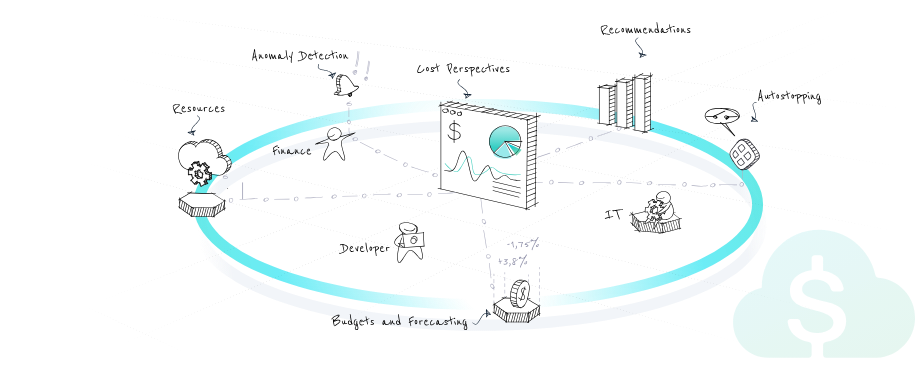

---
---

# Cloud & AI Cost Management (CACM)

Harness CACM is a cutting-edge cloud and AI cost management solution that empowers your FinOps, infrastructure, and engineering teams with intelligent tools to optimize your cloud and AI spend. With its advanced business intelligence (BI) capabilities, CACM provides complete cost transparency across teams in your organization.

<figure><figcaption></figcaption></figure>

### Get started with cloud & AI Cost management

<table data-view="cards"><thead><tr><th></th><th></th><th data-hidden data-card-target data-type="content-ref"></th></tr></thead><tbody><tr><td><strong>Overview</strong></td><td>Learn about Harness Cloud &#x26; AI Cost Management</td><td><a href="new-to-cacm/overview.md">overview.md</a></td></tr><tr><td><strong>What is Supported</strong></td><td>Find details on supported features, providers and frameworks</td><td><a href="resources/whats-supported.md">whats-supported.md</a></td></tr></tbody></table>

### Key features

<table data-view="cards"><thead><tr><th></th><th></th><th data-hidden data-card-target data-type="content-ref"></th></tr></thead><tbody><tr><td><strong>AutoStopping Rules</strong></td><td>AutoStopping Rules make sure that your non-production resources run only when used, and never when idle.</td><td><a href="cost-optimization/autostopping-rules/">autostopping-rules</a></td></tr><tr><td><strong>Recommendations</strong></td><td>Optimize cloud costs by applying CACM recommendations.</td><td><a href="cost-optimization/recommendations/">recommendations</a></td></tr><tr><td><strong>Commitment Orchestrator</strong></td><td>Manage all cloud commitments with Commitment Orchestrator</td><td><a href="cost-optimization/commitment-orchestrator/">commitment-orchestrator</a></td></tr><tr><td><strong>Cost Categories</strong></td><td>Use cost categories to take data across multiple sources and attribute it to business contexts.</td><td><a href="cost-reporting/cost-categories/">cost-categories</a></td></tr><tr><td><strong>Anomaly Detection</strong></td><td>Identify unusual or unexpected changes in your cloud service expenses.</td><td><a href="cost-governance/anomalies/">anomalies</a></td></tr><tr><td><strong>Asset governance</strong></td><td>Manage your cloud environment and cloud spend using the asset governance rules and budgets.</td><td><a href="cost-governance/asset-governance/">asset-governance</a></td></tr><tr><td><strong>Cluster Orchestrator</strong></td><td>Cluster Orchestrator for EKS to enhance workload-driven autoscaling and intelligent management of AWS Spot instances, contributing to overall cost efficiency.</td><td><a href="cost-optimization/cluster-orchestrator-for-aws-eks-clusters/">cluster-orchestrator-for-aws-eks-clusters</a></td></tr><tr><td><strong>Perspectives</strong></td><td>Group resources by what matters most to your business and create tailored views for engineering, finance, or leadership, all in one powerful, shareable dashboard.</td><td><a href="cost-reporting/perspectives/">perspectives</a></td></tr><tr><td><strong>Budgets</strong></td><td>Take control of your cloud spend with Harness CACM Budgets - set custom budgets and get real-time alerts before your costs exceed expectations.</td><td><a href="cost-governance/budgets/">budgets</a></td></tr><tr><td><strong>BI Dashboards</strong></td><td>Turn cloud data into actionable insights and model, analyze, and visualize key metrics to drive smarter, data-informed business decisions.</td><td><a href="cost-reporting/bi-dashboards/">bi-dashboards</a></td></tr></tbody></table>


