# Deployments

Harness Deployments enables deployment of application and infrastructure changes in a safe and sustainable way. Your deployment pipelines and application workflows can automate all of the steps necessary to get your changes into production. Make your software releases more efficient and reliable with Harness Deployments.

### Get started with Harness Deployments

<table data-view="cards"><thead><tr><th></th><th></th><th data-hidden data-card-target data-type="content-ref"></th></tr></thead><tbody><tr><td><strong>Overview</strong></td><td>Understand how Harness Deployments works: services, environments, pipelines, and the Delegate.</td><td><a href="new-to-deployments/overview.md">overview.md</a></td></tr><tr><td><strong>Getting Started</strong></td><td>Run your first deployment end to end in Harness.</td><td><a href="https://github.com/harness/harness-developer-hub/tree/main/3k-docs/delivery/continuous-delivery/new-to-deployments/getting-started.md">https://github.com/harness/harness-developer-hub/tree/main/3k-docs/delivery/continuous-delivery/new-to-deployments/getting-started.md</a></td></tr><tr><td><strong>Supported integrations</strong></td><td>See all supported platforms, artifact sources, and cloud providers.</td><td><a href="new-to-deployments/cd-integrations.md">cd-integrations.md</a></td></tr></tbody></table>

### Use Deployments

<table data-view="cards"><thead><tr><th></th><th></th><th data-hidden data-card-target data-type="content-ref"></th></tr></thead><tbody><tr><td><strong>Kubernetes deployments</strong></td><td>Deploy to Kubernetes using rolling, canary, and blue-green strategies.</td><td><a href="use-deployments/kubernetes/overview.md">overview.md</a></td></tr><tr><td><strong>Helm deployments</strong></td><td>Deploy Helm charts using basic, canary, and blue-green strategies.</td><td><a href="use-deployments/helm/overview.md">overview.md</a></td></tr><tr><td><strong>Serverless deployments</strong></td><td>Deploy Serverless Framework applications with Harness.</td><td><a href="use-deployments/serverless/overview.md">overview.md</a></td></tr><tr><td><strong>Google Cloud Run deployments</strong></td><td>Deploy containerized services to Google Cloud Run using basic and canary strategies.</td><td><a href="use-deployments/google-cloud/google-cloud-run/overview.md">overview.md</a></td></tr><tr><td><strong>AWS Lambda deployments</strong></td><td>Deploy AWS Lambda functions using canary and rolling strategies.</td><td><a href="use-deployments/aws-lambda/overview.md">overview.md</a></td></tr><tr><td><strong>AWS SAM deployments</strong></td><td>Deploy AWS Serverless Application Model (SAM) applications with Harness.</td><td><a href="use-deployments/aws-sam/overview.md">overview.md</a></td></tr></tbody></table>

### YAML Reference

<table data-view="cards"><thead><tr><th></th><th></th><th data-hidden data-card-target data-type="content-ref"></th></tr></thead><tbody><tr><td><strong>Step library YAML reference</strong></td><td>YAML examples for every Kubernetes and Helm step in one place.</td><td><a href="yaml-reference/step-library-yaml-reference.md">step-library-yaml-reference.md</a></td></tr></tbody></table>

### Resources

<table data-view="cards"><thead><tr><th></th><th></th><th data-hidden data-card-target data-type="content-ref"></th></tr></thead><tbody><tr><td><strong>CD Best Practices</strong></td><td>Follow recommended practices for building and scaling Harness Deployments pipelines.</td><td><a href="yaml-reference/cd-best-practices.md">cd-best-practices.md</a></td></tr><tr><td><strong>Harness Integration Upgrade Policy</strong></td><td>Understand how Harness manages version support and upgrades for integrations.</td><td><a href="yaml-reference/toolchain-policy.md">toolchain-policy.md</a></td></tr></tbody></table>


