# Feature Management & Experimentation release notes

These release notes describe recent changes to Harness Feature Management & Experimentation (FME).

**Last updated: September 25, 2026**

### September 2026 <a href="#september-2026" id="september-2026"></a>

#### Dart Client SDK and OpenFeature Provider are now available <a href="#dart-client-sdk-and-openfeature-provider-are-now-available" id="dart-client-sdk-and-openfeature-provider-are-now-available"></a>
 
***
 
**2026-09-25**
 
Harness FME now provides a Dart Client SDK, [`splitio_client_side`](https://pub.dev/packages/splitio_client_side), giving Dart and Flutter developers a way to add feature flags and experimentation directly into their applications. The SDK runs on the Dart VM and Flutter across every target platform (Android, iOS, Web, and Desktop), and is pure Dart with no `dart:html`, `dart:io`, or `dart:ffi` dependencies, so it works anywhere Dart or Flutter runs.
 
Harness FME also provides [`split_openfeature_provider_dart_client`](https://pub.dev/packages/split_openfeature_provider_dart_client), an OpenFeature provider that wraps the Dart Client SDK.
 
With the Dart OpenFeature Provider, teams can:
 
* Evaluate Harness FME feature flags through the standardized, vendor-agnostic [OpenFeature](https://openfeature.dev/) client-side API instead of FME's native SDK API
* Register the provider with a single `SplitFactory` instance and call `OpenFeatureAPI.instance.setProviderAndWait()`
* Evaluate flags with the standard `getBooleanValue`, `getStringValue`, and related OpenFeature client methods

**Related documentation**
 
* [Dart SDK](https://developer.harness.io/feature-management-experimentation/new-to-fme/sdks-and-customer-deployed-components/client-side-sdks/client-side-standard-sdks/dart-sdk)
* [OpenFeature Provider for Dart](https://developer.harness.io/feature-management-experimentation/new-to-fme/sdks-and-customer-deployed-components/openfeature-providers/dart-sdk)

### August 2026 <a href="#august-2026" id="august-2026"></a>

#### Jira Cloud integration for US and EU accounts <a href="#jira-cloud-integration-for-us-and-eu-accounts" id="jira-cloud-integration-for-us-and-eu-accounts"></a>

***

**2026-08-21**

Harness FME now provides Jira Cloud integrations for US and EU accounts through the [Atlassian Marketplace](https://marketplace.atlassian.com/vendors/1221408/harness-inc). These Forge-based integrations replace the **Split for Jira** integration and are now the primary way to connect Harness FME with Jira Cloud.

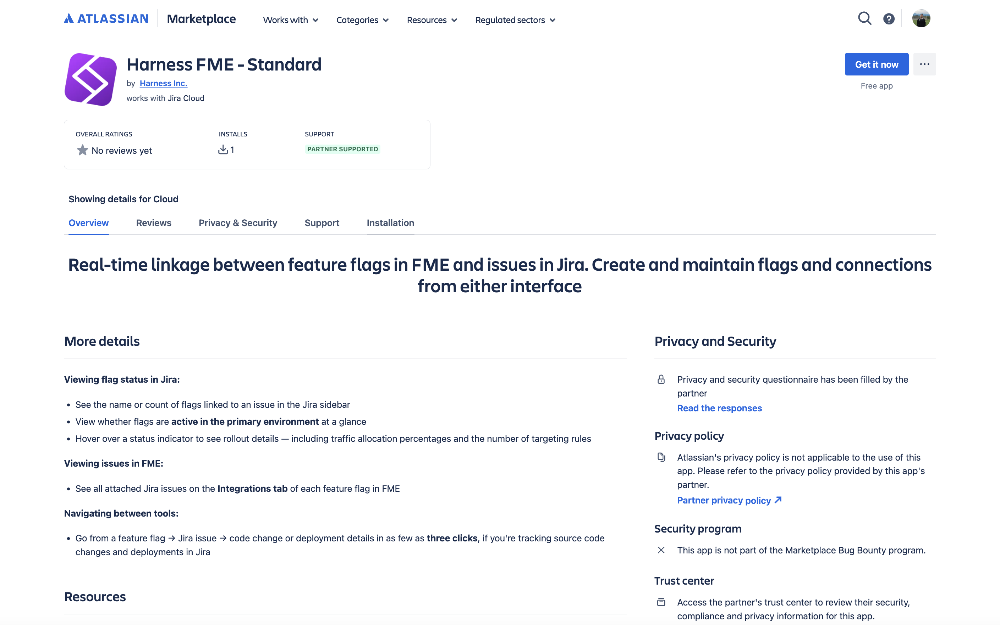

Use the Marketplace integration for Jira Cloud installations that corresponds to your Harness account region: [Harness FME - Standard](https://marketplace.atlassian.com/apps/1723796743/harness-fme-standard) or [Harness FME - Europe](https://marketplace.atlassian.com/apps/636403565/harness-fme-europe).

With the Jira integration, teams can:

* Associate Harness FME feature flags with Jira work items
* Create feature flags from Jira work items
* Link existing feature flags to Jira work items
* View feature flag and Jira work item associations from either platform
* Navigate between Jira and Harness FME

**Related documentation**

* [Jira Cloud](https://app.gitbook.com/s/rT2RGHAjtBTaObzchfpb/management-and-administration/integrations/jira-cloud)

#### FME Metric Check Step in Harness Pipelines <a href="#fme-metric-check-step-in-harness-pipelines" id="fme-metric-check-step-in-harness-pipelines"></a>

***

**2026-08-18**

Harness FME now supports the **Metric Check** step in [Harness pipelines](https://app.gitbook.com/s/rT2RGHAjtBTaObzchfpb/management-and-administration/pipelines), allowing teams to evaluate a [feature flag metric](https://app.gitbook.com/s/rT2RGHAjtBTaObzchfpb/use-fme/experimentation/experiment-results/viewing-experiment-results/index#viewing-metrics) during a pipeline execution and automatically gate rollout decisions based on the result. The step also exposes metric and evaluation details as pipeline outputs, allowing downstream steps to reference the results if needed.

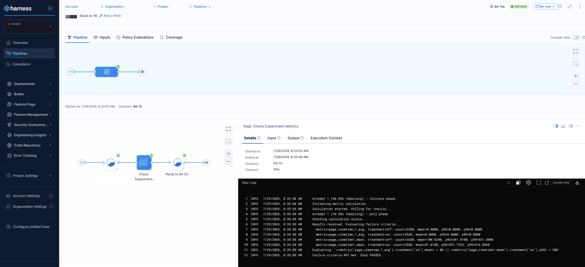

The **Metric Check** step retrieves a metric, evaluates it against user-defined failure criteria using JEXL expressions, and returns a pass or fail result. This enables release monitoring workflows where a pipeline can automatically continue, pause, roll back, or trigger another failure strategy based on live application metrics instead of requiring manual verification.

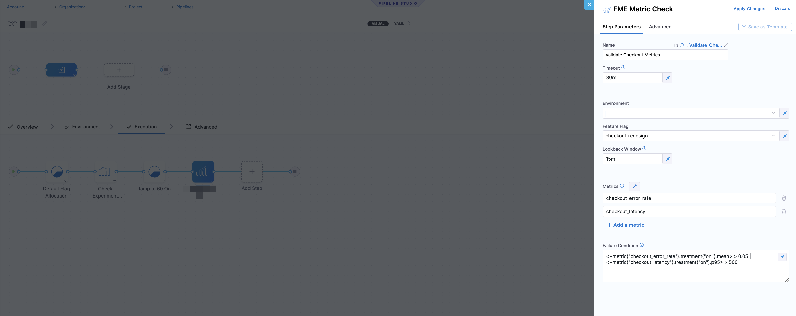

This step is available under **Feature Management & Experimentation** in the [Harness pipeline step library](https://app.gitbook.com/s/3F2TpHXhur2QtQnORSM9/use-harness-platform/pipelines/add-a-stage#steps-available-for-custom-stages) and can be combined with existing pipeline capabilities such as approvals, notifications, and failure strategies to validate error rates, latency, conversion rates, or other key metrics after a deployment before continuing a rollout.

**Related documentation**

* [Using Feature Management & Experimentation with Harness Pipelines](https://app.gitbook.com/s/rT2RGHAjtBTaObzchfpb/management-and-administration/pipelines#metric-check)

#### Scheduling in the Change Requests API <a href="#scheduling-in-the-change-requests-api" id="scheduling-in-the-change-requests-api"></a>

***

**2026-08-11**

The [Submit Change Request](https://docs.split.io/reference/create-change-request) API now supports scheduling. When submitting a change request for a feature flag or segment, you can include `scheduledFor`, a Unix timestamp in milliseconds marking the exact date and time an approved change executes, rather than having it execute immediately upon approval.

The two new fields, `scheduledFor` and `scheduledForTimezone`, are shown below. This example is abbreviated to highlight the new fields; a full UPDATE request also includes the existing `split` definition, as shown in [Schedule a change request](https://app.gitbook.com/s/rT2RGHAjtBTaObzchfpb/management-and-administration/api-best-practices/approvals#schedule-a-change-request).

```json
{
  "operationType": "UPDATE",
  "title": "New rollout split percentage",
  "comment": "updated rollout percentage",
  "approvers": [],
  "scheduledFor": 1786201200000,
  "scheduledForTimezone": "America/Los_Angeles"
}
```

`scheduledFor` is an absolute point in time and is not affected by time zone. Optionally include `scheduledForTimezone` to control the time zone used to display that scheduled time in the Harness FME UI, for example to approvers reviewing the pending change; it does not shift when the change executes. If omitted, Harness FME displays the scheduled time in `UTC`. The value must be a valid IANA time zone identifier, such as `America/New_York` or `Europe/London`; invalid time zones are rejected.

Change requests submitted with scheduling also follow a distinct status lifecycle: a pending scheduled change request reports `SCHEDULE_REQUESTED` instead of `REQUESTED`, and moves to `SCHEDULED` (instead of `APPROVED`) once approved, remaining there until the scheduled time arrives and the change publishes.

**Related documentation**

* [Approval Flows and Change Requests](https://app.gitbook.com/s/rT2RGHAjtBTaObzchfpb/management-and-administration/api-best-practices/approvals#schedule-a-change-request)
* [Submit Change Request API](https://docs.split.io/reference/create-change-request)

### July 2026 <a href="#july-2026" id="july-2026"></a>

#### Bucketing keys in Amazon S3 Exports <a href="#bucketing-keys-in-amazon-s3-exports" id="bucketing-keys-in-amazon-s3-exports"></a>

***

**2026-07-21**

Harness FME now includes a `bucketingKey` column in Amazon S3 impression exports. When your SDK provides a bucketing key for feature flag evaluations, that value appears in the `bucketingKey` column of the exported CSV. This makes it easier to analyze account-level rollouts, validate consistent treatment assignment across users, and support multi-tenant experimentation workflows.

```csv
key,label,treatment,splitName,splitVersion,properties,environmentId,trafficTypeId,sdk,sdkVersion,machineName,machineIp,timestamp,receptionTimestamp,bucketingKey
user_alice,default rule,on,new-dashboard,42,,prod,user,ruby,8.3.1,app-server-1,10.0.0.15,1783065571253,1783065598653,acct_abc123
user_bob,default rule,on,new-dashboard,42,,prod,user,ruby,8.3.1,app-server-1,10.0.0.15,1783065588095,1783065598653,acct_abc123
user_charlie,default rule,off,new-dashboard,42,,prod,user,ruby,8.3.1,app-server-2,10.0.0.16,1783065592000,1783065600000,
```

The `bucketingKey` column is optional and remains empty for SDK evaluations that do not provide a bucketing key.

**Related documentation**

* [Amazon S3 Integration](https://app.gitbook.com/s/rT2RGHAjtBTaObzchfpb/management-and-administration/integrations/amazon-s3)
* [How Bucketing Works](https://app.gitbook.com/s/rT2RGHAjtBTaObzchfpb/use-fme/feature-management#ensuring-a-consistent-user-experience)

### June 2026 <a href="#june-2026" id="june-2026"></a>

#### Remote evaluation SDKs for client-side are now supported <a href="#remote-evaluation-sdks-for-client-side-are-now-supported" id="remote-evaluation-sdks-for-client-side-are-now-supported"></a>

***

**2026-06-26**

Harness FME now supports remote evaluation through a new family of **thin SDKs** built for browsers, mobile applications, and edge/serverless JavaScript runtimes. With remote evaluation, the SDK delegates flag evaluation to the **Remote Evaluator** in FME cloud rather than computing treatments on the device. Rollout rules and segment definitions stay in the cloud, and the SDK only receives evaluation results.

Thin SDKs give teams choice over where evaluation happens, on a per-surface basis:

* **Total rule privacy**: keep targeting logic and segment definitions in the cloud, eliminating the risk of client-side rule inspection. With short-lived JWT authentication, thin SDKs receive only the evaluation result for the current target, never the underlying rollout configuration or segment definitions.
* **Architectural choice**: mix and match thin SDKs on high-sensitivity frontends with standard SDKs on surfaces where local-first performance matters. The same SDK key, target, and flag produce the same treatment in either mode.
* **Consistent and familiar**: thin SDKs share the same `getTreatment`, `track`, and event APIs as the standard SDKs, and use the same deterministic hashing and bucketing logic. Impressions, metrics, and experiments work identically across modes.

Standard SDKs with local evaluation remain the recommended default for most applications. Thin SDKs are the option when keeping targeting rules (not rollout rules) off the client is a priority, or even a must. To help teams choose, see the new [Choosing an evaluation mode](https://app.gitbook.com/s/rT2RGHAjtBTaObzchfpb/new-to-fme/sdks-and-customer-deployed-components/client-side-sdks/evaluation-modes) page.

**Related documentation**

* [Choosing an evaluation mode](https://app.gitbook.com/s/rT2RGHAjtBTaObzchfpb/new-to-fme/sdks-and-customer-deployed-components/client-side-sdks/evaluation-modes)
* [Client-side Standard SDKs](https://app.gitbook.com/s/rT2RGHAjtBTaObzchfpb/new-to-fme/sdks-and-customer-deployed-components/client-side-sdks/client-side-standard-sdks)
* [Client-side Thin SDKs](https://app.gitbook.com/s/rT2RGHAjtBTaObzchfpb/new-to-fme/sdks-and-customer-deployed-components/client-side-sdks/client-side-thin-sdks)

#### Update Feature Flag Definitions in Harness Pipelines <a href="#update-feature-flag-definitions-in-harness-pipelines" id="update-feature-flag-definitions-in-harness-pipelines"></a>

***

**2026-06-24**

Harness FME now supports the **Definition Instructions** step, allowing structured, atomic updates to feature flag definitions in [Harness pipelines](https://app.gitbook.com/s/rT2RGHAjtBTaObzchfpb/management-and-administration/pipelines). Teams can use this step to apply multiple configuration changes to a feature flag in a single, consistent operation without requiring raw patch operations.

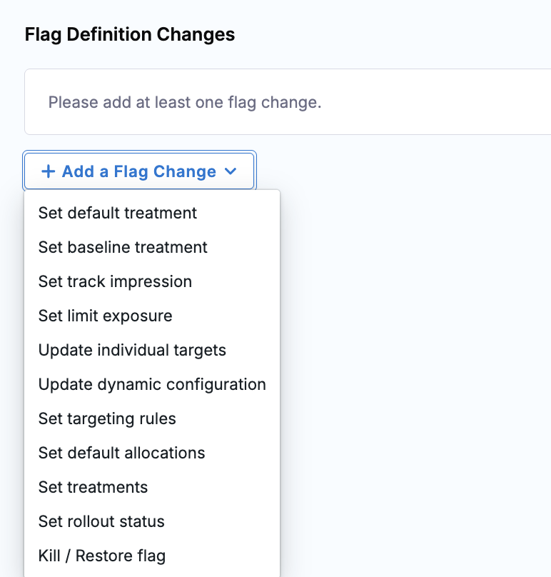

With the **Definition Instructions** step, teams can standardize how feature flags are configured across environments by applying updates to default treatments, baseline treatments, targeting rules, individual targeting, dynamic configurations, impression tracking, default allocations, treatments, rollout status, and kill/restore operations, all executed atomically to ensure consistency across changes.

This simplifies complex flag updates by providing a UI-driven approach to feature flag configuration. Instead of constructing patch payloads, you can define structured change instructions that are validated and applied together as a single operation. For advanced use cases requiring granular control, teams can use the [Admin API endpoint](https://docs.split.io/reference/full-update-feature-flag-definition-in-environment).

This step is available under **Feature Management & Experimentation** in the [Harness pipeline step library](https://app.gitbook.com/s/3F2TpHXhur2QtQnORSM9/use-harness-platform/pipelines/add-a-stage#steps-available-for-custom-stages) and can be combined with existing pipeline capabilities such as approvals, notifications, and failure strategies to standardize and automate feature management workflows.

**Related documentation**

* [Using Feature Management & Experimentation with Harness Pipelines](https://app.gitbook.com/s/rT2RGHAjtBTaObzchfpb/management-and-administration/pipelines#definition-instructions)
* [Full Update Feature Flag Definition Admin API Endpoint](https://docs.split.io/reference/full-update-feature-flag-definition-in-environment)

### May 2026 <a href="#may-2026" id="may-2026"></a>

#### Harness Policy As Code for FME Environments, Segments, and Segment Definitions <a href="#harness-policy-as-code-for-fme-environments-segments-and-segment-definitions" id="harness-policy-as-code-for-fme-environments-segments-and-segment-definitions"></a>

***

**2026-05-04**

Harness FME Policy as Code now includes support for environments, segments, and segment definitions. This allows teams to enforce consistent standards across Harness FME's configuration using the OPA-based policy framework.

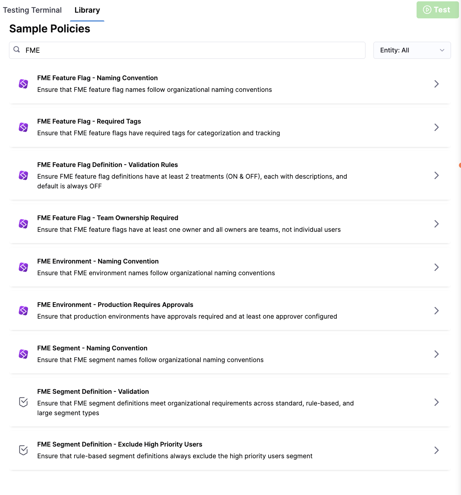

With this enhancement, teams can now define and enforce policies for:

* **FME Environments**: Enforce naming conventions for [environments](https://app.gitbook.com/s/rT2RGHAjtBTaObzchfpb/management-and-administration/environments) to ensure consistent and predictable structure across projects.
* **FME Segments**: Enforce naming conventions for [segments](https://app.gitbook.com/s/rT2RGHAjtBTaObzchfpb/use-fme/feature-management/targeting/segments) to standardize how user groups are defined and referenced.
* **FME Segment Definitions**: Validate [segment definitions](https://app.gitbook.com/s/rT2RGHAjtBTaObzchfpb/use-fme/feature-management/targeting/segments), including rules and exclusions (for example, ensuring rule-based segments exclude high-priority users where required).

These policies are evaluated automatically on **On Save** events, ensuring governance rules are applied at creation and update time before changes are persisted.

**Related documentation**

* [Using Harness Policy As Code with FME](https://app.gitbook.com/s/rT2RGHAjtBTaObzchfpb/management-and-administration/policies)
* [Policy As Code for FME Feature Flags](https://app.gitbook.com/s/3F2TpHXhur2QtQnORSM9/use-harness-platform/governance/policy-as-code/using-harness-policy-engine-for-fme)

### April 2026 <a href="#april-2026" id="april-2026"></a>

#### Identity-based Targeting Improvements <a href="#identity-based-targeting-improvements" id="identity-based-targeting-improvements"></a>

***

**2026-04-30**

Harness FME now supports identity-aware targeting workflows, improving how you select and inspect user attributes directly in feature flag targeting rules, the **Live Tail** tab of a feature flag after pausing the event stream, and segment definitions when adding individual keys or inspecting existing keys.

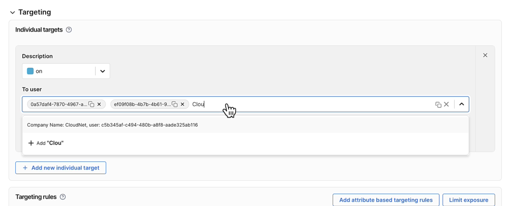

With identity data configured, you can:

*   Use key type-ahead when adding individual keys to targeting rules. Typing the lead characters of an attribute value returns matching identities from your uploaded identity data (case-sensitive, leading-character matching only).

    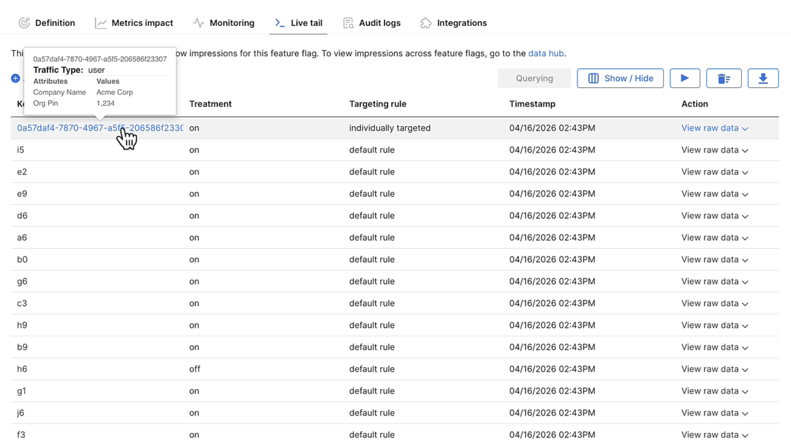
*   View identity tooltips by hovering over a key in targeting rules. Tooltips display the full set of attribute values associated with that identity, making it easier to validate targeting behavior and debug rule evaluation.

    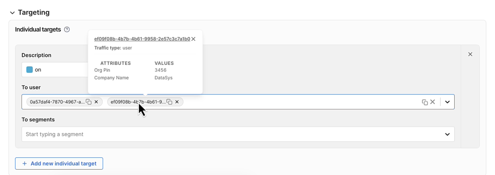

To enable key type-ahead and identity tooltip features, you must define attributes in [**FME Settings**](https://app.gitbook.com/s/rT2RGHAjtBTaObzchfpb/use-fme/feature-management/targeting/target-with-custom-attributes#create-custom-attributes-in-fme-settings) for a project and traffic type, then upload identity data (including user keys and attribute values) using the [Identities API](https://docs.split.io/reference/identities-overview).

**Related documentation**

* [Targeting With Custom Attributes](https://app.gitbook.com/s/rT2RGHAjtBTaObzchfpb/use-fme/feature-management/targeting/target-with-custom-attributes)
* [Identities API](https://docs.split.io/reference/identities-overview)

#### Additional FME Steps in Harness Pipelines <a href="#additional-fme-steps-in-harness-pipelines" id="additional-fme-steps-in-harness-pipelines"></a>

***

**2026-04-30**

Harness FME now supports additional steps for managing [segments](https://app.gitbook.com/s/rT2RGHAjtBTaObzchfpb/use-fme/feature-management/targeting/segments), [flag sets](https://app.gitbook.com/s/rT2RGHAjtBTaObzchfpb/use-fme/feature-management/manage-feature-flags/using-flag-sets-to-boost-sdk-performance), and [impression tracking](https://app.gitbook.com/s/rT2RGHAjtBTaObzchfpb/use-fme/feature-management/monitoring-and-analysis/impressions) directly through [Harness pipelines](https://app.gitbook.com/s/rT2RGHAjtBTaObzchfpb/management-and-administration/pipelines). Teams can use these steps to automate segment management, organize feature flags into reusable flag sets, and configure observability-related settings as part of their deployment workflows or standalone feature management pipelines.

This enhancement adds support for creating, updating, and deleting segments and flag sets, managing feature flag membership within flag sets, configuring rule-based segment targeting, updating segment targets, and enabling or disabling impression tracking on feature flags.

These steps are available under **Feature Management & Experimentation** in the [Harness pipeline step library](https://app.gitbook.com/s/3F2TpHXhur2QtQnORSM9/use-harness-platform/pipelines/add-a-stage#steps-available-for-custom-stages) and can be combined with existing pipeline capabilities such as approvals, notifications, and failure strategies to standardize and automate feature management workflows.

**Related documentation**

* [Using Feature Management & Experimentation with Harness Pipelines](https://app.gitbook.com/s/rT2RGHAjtBTaObzchfpb/management-and-administration/pipelines)

#### Remote Feature Flag Cleanup Templates for Harness FME is in beta <a href="#remote-feature-flag-cleanup-templates-for-harness-fme-is-in-beta" id="remote-feature-flag-cleanup-templates-for-harness-fme-is-in-beta"></a>

***

**2026-04-27**

Harness FME now supports Remote Feature Flag Cleanup Templates in beta. These [reusable pipeline and stage templates](https://github.com/harness-community/solutions-architecture/tree/main/fme) help teams identify stale feature flags, remove them from application codebases, and automatically generate pull requests with the proposed cleanup changes.

* Use **Pipeline templates** to discover eligible feature flags, select cleanup candidates, and generate pull requests automatically.
* Use **Stage templates** to clean up a known feature flag directly within an existing pipeline workflow.

These templates are configured as [remote templates](https://app.gitbook.com/s/3F2TpHXhur2QtQnORSM9/use-harness-platform/templates/template#save-a-template-to-a-different-repository) in Harness, where the template YAML is sourced from an external Git repository using a Git connector, and support Harness Code repositories and [GitHub repositories](https://app.gitbook.com/s/3F2TpHXhur2QtQnORSM9/use-harness-platform/connectors/code-repositories/ref-source-repo-provider/git-hub-connector-settings-reference).

To request access to the Remote Feature Flag Cleanup Templates beta experience, contact [Harness Support](https://app.gitbook.com/s/rT2RGHAjtBTaObzchfpb/troubleshooting-and-resources/fme-support).

**Related documentation**

* [Feature Flag Cleanup Templates](https://app.gitbook.com/s/rT2RGHAjtBTaObzchfpb/management-and-administration/automated-feature-flag-cleanup)
* [Harness Templates](https://app.gitbook.com/s/3F2TpHXhur2QtQnORSM9/use-harness-platform/templates/template)

#### Google BigQuery Support in Warehouse Native Experimentation <a href="#google-bigquery-support-in-warehouse-native-experimentation" id="google-bigquery-support-in-warehouse-native-experimentation"></a>

***

**2026-04-22**

Harness FME now supports [Google BigQuery](https://app.gitbook.com/s/rT2RGHAjtBTaObzchfpb/use-fme/warehouse-native-experimentation/integrations/bigquery) as a data warehouse for [Warehouse Native Experimentation](https://app.gitbook.com/s/rT2RGHAjtBTaObzchfpb/use-fme/warehouse-native-experimentation). Teams can connect their BigQuery instance to run experiments directly on warehouse data, using existing datasets as the source of truth for assignment and metric analysis.

Connect your BigQuery project and dataset using a service account in Harness FME and configure a results table in BigQuery for experiment results. Warehouse Native Experimentation must be enabled for your account. To request access, contact your [sales representative or account manager](https://www.harness.io/company/contact-sales).

**Related documentation**

* [Google BigQuery](https://app.gitbook.com/s/rT2RGHAjtBTaObzchfpb/use-fme/warehouse-native-experimentation/integrations/bigquery)
* [Connect Your Data Warehouse](https://app.gitbook.com/s/rT2RGHAjtBTaObzchfpb/use-fme/warehouse-native-experimentation/integrations/index)

#### Reallocate Traffic (Reseed Bucketing) API <a href="#reallocate-traffic-reseed-bucketing-api" id="reallocate-traffic-reseed-bucketing-api"></a>

***

**2026-04-14**

The Harness FME API now includes a Reallocate Traffic endpoint, allowing you to reset the bucketing seed for a feature flag in a specific [environment](https://app.gitbook.com/s/rT2RGHAjtBTaObzchfpb/management-and-administration/environments).

```json
{
  "title": "Optional title for the change.",
  "comment": "Optional comment explaining the reallocation."
}
```

This operation reassigns all users to new buckets based on existing [targeting rules](https://app.gitbook.com/s/rT2RGHAjtBTaObzchfpb/use-fme/feature-management/setup/define-feature-flag-treatments-and-targeting), effectively resetting treatment assignments. Previously only available in the FME UI, this endpoint enables reallocation as part of your deployment workflows.

Use the [Reallocate Traffic API](https://docs.split.io/reference/reallocate-traffic-reseed-bucketing) when you need to:

* Redistribute users across treatments without changing targeting rules
* Collect unbiased feedback from a new set of users on a feature

**Related documentation**

* [Reallocate Traffic (Reseed Bucketing) API](https://docs.split.io/reference/reallocate-traffic-reseed-bucketing)
* [How Bucketing Works](https://app.gitbook.com/s/rT2RGHAjtBTaObzchfpb/use-fme/feature-management#ensuring-a-consistent-user-experience)

#### Warehouse Native Experimentation is GA <a href="#warehouse-native-experimentation-is-ga" id="warehouse-native-experimentation-is-ga"></a>

***

**2026-04-08**

Harness FME now fully supports Warehouse Native Experimentation, allowing you to run experiments directly in your data warehouse using your assignment and metric data without exporting or duplicating data outside of your source of truth for analytics. Warehouse Native Experimentation supports Snowflake and Amazon Redshift.

With Warehouse Native Experimentation, teams can:

* Run experiments on their warehouse data, using FME's statistical engine for accurate measurement and confidence intervals.
* Maintain data privacy and security. All experiment queries run directly in your data warehouse. Harness FME only accesses the aggregated results needed for analysis and does not stor your raw event data.
* Define custom filters in Harness FME to focus experiments and metrics on specific populations using custom fields defined in your assignment or metric sources.

Warehouse Native Experimentation must be enabled for your account. To request access, contact your [sales representative or account manager](https://www.harness.io/company/contact-sales).

**Related documentation**

* [Warehouse Native Experimentation](https://app.gitbook.com/s/rT2RGHAjtBTaObzchfpb/use-fme/warehouse-native-experimentation)
* [Connect Your Data Warehouse](https://app.gitbook.com/s/rT2RGHAjtBTaObzchfpb/use-fme/warehouse-native-experimentation/integrations/index)

### March 2026 <a href="#march-2026" id="march-2026"></a>

#### Harness Policy As Code for FME Feature Flags <a href="#harness-policy-as-code-for-fme-feature-flags" id="harness-policy-as-code-for-fme-feature-flags"></a>

***

**2026-03-09**

Harness Feature Management & Experimentation (FME) now supports [Harness Policy As Code (OPA)](https://app.gitbook.com/s/3F2TpHXhur2QtQnORSM9/use-harness-platform/governance/policy-as-code/harness-governance-overview), enabling teams to define and enforce governance rules for feature flags at save time.

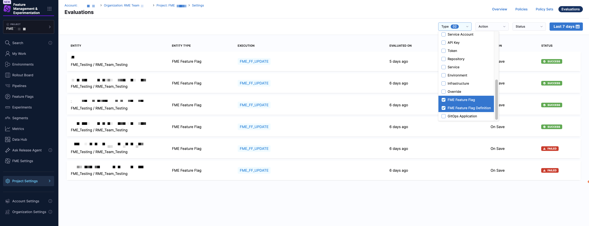

You can create and manage policies for **Feature Flag** and **Feature Flag Definition** entities in the Harness Policy As Code Editor. These policies are automatically evaluated on **On Save** events whenever a feature flag is created, updated, deleted, or archived.

Policies are authored in [Rego](https://www.openpolicyagent.org/docs/policy-language) and define the rules that govern actions. These policies are applied through **policy sets**, which are what actually execute the rules whenever the action is triggered (either from the Harness UI or from a pipeline). In other words, policies describe the rules, while policy sets organize and enforce them, so you must create a policy first before assigning it to a policy set.

With Policy As Code for Harness FME, teams can:

* Prevent misconfigured feature flags before they reach production (for example, missing descriptions, owners, or invalid naming)
* Validate targeting rules, rollout percentages, and treatment configurations at save time
* Enforce organizational standards consistently across projects
* Choose enforcement behavior per policy, using **Warn and Continue** or **Error and Exit** to balance safety and developer velocity
* Audit policy evaluations with a full history of successful, warning, and failed save attempts

This integration helps teams shift feature flag governance left, catching issues earlier while maintaining clear visibility into policy enforcement outcomes.

**Related documentation**

* [Policy As Code for FME Feature Flags](https://app.gitbook.com/s/rT2RGHAjtBTaObzchfpb/management-and-administration/policies)
* [Harness Policy As Code](https://app.gitbook.com/s/3F2TpHXhur2QtQnORSM9/use-harness-platform/governance/policy-as-code/harness-governance-quickstart)
* [Harness Policy Samples](https://app.gitbook.com/s/3F2TpHXhur2QtQnORSM9/use-harness-platform/governance/policy-as-code/sample-policy-use-case#fme-feature-flag-policies)

#### Feature Flag Archiving <a href="#feature-flag-archiving" id="feature-flag-archiving"></a>

***

**2026-03-09**

Harness FME now supports feature flag archiving, enabling teams to retire feature flags without permanently deleting them. Archiving a flag removes it from default views and stops its definition from being sent to SDKs, while preserving all historical data (including configurations, impressions, and audit logs) for compliance, auditing, and analysis. Archiving is governed by two RBAC permissions (**Archive FME Feature Flag** and **Unarchive FME Feature Flag**), which are included by default in the `FME Administrator` role.

Before a flag can be archived, Harness FME performs pre-archive checks and blocks archiving if the flag is used as a dependency and issues warnings for active experiments, recent traffic, or outstanding change requests.

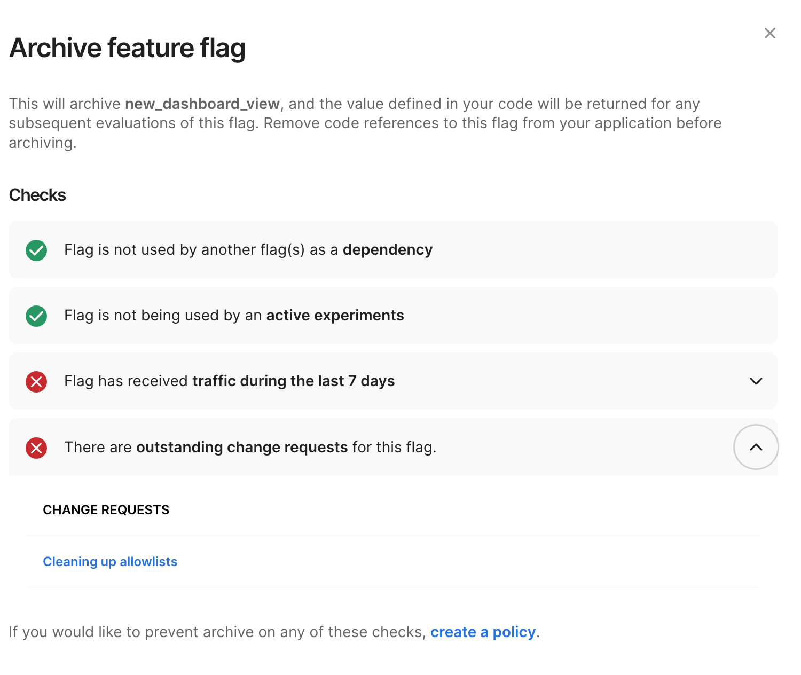

Feature flags in Harness FME have three states (`Active`, `Archived`, and `Deleted`). You can archive feature flags on the **Feature Flags** page, programmatically in Harness pipelines using the **Archive Feature Flag** step, or conditionally using Harness Policy as Code (OPA) to enforce governance rules.

With flag archiving, teams can:

* Reduce clutter in projects with high flag counts
* Hide retired flags from default views (such as the Feature Flags, Environments, and Rollout board pages)
* Enforce governance on the archive action using Harness Policy as Code (OPA)
* Unarchive a feature flag, restoring it to the active state

**Related documentation**

* [Archive a feature flag](https://app.gitbook.com/s/rT2RGHAjtBTaObzchfpb/use-fme/feature-management/manage-feature-flags/archive-a-feature-flag)
* [Harness RBAC for Feature Management & Experimentation (FME)](https://app.gitbook.com/s/rT2RGHAjtBTaObzchfpb/management-and-administration/permissions/rbac)
* [Permissions Reference](https://app.gitbook.com/s/3F2TpHXhur2QtQnORSM9/use-harness-platform/platform-access-control/permissions-reference#feature-management-and-experimentation)
* [Harness Sample Policies](https://app.gitbook.com/s/3F2TpHXhur2QtQnORSM9/use-harness-platform/governance/policy-as-code/sample-policy-use-case#prevent-archiving-a-feature-flag-with-recent-traffic)

#### FME Steps in Harness Pipelines <a href="#fme-steps-in-harness-pipelines" id="fme-steps-in-harness-pipelines"></a>

***

**2026-03-05**

FME steps in Harness pipelines is now generally available, expanding on the [beta launch](https://app.gitbook.com/s/rT2RGHAjtBTaObzchfpb/management-and-administration/pipelines). You can manage the full feature flag lifecycle and configure flag definitions directly within your pipelines, whether as part of a deployment, a standalone release process, or any automated workflow.

This release includes 14 steps, covering full flag lifecycle management, targeting capabilities, traffic allocation, and advanced patch operations, which are available under **Feature Management & Experimentation** in the [Harness pipeline step library](https://app.gitbook.com/s/3F2TpHXhur2QtQnORSM9/use-harness-platform/pipelines/add-a-stage#steps-available-for-custom-stages):

* **Create Feature Flag**, **Update Feature Flag**, and **Delete Feature Flag** for managing the full feature flag lifecycle as part of a pipeline
* **Set Default Allocations** for defining how traffic is split across treatments when no targeting rules match is the primary mechanism for percentage-based rollouts (for example, 50/50, 90/10, or 100% to a single treatment)
* **Set Individual Targets** and **Add/Remove Individual Targets** for deterministic targeting of specific users or segments
* **Kill Feature Flag** and **Restore Feature Flag** for disabling and re-enabling flags in specific environments
* **Set Treatments**, **Set Dynamic Configurations**, and **Set Targeting Rules** for configuring flag definitions, including treatment values, dynamic configurations, and attribute-based targeting
* **Limit Exposure** and **Reallocate Traffic** for controlling experiment participation: Limit Exposure sets the percentage of users exposed to targeting rules, with everyone else going to the default treatment, while Reallocate Traffic reassigns users across treatments without changing the targeting rules
* **Patch Definition** for applying advanced patch operations to a flag definition, based on the [FME Admin API partial update endpoint](https://docs.split.io/reference/partial-update-feature-flag-definition-in-environment)

These steps run alongside standard pipeline capabilities such as [approvals](https://app.gitbook.com/s/3F2TpHXhur2QtQnORSM9/use-harness-platform/approvals/approvals-tutorial), [failure strategies](https://app.gitbook.com/s/3F2TpHXhur2QtQnORSM9/use-harness-platform/pipelines/failure-handling/define-a-failure-strategy-on-stages-and-steps), and [notifications](https://app.gitbook.com/s/3F2TpHXhur2QtQnORSM9/use-harness-platform/notifications-alerts-and-banners/notifications/configure-notifications#configure-pipeline-notifications). Teams using Harness for deployments can coordinate feature flag changes alongside application releases, while teams using FME can build reusable pipelines to standardize and automate their feature flag operations; no additional Harness modules required.

**Related documentation**

* [Using FME with Harness Pipelines](https://app.gitbook.com/s/rT2RGHAjtBTaObzchfpb/management-and-administration/pipelines)

### February 2026 <a href="#february-2026" id="february-2026"></a>

#### Explore Feature Flag, Segment, and Metric Lists in Harness FME <a href="#explore-feature-flag-segment-and-metric-lists-in-harness-fme" id="explore-feature-flag-segment-and-metric-lists-in-harness-fme"></a>

***

**2026-02-13**

Harness FME has improved the browsing experience for feature flags, segments, and metrics by replacing the browse panels with full-width list pages, consistent with other Harness modules.



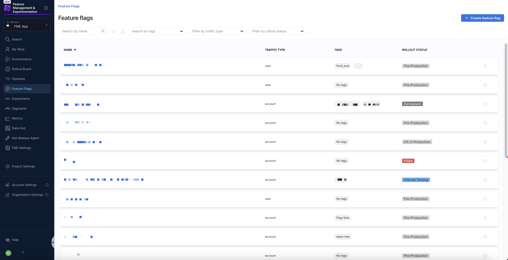



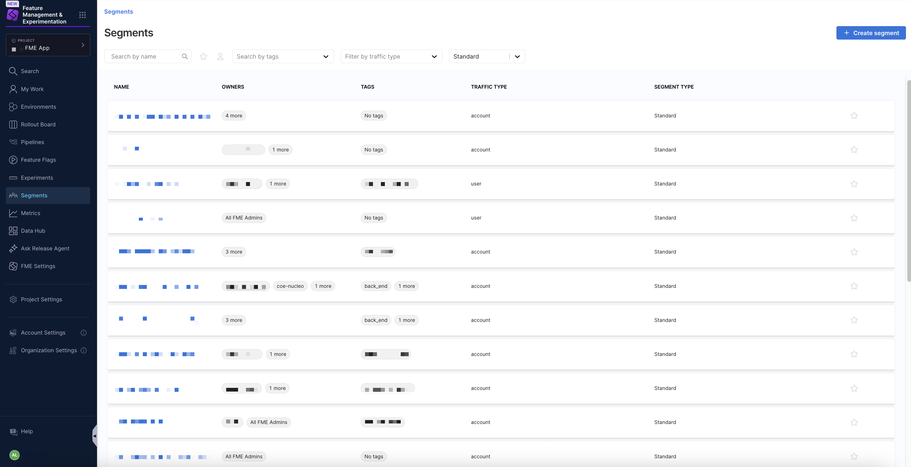



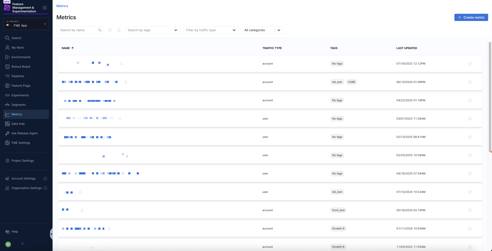



With this enhancement, you can:

* View a full list of feature flags, segments, or metrics in a single page
* Create FME objects using the **+ Create feature flag**, **+ Create segment**, and **+ Create metric** buttons
* Search FME objects by name or tags and filter results by traffic type
* Access FME objects you've starred or that are owned by you
* Scan FME object details at a glance using column-based lists

**Related documentation**

* [FME Feature Flags](https://app.gitbook.com/s/rT2RGHAjtBTaObzchfpb/use-fme/feature-management/setup/create-a-feature-flag)
* [FME Segments](https://app.gitbook.com/s/rT2RGHAjtBTaObzchfpb/use-fme/feature-management/targeting/segments)
* [FME Metrics](https://app.gitbook.com/s/rT2RGHAjtBTaObzchfpb/use-fme/release-monitoring/metrics/index)

### January 2026 <a href="#january-2026" id="january-2026"></a>

#### Include metadata with events <a href="#include-metadata-with-events" id="include-metadata-with-events"></a>

***

**2026-01-30**

Supported Harness FME SDKs (Android, iOS, Browser, JavaScript, Node.js, and Python) and suites (Android, iOS, and Browser) now include event metadata when [subscribing to events](feature-management-experimentation.md#new-feature-subscribe-to-events-in-server-side-sdks). This enhancement provides additional context about SDK readiness, cache state, and updates.

Metadata is available for the following events, for example:

| Event                                | Metadata Keys                                                                                          | Description                                                                                      |
| ------------------------------------ | ------------------------------------------------------------------------------------------------------ | ------------------------------------------------------------------------------------------------ |
| `SDK_READY` / `SDK_READY_FROM_CACHE` | <p><code>initialCacheLoad: Bool</code><br><code>lastUpdateTimestamp: Int64 (ms since epoch)</code></p> | Indicates whether data was loaded from cache and when it was last updated.                       |
| `SDK_READY_TIMED_OUT`                | None                                                                                                   | Fires if the SDK could not fetch the latest data within the configured timeout.                  |
| `SDK_UPDATE`                         | <p><code>type: "FLAGS_UPDATE" or "SEGMENTS_UPDATE"</code><br><code>names: [String]</code></p>          | Indicates the type of update and which flags were impacted. Empty list for segment-only updates. |

The event names may differ slightly depending on the SDK or suite. With this metadata, your applications can programmatically respond to updates, handle feature flag changes more reliably, and optimize background processing across supported SDKs.

**Related documentation**

* [Android SDK](https://app.gitbook.com/s/rT2RGHAjtBTaObzchfpb/new-to-fme/sdks-and-customer-deployed-components/client-side-sdks/client-side-standard-sdks/android-sdk#include-metadata)
* [iOS SDK](https://app.gitbook.com/s/rT2RGHAjtBTaObzchfpb/new-to-fme/sdks-and-customer-deployed-components/client-side-sdks/client-side-standard-sdks/ios-sdk#include-metadata)
* [Browser SDK](https://app.gitbook.com/s/rT2RGHAjtBTaObzchfpb/new-to-fme/sdks-and-customer-deployed-components/client-side-sdks/client-side-standard-sdks/browser-sdk#include-metadata)
* [Android Suite](https://app.gitbook.com/s/rT2RGHAjtBTaObzchfpb/new-to-fme/sdks-and-customer-deployed-components/client-side-sdk-suites/android-suite#include-metadata)
* [iOS Suite](https://app.gitbook.com/s/rT2RGHAjtBTaObzchfpb/new-to-fme/sdks-and-customer-deployed-components/client-side-sdk-suites/ios-suite#include-metadata)
* [Browser Suite](https://app.gitbook.com/s/rT2RGHAjtBTaObzchfpb/new-to-fme/sdks-and-customer-deployed-components/client-side-sdk-suites/browser-suite#include-metadata)
* [JavaScript SDK](https://app.gitbook.com/s/rT2RGHAjtBTaObzchfpb/new-to-fme/sdks-and-customer-deployed-components/client-side-sdks/client-side-standard-sdks/javascript-sdk#include-metadata)
* [Node.js SDK](https://app.gitbook.com/s/rT2RGHAjtBTaObzchfpb/new-to-fme/sdks-and-customer-deployed-components/server-side-sdks/nodejs-sdk#include-metadata)
* [Python SDK](https://app.gitbook.com/s/rT2RGHAjtBTaObzchfpb/new-to-fme/sdks-and-customer-deployed-components/server-side-sdks/python-sdk#include-metadata)

#### Subscribe to events in server-side SDKs <a href="#subscribe-to-events-in-server-side-sdks" id="subscribe-to-events-in-server-side-sdks"></a>

***

**2026-01-30**

Server-side SDKs for [Python](https://app.gitbook.com/s/rT2RGHAjtBTaObzchfpb/new-to-fme/sdks-and-customer-deployed-components/server-side-sdks/python-sdk), [.NET](https://app.gitbook.com/s/rT2RGHAjtBTaObzchfpb/new-to-fme/sdks-and-customer-deployed-components/server-side-sdks/net-sdk), and [Node.js](https://app.gitbook.com/s/rT2RGHAjtBTaObzchfpb/new-to-fme/sdks-and-customer-deployed-components/server-side-sdks/nodejs-sdk) can now subscribe to SDK events, enabling your applications to respond programmatically to SDK changes.

Previously, the [`Subscribe to events` feature](https://app.gitbook.com/s/rT2RGHAjtBTaObzchfpb/new-to-fme/sdks-and-customer-deployed-components/client-side-sdks/client-side-standard-sdks/android-sdk#subscribe-to-events) was only available in client-side SDKs. With this update, server-side applications can listen for the following events:

* `SDK_READY_FROM_CACHE`: Fires when cached data is loaded.
* `SDK_READY`: Fires when the SDK is ready with the latest rollout plan.
* `SDK_READY_TIMED_OUT`: Fires if the SDK cannot fetch the latest data within the configured timeout.
* `SDK_UPDATE`: Fires whenever feature flags or segments change.

The event names and available options may differ slightly depending on the SDK. This feature allows server-side applications to refresh relevant flags, optimize background processing, and respond to feature rollout changes reliably.

**Related documentation**

* [Python SDK](https://app.gitbook.com/s/rT2RGHAjtBTaObzchfpb/new-to-fme/sdks-and-customer-deployed-components/server-side-sdks/python-sdk#subscribe-to-events)
* [.NET SDK](https://app.gitbook.com/s/rT2RGHAjtBTaObzchfpb/new-to-fme/sdks-and-customer-deployed-components/server-side-sdks/net-sdk#subscribe-to-events)
* [Node.js SDK](https://app.gitbook.com/s/rT2RGHAjtBTaObzchfpb/new-to-fme/sdks-and-customer-deployed-components/server-side-sdks/nodejs-sdk#subscribe-to-events)

#### Improved Onboarding Flow for Harness FME <a href="#improved-onboarding-flow-for-harness-fme" id="improved-onboarding-flow-for-harness-fme"></a>

***

**2026-01-29**

The onboarding experience for [Harness Feature Management & Experimentation (FME)](https://app.gitbook.com/s/rT2RGHAjtBTaObzchfpb/new-to-fme/get-started) has been improved to clarify the required steps for starting FME in a Harness project. To get started, navigate to the left-hand navigation menu, select the **Grid Menu** icon, and click **Feature Management & Experimentation (FME)** in [Harness](https://app.harness.io/).

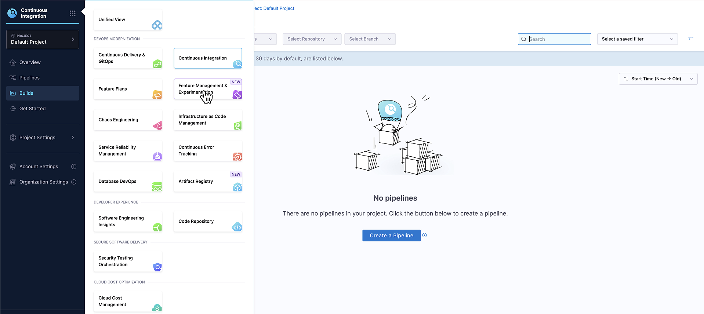

Then, select **Start FME Free Plan**. This step initializes FME for your account and is **required for all Harness customers**.

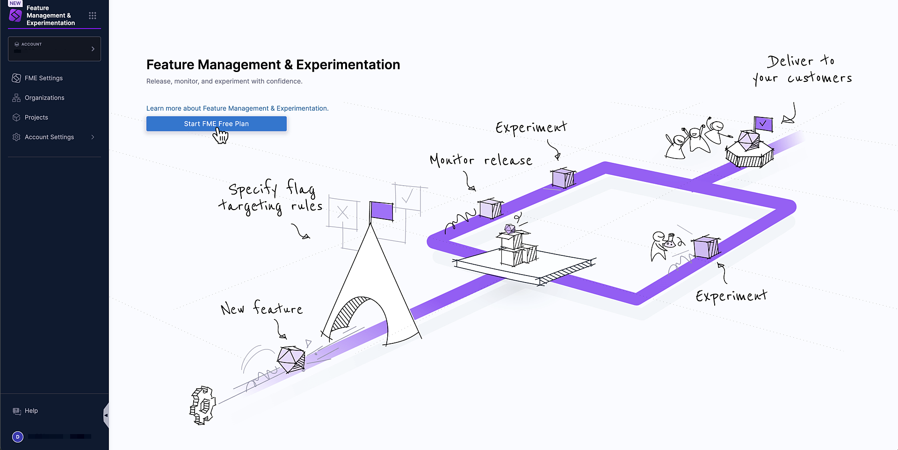

Customers on the [Enterprise Plan](https://www.harness.io/pricing) can then work with their [Harness sales representative](https://www.harness.io/company/contact-sales) to activate a paid FME subscription with access to additional features.

This enhancement helps reduce confusion during initial setup and ensures a smoother path to getting started with Feature Management & Experimentation (FME) in the Harness platform.

**Related documentation**

* [Split and Harness](https://app.gitbook.com/s/rT2RGHAjtBTaObzchfpb/new-to-fme/split-and-harness#accessing-harness-fme)
* [Harness Feature Management & Experimentation (FME)](https://app.gitbook.com/s/rT2RGHAjtBTaObzchfpb/new-to-fme/get-started)

#### Identifier-based Filtering for Harness FME Projects <a href="#identifier-based-filtering-for-harness-fme-projects" id="identifier-based-filtering-for-harness-fme-projects"></a>

***

**2026-01-23**

The Split [Get Projects (Workspaces) Admin API](https://docs.split.io/reference/get-workspaces) now provides Harness identifiers and supports identifier-based filtering, making it easier and more reliable to retrieve project (workspace) IDs, or `wsId`, after migration to Harness.

Previously, workspace ID retrieval relied on filtering by [Harness project name](https://www.postman.com/harness-fme-enablement/harness-fme/folder/qqutu4c/harness-after). With this enhancement, you can now filter by `organizationIdentifier` and `projectIdentifier`, providing a more stable way to programmatically retrieve workspace IDs for Split Admin API calls.

**Related documentation**

* [Get Projects (Workspaces) API](https://docs.split.io/reference/get-workspaces)
* [API for Split Admins](https://app.gitbook.com/s/rT2RGHAjtBTaObzchfpb/troubleshooting-and-resources/split-to-harness-migration/api-for-split-admins#are-the-harness-project-identifier-and-split-project-id-wsid-equivalent-can-i-use-either-in-the-split-admin-api-endpoints-after-migration)
* [Postman Collection](https://www.postman.com/harness-fme-enablement/harness-fme/folder/qqutu4c/harness-after)

#### FME Steps in Harness Pipelines is in Beta <a href="#fme-steps-in-harness-pipelines-is-in-beta" id="fme-steps-in-harness-pipelines-is-in-beta"></a>

***

**2026-01-23**

Harness FME steps in pipelines is now in beta, allowing you to manage feature flags directly within your deployment workflows. You can add FME steps to [custom stages](https://app.gitbook.com/s/3F2TpHXhur2QtQnORSM9/use-harness-platform/pipelines/add-a-stage#add-a-custom-stage) and perform feature flag operations as part of a single, auditable pipeline.

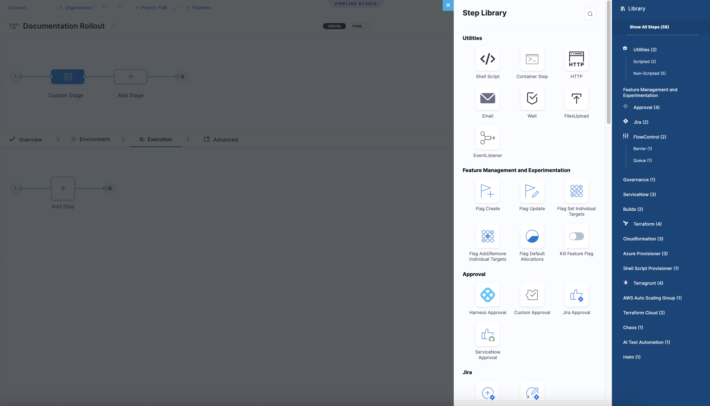

You can add FME steps in Harness pipelines to automate and standardize the following operations, for example:

* Create and update feature flags as part of a deployment
* Manage individual targets deterministically, including setting or modifying explicit target lists during a rollout
* Control default traffic allocation for staged or percentage-based rollouts
* Disable a feature flag using a kill step
* Coordinate deployments and feature flag changes in a single workflow, reducing manual configuration and operational risk

These steps run alongside standard pipeline steps and logic such as approvals, failure strategies, waits, and notifications. To request access to the FME steps in Harness pipelines beta experience, contact [Harness Support](https://app.gitbook.com/s/rT2RGHAjtBTaObzchfpb/troubleshooting-and-resources/fme-support).

**Related documentation**

* [FME Steps in Harness Pipelines](https://app.gitbook.com/s/rT2RGHAjtBTaObzchfpb/management-and-administration/pipelines)
* [Integrating CD with other Harness modules](https://app.gitbook.com/s/y1JhZ4oKIppwY7d5AhPj/troubleshooting-and-resources/resources/integrating-cd-other-modules)

#### Web support in the Flutter Plugin <a href="#web-support-in-the-flutter-plugin" id="web-support-in-the-flutter-plugin"></a>

***

**2026-01-16**

[Flutter](https://flutter.dev/) is a framework for building cross-platform applications. The Flutter plugin already supports Android and iOS, and Harness FME now includes Web support, allowing your applications to target mobile and web. With this feature, the [**Configuration** section](https://app.gitbook.com/s/rT2RGHAjtBTaObzchfpb/new-to-fme/sdks-and-customer-deployed-components/client-side-sdks/client-side-standard-sdks/flutter-plugin#configuration) of the documentation includes a `Supported Platforms` column, indicating which parameters are supported on Android, iOS, Web, or all.

For Web capabilities:

* Dart SDK v3.3.0 or later and Flutter v3.19.0 or later are required.
* Compatible with [WebAssembly (WASM) compilation](https://dart.dev/web/wasm).

This feature enables you to integrate the plugin into multi-platform Flutter applications while keeping configuration consistent across all targets.

**Related documentation**

* [Flutter Plugin](https://app.gitbook.com/s/rT2RGHAjtBTaObzchfpb/new-to-fme/sdks-and-customer-deployed-components/client-side-sdks/client-side-standard-sdks/flutter-plugin)

#### Certificate pinning status handler for iOS SDK and iOS Suite <a href="#certificate-pinning-status-handler-for-ios-sdk-and-ios-suite" id="certificate-pinning-status-handler-for-ios-sdk-and-ios-suite"></a>

***

**2026-01-15**

The iOS SDK and iOS Suite now support a certificate pinning status handler, allowing you to observe the full outcome of the certificate pinning process. Certificate pinning is supported across multiple mobile platforms (including [iOS SDK](https://app.gitbook.com/s/rT2RGHAjtBTaObzchfpb/new-to-fme/sdks-and-customer-deployed-components/client-side-sdks/client-side-standard-sdks/ios-sdk#certificate-pinning), [iOS Suite](https://app.gitbook.com/s/rT2RGHAjtBTaObzchfpb/new-to-fme/sdks-and-customer-deployed-components/client-side-sdk-suites/ios-suite#certificate-pinning), [Android SDK](https://app.gitbook.com/s/rT2RGHAjtBTaObzchfpb/new-to-fme/sdks-and-customer-deployed-components/client-side-sdks/client-side-standard-sdks/android-sdk#certificate-pinning), [Android Suite](https://app.gitbook.com/s/rT2RGHAjtBTaObzchfpb/new-to-fme/sdks-and-customer-deployed-components/client-side-sdk-suites/android-suite#certificate-pinning), and [Flutter](https://app.gitbook.com/s/rT2RGHAjtBTaObzchfpb/new-to-fme/sdks-and-customer-deployed-components/client-side-sdks/client-side-standard-sdks/flutter-plugin#certificate-pinning)) for securing network communication by constraining trusted certificates. Previously on iOS, applications could only register a failure handler, which was invoked when pinning validation failed.

Starting in the iOS SDK version 3.5.0 and iOS Suite version 2.4.0, you can register a status handler that is called for all pinning outcomes, including successful validation and cases where the SDK falls back to default OS handling.

Use the status handler if you need to:

* Audit certificate pinning behavior across hosts
* Detect unintended fallback to default OS handling
* Log and track all pinning outcomes for security or compliance reviews

This enhancement enables better observability, auditing, and compliance monitoring for certificate pinning behavior in production environments.

**Related documentation**

* [iOS SDK](https://app.gitbook.com/s/rT2RGHAjtBTaObzchfpb/new-to-fme/sdks-and-customer-deployed-components/client-side-sdks/client-side-standard-sdks/ios-sdk#certificate-pinning)
* [iOS Suite](https://app.gitbook.com/s/rT2RGHAjtBTaObzchfpb/new-to-fme/sdks-and-customer-deployed-components/client-side-sdk-suites/ios-suite#certificate-pinning)

#### Streamline Project Configuration in FME Settings <a href="#streamline-project-configuration-in-fme-settings" id="streamline-project-configuration-in-fme-settings"></a>

***

**2026-01-12**

Harness FME has improved project configuration by moving **Create Environment**, **Create Traffic Type**, and **Create SDK API Key** buttons out of the **Actions** dropdown menu into their respective tabs on the **Projects** page in **FME Settings**.

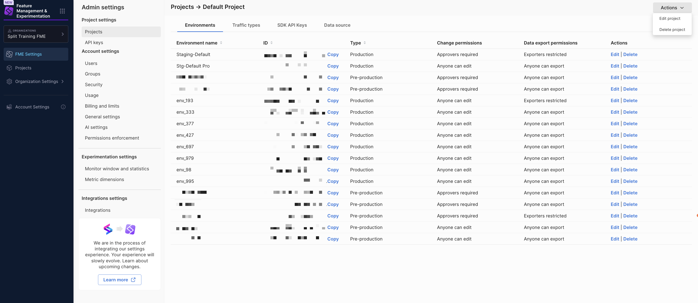

With this enhancement, you can:

* Create environments, traffic types, and SDK API keys from their respective tabs
* Reduce accidental configuration changes from the previous dropdown menu
* Simplify onboarding for new team members by making creation points more discoverable

**Related documentation**

* [FME Projects](https://app.gitbook.com/s/rT2RGHAjtBTaObzchfpb/management-and-administration/projects)
* [FME Environments](https://app.gitbook.com/s/rT2RGHAjtBTaObzchfpb/management-and-administration/environments)
* [Traffic Types](https://app.gitbook.com/s/rT2RGHAjtBTaObzchfpb/management-and-administration/traffic-types)
* [SDK API Keys](https://app.gitbook.com/s/rT2RGHAjtBTaObzchfpb/management-and-administration/api-keys)

#### Environment Type-based Access Control in Harness FME <a href="#environment-type-based-access-control-in-harness-fme" id="environment-type-based-access-control-in-harness-fme"></a>

***

**2026-01-12**

Harness FME now supports environment type-based access control in [Harness resource groups](https://app.gitbook.com/s/3F2TpHXhur2QtQnORSM9/use-harness-platform/platform-access-control/manage-resource-groups), allowing administrators to grant permissions by [FME environment type](https://app.gitbook.com/s/rT2RGHAjtBTaObzchfpb/management-and-administration/environments#create-environments) in addition to granting access to all FME environments or specific FME environments by name.

When creating a resource group, you can select from the following access types for the **FME Environments** resource:

* **All**: Grants access to all FME environments.
* **By Type**: Grants access to FME environments based on type (`Production` or `Pre-Production`).
* **Specified**: Grants access only to selected FME environments by name.

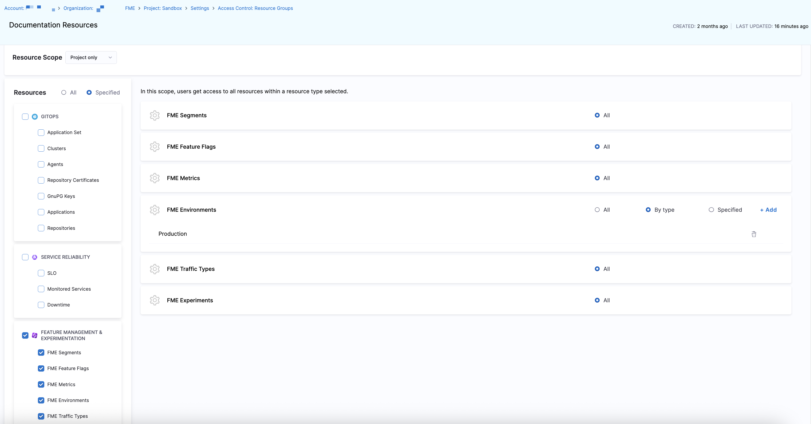

Once you've configured a resource group, you can assign that resource group to a role by clicking **Manage Role Bindings** on the **Users** or **User Groups** page.

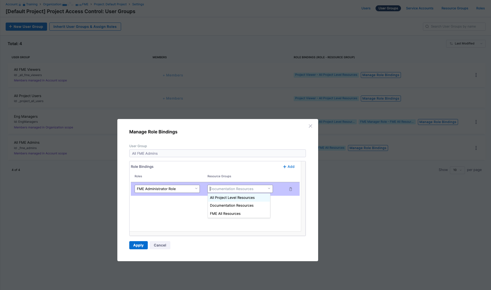

With environment type-based access control, teams can:

* Restrict write access to production environments while enabling broader access in pre-production environments
* Simplify RBAC configuration for teams that share environment standards
* Reduce administrative overhead as FME environments are added or renamed
* Enforce safer default permissions for sensitive environments

This feature extends [Harness RBAC for FME](https://app.gitbook.com/s/rT2RGHAjtBTaObzchfpb/management-and-administration/permissions/rbac), and improves the security, scalability, and maintainability of environment-level governance.

**Related documentation**

* [Harness RBAC for FME](https://app.gitbook.com/s/rT2RGHAjtBTaObzchfpb/management-and-administration/permissions/rbac)
* [FME Environments](https://app.gitbook.com/s/rT2RGHAjtBTaObzchfpb/management-and-administration/environments)

### December 2025 <a href="#december-2025" id="december-2025"></a>

#### Disable impressions per evaluation request in the Split Evaluator <a href="#disable-impressions-per-evaluation-request-in-the-split-evaluator" id="disable-impressions-per-evaluation-request-in-the-split-evaluator"></a>

***

**2025-12-22**

The Split Evaluator now supports disabling impression impression logging on a per-request basis for client evaluation endpoints using the `impressionsDisabled` evaluation option. By default, evaluations performed through the Split Evaluator generate [impressions](https://app.gitbook.com/s/rT2RGHAjtBTaObzchfpb/use-fme/feature-management/monitoring-and-analysis/impressions). With this feature, you can selectively disable impression generation for individual evaluation requests without affecting treatment assignment or configuration payloads.

This option is supported by all client evaluation endpoints, and is useful in situations where you want to:

* Evaluate feature flags without affecting analytics
* Perform background, preview, or speculative evaluations
* Reduce impression volume for high-frequency evaluation requests

Impressions can be disabled for both `GET` and `POST` requests by using a query parameter or the request body field. This behavior only applies to the current request and does not change global evaluator or SDK configuration.

**Related documentation**

* [Split Evaluator](https://app.gitbook.com/s/rT2RGHAjtBTaObzchfpb/new-to-fme/sdks-and-customer-deployed-components/customer-deployed-components/split-evaluator#disabling-impressions-per-evaluation)
* [Impressions](https://app.gitbook.com/s/rT2RGHAjtBTaObzchfpb/use-fme/feature-management/monitoring-and-analysis/impressions)

#### Reverse Proxy Support for the Harness Proxy <a href="#reverse-proxy-support-for-the-harness-proxy" id="reverse-proxy-support-for-the-harness-proxy"></a>

***

**2025-12-16**

The Harness Proxy now supports reverse proxying and forward-proxy capabilities. You can route both outbound and inbound traffic through a centralized, customer-managed proxy while maintaining end-to-end encryption and strict control over how traffic reaches Harness services.

This feature is valuable for organizations that want a single connection point for their SDKs or need to expose Harness endpoints inside tightly controlled networks.

By enabling reverse proxy mode, you can:

* Expose a unified entry point for SDK traffic to Harness FME services
* Simplify client configuration by mapping Harness endpoints to internal URLs
* Support secure connections with TLS and mTLS, including client certificate validation
* Use built-in presets (such as FME) or custom location mappings to control routing
* Maintain full control over how requests are authenticated, encrypted, and forwarded from your infrastructure to Harness

Reverse proxy support gives enterprise customers greater flexibility in meeting network, compliance, and security requirements while reducing operational overhead for teams managing complex environments.

**Related documentation**

* [Harness Proxy](https://app.gitbook.com/s/rT2RGHAjtBTaObzchfpb/new-to-fme/sdks-and-customer-deployed-components/customer-deployed-components/harness-proxy)

#### Consolidate FME Large Segments into FME Segments Permission <a href="#consolidate-fme-large-segments-into-fme-segments-permission" id="consolidate-fme-large-segments-into-fme-segments-permission"></a>

***

**2025-12-10**

Harness FME has streamlined RBAC permissions by consolidating **FME Large Segments** into the existing **FME Segments** resource. This simplification makes it easier to manage segment access across your organization.

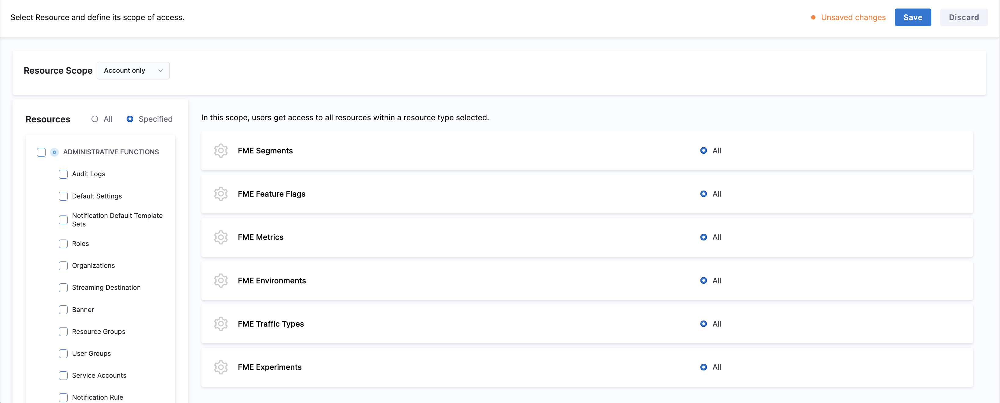

With this enhancement, you can:

* Manage standard, large, and rule-based segments under a single **FME Segments** permission
* Simplify access control in **Resource Groups** and **Roles**
* Reduce confusion when assigning or auditing permissions for segments

**Related documentation**

* [Harness RBAC for Feature Management & Experimentation](https://app.gitbook.com/s/rT2RGHAjtBTaObzchfpb/management-and-administration/permissions/rbac)
* [Harness Resource Groups and Roles](https://app.gitbook.com/s/3F2TpHXhur2QtQnORSM9/use-harness-platform/platform-access-control/manage-resource-groups)

### November 2025 <a href="#november-2025" id="november-2025"></a>

#### Metric Alert Webhook Integration <a href="#metric-alert-webhook-integration" id="metric-alert-webhook-integration"></a>

***

**2025-11-21**

The Metric Alert Webhook enables teams to automatically forward metric alert notifications (including [alert policy degradations](https://app.gitbook.com/s/rT2RGHAjtBTaObzchfpb/use-fme/release-monitoring/alerts/index#determine-an-alert-mechanism), [key metric significance](https://app.gitbook.com/s/rT2RGHAjtBTaObzchfpb/use-fme/release-monitoring/alerts/automated-alerts-and-notifications/index), and [guardrail significance alerts](https://app.gitbook.com/s/rT2RGHAjtBTaObzchfpb/use-fme/release-monitoring/alerts/automated-alerts-and-notifications/index)) to any external system through a configurable HTTP POST webhook. This webhook supports experiment and feature flag alerts, enabling real-time automation and integration with your incident management, analytics, and CI/CD tools.

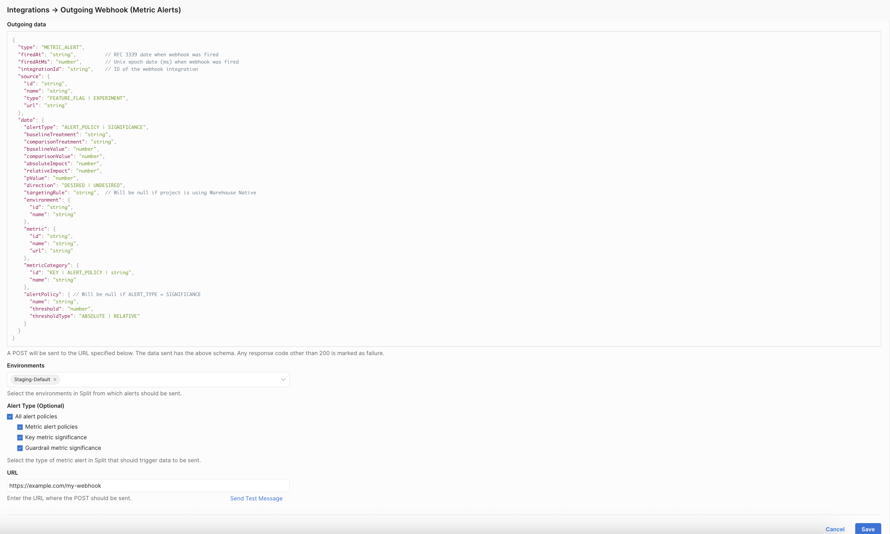

With this webhook, you can:

* Automate operational workflows by triggering incidents, posting alerts in Slack, or creating Jira tickets
* Integrate alert data with downstream systems for more in-depth analytics and monitoring
* Filter alerts by environment and type, providing teams fine-grained control over what's sent
* Use a consistent webhook payload schema shared across other Harness FME webhooks (impressions, audit logs, and admin audit logs)

This integration enables product, experimentation, and DevOps teams to automate responses to experiment and feature flag alerts and maintain greater visibility across systems.

**Related documentation**

* [Metric Alert Webhook](https://app.gitbook.com/s/rT2RGHAjtBTaObzchfpb/management-and-administration/api-best-practices/webhooks/metric-alerts)
* [Automated Alerts and Notifications](https://app.gitbook.com/s/rT2RGHAjtBTaObzchfpb/use-fme/release-monitoring/alerts/automated-alerts-and-notifications/index)
* [Harness FME Integrations](https://app.gitbook.com/s/rT2RGHAjtBTaObzchfpb/management-and-administration/integrations)

#### Permissions Enforcement Controls for Transitioning from Split Legacy Permissions <a href="#permissions-enforcement-controls-for-transitioning-from-split-legacy-permissions" id="permissions-enforcement-controls-for-transitioning-from-split-legacy-permissions"></a>

***

**2025-11-14**

Harness FME now provides a streamlined way for administrators to manage the transition from Split legacy permissions to centralized RBAC governance. Migrated customers can now choose how Split legacy environment-level and object-level permissions interact with Harness RBAC on the **Permissions Enforcement** page in **FME Settings**.

RBAC permissions are always enforced. Legacy settings serve only as an additional layer of restriction.

Administrators can select one of three permissions enforcement modes:

|                                  Enforcement Mode                                 |                                                                                       Description                                                                                       |
| :-------------------------------------------------------------------------------: | :-------------------------------------------------------------------------------------------------------------------------------------------------------------------------------------: |
| **RBAC permissions + legacy environment-level + legacy object-level permissions** | Continues to enforce Split legacy restrictions on who can edit/export in environments and provides legacy object-level edit controls for feature flag, segment, and metric definitions. |
|            **RBAC permissions + legacy object-level permissions only**            |                    Disables Split legacy environment-level restrictions while retaining object-level edit controls for feature flag, segment, and metric definitions.                   |
|                             **RBAC permissions only**                             |                                  Fully removes legacy Split permissions from the UI and enforcement. Harness RBAC becomes the single governance layer.                                  |

With Permissions Enforcement, organizations can:

* Remove redundant environment-level governance once RBAC controls are in place
* Reduce UI clutter and operational confusion from overlapping permission systems
* Retain object-level edit protection temporarily while evaluating modern governance alternatives
* Standardize how access is managed and audited across FME and additional Harness product modules

This feature provides administrators with full control over their transition from Split legacy permissions to centralized RBAC, providing a smooth, customer-paced migration path that simplifies governance and ensures minimal operational disruption.

**Related documentation**

* [Permissions Enforcement for FME](https://app.gitbook.com/s/rT2RGHAjtBTaObzchfpb/management-and-administration/permissions/enforcement)
* [Harness RBAC for FME](https://app.gitbook.com/s/rT2RGHAjtBTaObzchfpb/management-and-administration/permissions/rbac)
* [Harness RBAC](https://app.gitbook.com/s/3F2TpHXhur2QtQnORSM9/use-harness-platform/platform-access-control)

#### Environment-level RBAC Governance in FME <a href="#environment-level-rbac-governance-in-fme" id="environment-level-rbac-governance-in-fme"></a>

***

**2025-11-14**

Harness FME now supports granular access control at the environment level through Harness Role-Based Access Control (RBAC). Administrators can define [resource groups](https://app.gitbook.com/s/3F2TpHXhur2QtQnORSM9/use-harness-platform/platform-access-control/manage-resource-groups) that limit access to specific [FME environments](https://app.gitbook.com/s/rT2RGHAjtBTaObzchfpb/management-and-administration/environments) by name, controlling who can view, edit, or manage FME resources such as feature flags and segment definitions within those environments.

Environment-level permissions can now be configured in Harness RBAC using Resource Groups and Roles. Legacy environment permissions in **FME Settings** can be replaced with Harness RBAC. This enhancement enables consistent governance across Harness modules while improving security and release workflows in Harness FME.

With environment-level RBAC in FME, teams can:

* Prevent unauthorized changes in production environments
* Allow development and QA teams to safely experiment in non-production environments
* Centralize permissions and remove reliance on Split legacy permission settings
* Maintain auditability of who can modify resources in each environment

This feature enables Harness FME administrators to use resource groups to control access to FME resources by a specific environment, ensuring precise permissions, safer non-production edits, and auditable governance.

**Related documentation**

* [Harness RBAC for FME](https://app.gitbook.com/s/rT2RGHAjtBTaObzchfpb/management-and-administration/permissions/rbac)
* [Harness RBAC](https://app.gitbook.com/s/3F2TpHXhur2QtQnORSM9/use-harness-platform/platform-access-control)

### October 2025 <a href="#october-2025" id="october-2025"></a>

#### Owners Are Metadata Only <a href="#owners-are-metadata-only" id="owners-are-metadata-only"></a>

***

**2025-10-31**

Harness FME has updated the [owners role](https://app.gitbook.com/s/rT2RGHAjtBTaObzchfpb/management-and-administration/owners) to improve clarity and enhance security in feature flag, segment, and metric permissions. Owners now represent responsible stakeholders, rather than users with inherent editing rights.

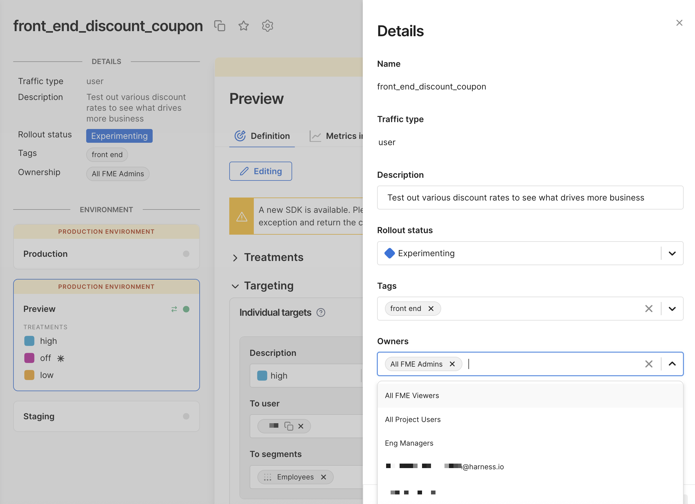

With this enhancement, you can:

* Indicate who is accountable for a feature
* Manage edit permissions through [RBAC for Split Admins](https://app.gitbook.com/s/rT2RGHAjtBTaObzchfpb/troubleshooting-and-resources/split-to-harness-migration/administering-migrated-account)
* Reduce confusion over who can modify production rollouts
* Maintain access control in sensitive environments

All existing edit permissions have been preserved. No one will lose the current access they rely on. To control who can edit feature flags, segments, and metrics, use the latest [FME permissions model](https://app.gitbook.com/s/rT2RGHAjtBTaObzchfpb/management-and-administration/permissions), which includes environment-level restrictions and optional approval workflows.

**Related documentation**

* [Harness FME Permissions](https://app.gitbook.com/s/rT2RGHAjtBTaObzchfpb/management-and-administration/permissions)
* [RBAC for Split Admins](https://app.gitbook.com/s/rT2RGHAjtBTaObzchfpb/troubleshooting-and-resources/split-to-harness-migration/administering-migrated-account)
* [Owners (Legacy Split)](https://app.gitbook.com/s/rT2RGHAjtBTaObzchfpb/management-and-administration/owners)

#### Harness FME MCP Tools <a href="#harness-fme-mcp-tools" id="harness-fme-mcp-tools"></a>

***

**2025-10-31**

The Harness FME Model Context Protocol (MCP) tools bring the power of natural language to your feature flag workflows. FME MCP enables developers, product managers, and experimentation teams to discover, inspect, and manage feature flags directly from AI-powered IDEs and assistants such as Claude Code, Windsurf, Cursor, and VS Code.

This integration bridges Harness FME with AI developer tools, allowing teams to interact with their feature management data conversationally, without switching contexts or writing API calls.

By using Harness FME MCP tools, you can:

* Explore projects and environments interactively
* Retrieve feature flag definitions, variations, and targeting rules
* Understand the status and rollout of flags across environments
* Audit or compare flag configurations for consistency and governance

The Harness FME MCP helps teams accelerate feature delivery and experimentation by making key configuration data accessible through natural language. This enables faster insight, safer releases, and collaboration across engineering and product.

**Related documentation**

* [Harness FME MCP Tools](https://app.gitbook.com/s/rT2RGHAjtBTaObzchfpb/use-fme/release-agent/mcp-tools)
* [Harness MCP Server](/broken/spaces/3F2TpHXhur2QtQnORSM9/pages/y8FEl4kGJoXrfJVN5jc1)

#### OpenFeature Providers <a href="#openfeature-providers" id="openfeature-providers"></a>

***

**2025-10-28**

Harness FME supports [OpenFeature](https://openfeature.dev/), an open specification offering a vendor-agnostic API for feature flagging. Providers handle flag evaluations, enabling consistent, centralized control over feature flags across multiple SDKs and environments.

This feature is valuable for organizations that want to:

* Standardize feature flag behavior across services and applications
* Reduce vendor lock-in by enabling flexible provider implementations
* Integrate feature flags across multiple languages and platforms

Harness FME offers providers for Android, iOS, Web, Angular, React, Java, Node.js, Python, .NET, and Go SDKs. Your application can integrate with either the Harness FME SDK or OpenFeature providers, depending on your organization’s requirements.

**Related documentation**

* [OpenFeature Providers](https://app.gitbook.com/s/rT2RGHAjtBTaObzchfpb/new-to-fme/sdks-and-customer-deployed-components/openfeature-providers)
* [Android SDK](https://app.gitbook.com/s/rT2RGHAjtBTaObzchfpb/new-to-fme/sdks-and-customer-deployed-components/openfeature-providers/android-sdk)
* [iOS SDK](https://app.gitbook.com/s/rT2RGHAjtBTaObzchfpb/new-to-fme/sdks-and-customer-deployed-components/openfeature-providers/ios-sdk)
* [Web SDK](https://app.gitbook.com/s/rT2RGHAjtBTaObzchfpb/new-to-fme/sdks-and-customer-deployed-components/openfeature-providers/web-sdk)
* [Angular](https://app.gitbook.com/s/rT2RGHAjtBTaObzchfpb/new-to-fme/sdks-and-customer-deployed-components/openfeature-providers/angular-sdk)
* [React](https://app.gitbook.com/s/rT2RGHAjtBTaObzchfpb/new-to-fme/sdks-and-customer-deployed-components/openfeature-providers/react-sdk)
* [Java SDK](https://app.gitbook.com/s/rT2RGHAjtBTaObzchfpb/new-to-fme/sdks-and-customer-deployed-components/openfeature-providers/java-sdk)
* [Node.js SDK](https://app.gitbook.com/s/rT2RGHAjtBTaObzchfpb/new-to-fme/sdks-and-customer-deployed-components/openfeature-providers/nodejs-sdk)
* [Python SDK](https://app.gitbook.com/s/rT2RGHAjtBTaObzchfpb/new-to-fme/sdks-and-customer-deployed-components/openfeature-providers/python-sdk)
* [.NET SDK](https://app.gitbook.com/s/rT2RGHAjtBTaObzchfpb/new-to-fme/sdks-and-customer-deployed-components/openfeature-providers/net-sdk)
* [Go SDK](https://app.gitbook.com/s/rT2RGHAjtBTaObzchfpb/new-to-fme/sdks-and-customer-deployed-components/openfeature-providers/go-sdk)

#### Warehouse Native Experimentation in Beta <a href="#warehouse-native-experimentation-in-beta" id="warehouse-native-experimentation-in-beta"></a>

***

**2025-10-22**

Harness FME now supports **Warehouse Native Experimentation** in beta. Warehouse Native allows you to run experiments directly in your data warehouse using your own assignment and event data. This approach gives you greater flexibility, transparency, and control over experiment analysis, without needing to export or duplicate data outside your analytics environment.

You can use Warehouse Native Experimentation to:

* Run analyses on experiments with data already stored in your warehouse.
* Leverage FME's statistical engine and additional measurement techniques for improved accuracy and confidence intervals.
* Integrate with existing assignment and metric tables in your data warehouse.

To request access for the Warehouse Native Experimentation beta experience, contact [Harness Support](https://app.gitbook.com/s/rT2RGHAjtBTaObzchfpb/troubleshooting-and-resources/fme-support).

**Related documentation**

* [Warehouse Native Experimentation](https://app.gitbook.com/s/rT2RGHAjtBTaObzchfpb/use-fme/warehouse-native-experimentation)
* [Warehouse Native Setup](https://app.gitbook.com/s/rT2RGHAjtBTaObzchfpb/use-fme/warehouse-native-experimentation/setup/index)

#### Harness Proxy <a href="#harness-proxy" id="harness-proxy"></a>

***

**2025-10-15**

Harness Proxy allows you to securely route all outgoing Harness traffic (including FME SDK calls and additional Harness module traffic) through a centralized, customer-managed proxy. Its simplicity supports multiple Harness modules, starting with [FME](https://app.gitbook.com/s/rT2RGHAjtBTaObzchfpb/README) and [Database DevOps](https://app.gitbook.com/s/Wwqb27iUU3gZvwGNroZp/README), and is compatible with Java, Android, Node.js, and Browser SDKs.

This feature is especially valuable for organizations with strict egress controls and security requirements.

By deploying the Harness Proxy, you can:

* Centralize and control all outgoing traffic
* Simplify network configuration by avoiding per-deployment firewall exceptions
* Support secure SDK connections with custom authentication, including OAuth and mTLS
* Maintain control over proxy routing and connectivity from your infrastructure to Harness SaaS while respecting end-to-end encryption

Harness Proxy makes it easier for enterprise customers to meet compliance and security needs at scale, while reducing operational overhead.

**Related documentation**

* [Harness Proxy](https://app.gitbook.com/s/rT2RGHAjtBTaObzchfpb/new-to-fme/sdks-and-customer-deployed-components/customer-deployed-components/harness-proxy)

### September 2025 <a href="#september-2025" id="september-2025"></a>

#### Fallback Treatments <a href="#fallback-treatments" id="fallback-treatments"></a>

***

**2025-09-25**

Harness FME supports fallback treatments, a configuration option that lets you define a default treatment and optional configuration to be returned instead of the standard `control`. You can set fallback values globally at the SDK level or for individual flags, giving you greater flexibility and resilience in flag evaluations.

This feature is valuable for organizations that want to:

* Avoid unexpected `control` values in production by returning a predictable treatment (such as `off`)
* Customize behavior per flag when an evaluation cannot be completed (e.g. network failure or missing attributes)
* Ensure consistent user experience across environments and SDKs

By configuring fallback treatments, you can improve reliability, reduce surprises in flag evaluation, and simplify how your applications handle edge cases.

**Related documentation**

* [Fallback treatment](https://app.gitbook.com/s/rT2RGHAjtBTaObzchfpb/use-fme/feature-management/setup/fallback-treatment)
* [Android SDK](https://app.gitbook.com/s/rT2RGHAjtBTaObzchfpb/new-to-fme/sdks-and-customer-deployed-components/client-side-sdks/client-side-standard-sdks/android-sdk#configure-fallback-treatments)
* [iOS SDK](https://app.gitbook.com/s/rT2RGHAjtBTaObzchfpb/new-to-fme/sdks-and-customer-deployed-components/client-side-sdks/client-side-standard-sdks/ios-sdk#configure-fallback-treatments)
* [Browser SDK](https://app.gitbook.com/s/rT2RGHAjtBTaObzchfpb/new-to-fme/sdks-and-customer-deployed-components/client-side-sdks/client-side-standard-sdks/browser-sdk#configure-fallback-treatments)
* [Flutter Plugin](https://app.gitbook.com/s/rT2RGHAjtBTaObzchfpb/new-to-fme/sdks-and-customer-deployed-components/client-side-sdks/client-side-standard-sdks/flutter-plugin#configure-fallback-treatments)
* [Java SDK](https://app.gitbook.com/s/rT2RGHAjtBTaObzchfpb/new-to-fme/sdks-and-customer-deployed-components/server-side-sdks/java-sdk#configure-fallback-treatments)
* [Python SDK](https://app.gitbook.com/s/rT2RGHAjtBTaObzchfpb/new-to-fme/sdks-and-customer-deployed-components/server-side-sdks/python-sdk#configure-fallback-treatments)
* [Ruby SDK](https://app.gitbook.com/s/rT2RGHAjtBTaObzchfpb/new-to-fme/sdks-and-customer-deployed-components/server-side-sdks/ruby-sdk#configure-fallback-treatments)
* [.NET SDK](https://app.gitbook.com/s/rT2RGHAjtBTaObzchfpb/new-to-fme/sdks-and-customer-deployed-components/server-side-sdks/net-sdk#configure-fallback-treatments)
* [JavaScript SDK](https://app.gitbook.com/s/rT2RGHAjtBTaObzchfpb/new-to-fme/sdks-and-customer-deployed-components/client-side-sdks/client-side-standard-sdks/javascript-sdk#configure-fallback-treatments)
* [Node.js SDK](https://app.gitbook.com/s/rT2RGHAjtBTaObzchfpb/new-to-fme/sdks-and-customer-deployed-components/server-side-sdks/nodejs-sdk#configure-fallback-treatments)
* [Go SDK](https://app.gitbook.com/s/rT2RGHAjtBTaObzchfpb/new-to-fme/sdks-and-customer-deployed-components/server-side-sdks/go-sdk#configure-fallback-treatments)
* [React SDK](https://app.gitbook.com/s/rT2RGHAjtBTaObzchfpb/new-to-fme/sdks-and-customer-deployed-components/client-side-sdks/client-side-standard-sdks/react-sdk#configure-fallback-treatments)

#### Experiment Entry Event Filter <a href="#experiment-entry-event-filter" id="experiment-entry-event-filter"></a>

***

**2025-09-25**

You can now define an entry event filter when creating an experiment in Harness FME. This filter ensures only users who actually interact with the experiment entry point are included in the analysis. This reduces noise, increases accuracy, and helps make your metrics reusable across experiments without requiring manual filtering.

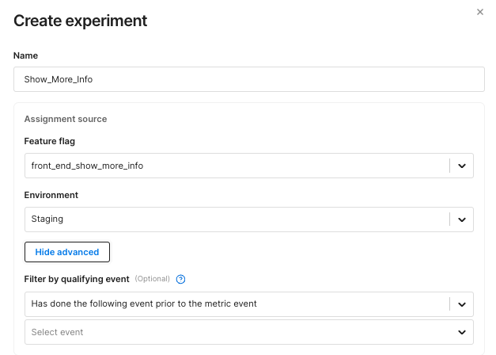

You can set this filter during experiment creation, and it is applied globally across all key, guardrail, and supporting metrics. These filters are additive, meaning if a [metric already includes a qualifying event](https://app.gitbook.com/s/rT2RGHAjtBTaObzchfpb/use-fme/experimentation/metrics/setup/filtering#applying-a-filter), the experiment's entry filter is applied first, and both must be satisfied.

**Related documentation**

* [Create an experiment](https://app.gitbook.com/s/rT2RGHAjtBTaObzchfpb/new-to-fme/get-started/create-an-experiment)
* [Experimentation Setup](https://app.gitbook.com/s/rT2RGHAjtBTaObzchfpb/use-fme/experimentation/setup/index)

### July 2025 <a href="#july-2025" id="july-2025"></a>

#### Dimensional Analysis <a href="#dimensional-analysis" id="dimensional-analysis"></a>

***

**2025-07-25**

You can now break down your experiment results by dimensions such as browser, device type, or region on the new experiment and metrics dashboards in Harness FME. While this capability was previously available on the Metrics impact tab, it’s now also available on the Experiments metric details dashboard, making it easier to uncover how different users respond to a treatment. This can reveal hidden patterns or regressions that might not be visible in the aggregate view of the **Current impact snapshot by treatment** chart.

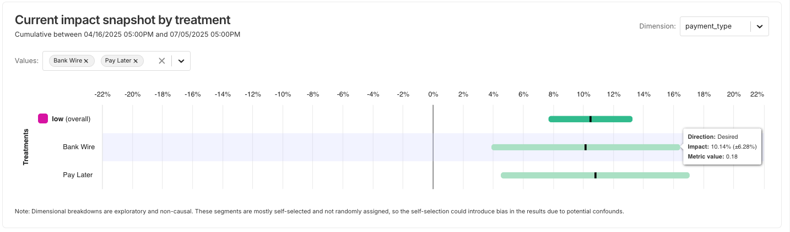

Select a dimension group from the dropdown menu to view the direction, impact, and metric value for each segment compared against the control group's performance. For example, your experiment may show an overall positive result, but drilling down into specific dimensions (like state, payment type, or browser) might reveal that certain groups experienced negative or neutral impact.

This gives you a more nuanced understanding of your results and another tool for refining your hypothesis or identifying follow-up experiments.

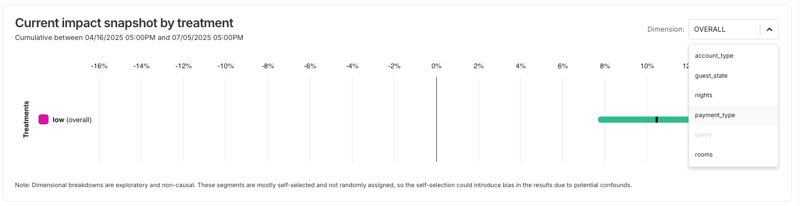

This is especially helpful for identifying how specific segments are impacted by changes, so you can make more informed experiment decisions based on deeper insights.

**Related documentation**

* [Metric details and trends](https://app.gitbook.com/s/rT2RGHAjtBTaObzchfpb/use-fme/experimentation/experiment-results/viewing-experiment-results/index#use-ai-summarize)
* [Analyzing experiment results](https://app.gitbook.com/s/rT2RGHAjtBTaObzchfpb/use-fme/experimentation/experiment-results/analyzing-experiment-results/index#current-impact-snapshot-by-treatment)
* [Dimensional analysis](https://app.gitbook.com/s/rT2RGHAjtBTaObzchfpb/use-fme/experimentation/experiment-results/analyzing-experiment-results/dimensional-analysis)

#### AI Summarize button for metrics and experiments <a href="#ai-summarize-button-for-metrics-and-experiments" id="ai-summarize-button-for-metrics-and-experiments"></a>

***

**2025-07-14**

Harness FME now includes an AI Summarize button on the Experiments Dashboard and Metric Details Dashboard. This feature uses AI to summarize your overall experiment results as well as how individual metrics on that experiment are performing over time, providing a more holistic view of performance and outcomes.

These summaries help teams quickly interpret statistical results (both at the metric level and the experiment level) without needing to dig into raw data or graphs.

AI summaries are especially helpful for product managers and non-technical stakeholders who want fast, accurate takeaways about the effectiveness of feature flags or treatments.

**Related documentation**

* [Viewing experiment results](https://app.gitbook.com/s/rT2RGHAjtBTaObzchfpb/use-fme/experimentation/experiment-results/viewing-experiment-results/index#use-ai-summarize)

### June 2025 <a href="#june-2025" id="june-2025"></a>

#### Support for rule-based segments <a href="#support-for-rule-based-segments" id="support-for-rule-based-segments"></a>

***

**2025-06-18**

You can now define rule-based segments in Harness FME. These dynamic segments allow you to group users based on custom attribute conditions (such as location, plan type, or usage behavior) instead of maintaining static user ID lists. Rule-based segments are evaluated in real time during flag evaluation, helping you target users more flexibly and reduce manual maintenance.

This feature is especially useful when working with large user segments, as they help improve maintainability and reduce performance overhead compared to managing long lists of individual user IDs.

**Related documentation**

* [Create a segment](https://app.gitbook.com/s/rT2RGHAjtBTaObzchfpb/use-fme/feature-management/targeting/segments)
* [Target segments](https://app.gitbook.com/s/rT2RGHAjtBTaObzchfpb/use-fme/feature-management/targeting/target-segments)
* [Android SDK](https://app.gitbook.com/s/rT2RGHAjtBTaObzchfpb/new-to-fme/sdks-and-customer-deployed-components/client-side-sdks/client-side-standard-sdks/android-sdk)
* [Browser SDK](https://app.gitbook.com/s/rT2RGHAjtBTaObzchfpb/new-to-fme/sdks-and-customer-deployed-components/client-side-sdks/client-side-standard-sdks/browser-sdk)
* [Browser Suite](https://app.gitbook.com/s/rT2RGHAjtBTaObzchfpb/new-to-fme/sdks-and-customer-deployed-components/client-side-sdk-suites/browser-suite)
* [iOS SDK](https://app.gitbook.com/s/rT2RGHAjtBTaObzchfpb/new-to-fme/sdks-and-customer-deployed-components/client-side-sdks/client-side-standard-sdks/ios-sdk)
* [JavaScript SDK](https://app.gitbook.com/s/rT2RGHAjtBTaObzchfpb/new-to-fme/sdks-and-customer-deployed-components/client-side-sdks/client-side-standard-sdks/javascript-sdk)
* [React SDK](https://app.gitbook.com/s/rT2RGHAjtBTaObzchfpb/new-to-fme/sdks-and-customer-deployed-components/client-side-sdks/client-side-standard-sdks/react-sdk)
* [Redux SDK](https://app.gitbook.com/s/rT2RGHAjtBTaObzchfpb/new-to-fme/sdks-and-customer-deployed-components/client-side-sdks/client-side-standard-sdks/redux-sdk)
* [Java SDK](https://app.gitbook.com/s/rT2RGHAjtBTaObzchfpb/new-to-fme/sdks-and-customer-deployed-components/server-side-sdks/java-sdk)
* [.NET SDK](https://app.gitbook.com/s/rT2RGHAjtBTaObzchfpb/new-to-fme/sdks-and-customer-deployed-components/server-side-sdks/net-sdk)
* [NodeJS SDK](https://app.gitbook.com/s/rT2RGHAjtBTaObzchfpb/new-to-fme/sdks-and-customer-deployed-components/server-side-sdks/nodejs-sdk)
* [Python SDK](https://app.gitbook.com/s/rT2RGHAjtBTaObzchfpb/new-to-fme/sdks-and-customer-deployed-components/server-side-sdks/python-sdk)
* [Ruby SDK](https://app.gitbook.com/s/rT2RGHAjtBTaObzchfpb/new-to-fme/sdks-and-customer-deployed-components/server-side-sdks/ruby-sdk)

#### Experiment Tags <a href="#experiment-tags" id="experiment-tags"></a>

***

**2025-06-16**

You can now add tags to experiments in Harness FME, making it easier to organize, search, and manage your experiments at scale. Use tags to label experiments by team, purpose, status, or any other internal convention, just like you already do with flags, metrics, and segments.

This is especially helpful for organizations with multiple teams running experiments in the same project, where clear organization and discoverability are key.

**Related documentation**

* [Tags](https://app.gitbook.com/s/rT2RGHAjtBTaObzchfpb/management-and-administration/tags)
* [Experimentation Overview](https://app.gitbook.com/s/rT2RGHAjtBTaObzchfpb/use-fme/experimentation/overview)
* [Experiments Setup](https://app.gitbook.com/s/rT2RGHAjtBTaObzchfpb/use-fme/experimentation/setup/index)

#### Control cache expiration for client-side SDKs <a href="#control-cache-expiration-for-client-side-sdks" id="control-cache-expiration-for-client-side-sdks"></a>

***

**2025-06-05**

The following SDKs now allow you to configure how long the rollout cache for feature flags and segment memberships persist: Browser, iOS, and Android. By default, the cache expires after 10 days.

This update introduces new configuration options for overriding that default and for explicitly clearing the cache on SDK initialization.

**Related documentation**

* [Browser SDK](https://app.gitbook.com/s/rT2RGHAjtBTaObzchfpb/new-to-fme/sdks-and-customer-deployed-components/client-side-sdks/client-side-standard-sdks/browser-sdk#configuring-localstorage-cache-for-the-sdk)
* [Browser SDK Suite](https://app.gitbook.com/s/rT2RGHAjtBTaObzchfpb/new-to-fme/sdks-and-customer-deployed-components/client-side-sdk-suites/browser-suite#configuring-localstorage-cache-for-the-suite)
* [iOS SDK](https://app.gitbook.com/s/rT2RGHAjtBTaObzchfpb/new-to-fme/sdks-and-customer-deployed-components/client-side-sdks/client-side-standard-sdks/ios-sdk#configure-cache-behavior)
* [iOS SDK Suite](https://app.gitbook.com/s/rT2RGHAjtBTaObzchfpb/new-to-fme/sdks-and-customer-deployed-components/client-side-sdk-suites/ios-suite#configure-cache-behavior)
* [Android SDK](https://app.gitbook.com/s/rT2RGHAjtBTaObzchfpb/new-to-fme/sdks-and-customer-deployed-components/client-side-sdks/client-side-standard-sdks/android-sdk#configure-cache-behavior)
* [Android SDK Suite](https://app.gitbook.com/s/rT2RGHAjtBTaObzchfpb/new-to-fme/sdks-and-customer-deployed-components/client-side-sdk-suites/android-suite#configure-cache-behavior)

### April 2025 <a href="#april-2025" id="april-2025"></a>

#### Experiments Dashboard <a href="#experiments-dashboard" id="experiments-dashboard"></a>

***

**2025-04-30**

Harness Feature Management & Experimentation now offers a new Experiments Dashboard designed to simplify the creation and analysis of experiments.

The new Experiments Dashboard improves the experiment setup process, supports concurrent analysis of multiple treatments, and introduces an intuitive metric table layout for reviewing experiment results.

Key enhancements include:

* A dedicated experiment creation workflow with smart defaults to streamline setup.
* A redesigned results dashboard for easier interpretation of metrics and impact trends.
* Support for analyzing multiple treatments in a single view.
* Decoupling of experiments from feature flag lifecycle management, enabling faster flag cleanup and reducing technical debt.

This release makes it easier for teams to run experiments without requiring deep technical expertise, while providing advanced users with greater visibility and flexibility during analysis.

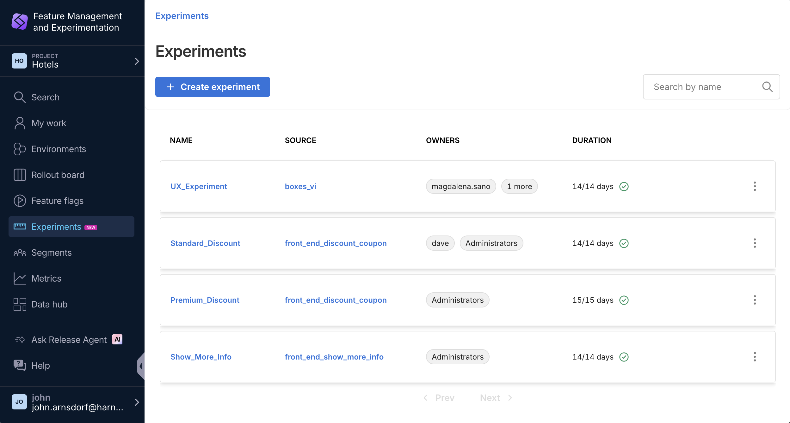 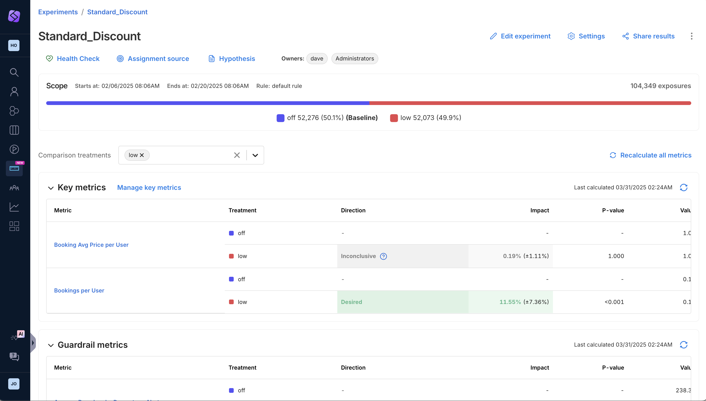 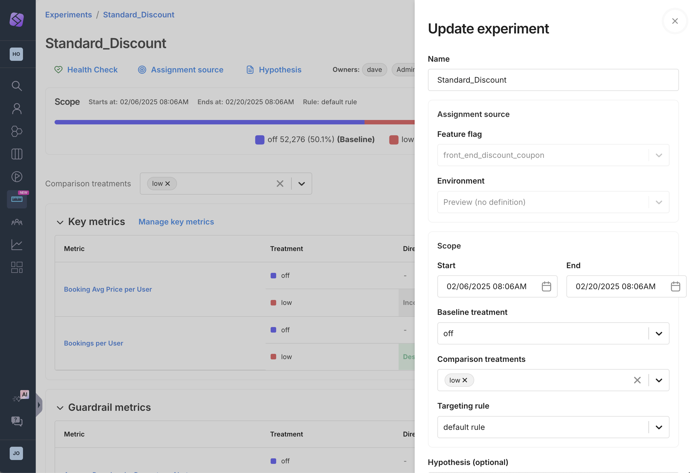 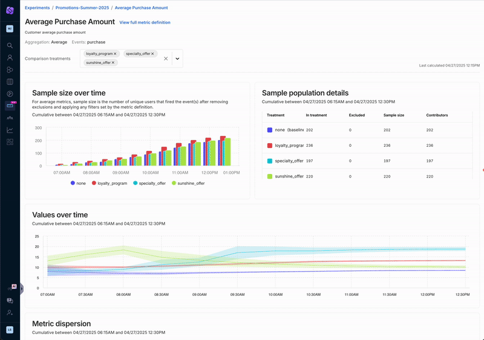

**Related documentation**

* [Experiments](https://app.gitbook.com/s/rT2RGHAjtBTaObzchfpb/use-fme/experimentation/overview)
* [Experiment health check](https://app.gitbook.com/s/rT2RGHAjtBTaObzchfpb/use-fme/experimentation/experiment-results/analyzing-experiment-results/health-check)

#### Centralized control for React SDK flag update behavior <a href="#centralized-control-for-react-sdk-flag-update-behavior" id="centralized-control-for-react-sdk-flag-update-behavior"></a>

***

**2025-04-16**

You can now configure how your React application responds to SDK lifecycle events using new props on the `<SplitFactoryProvider>` component. This allows you to set default reactivity behavior for all components in the application, reducing the need to configure each hook individually.

This is especially useful for use cases like suppressing UI updates during onboarding flows or session transactions. For example, setting `updateOnSdkUpdate={false}` at the root level (i.e., the `<SplitFactoryProvider>` component) disables updates of the `useSplitTreatments` hook triggered by flag changes until re-enabled.

The following options are supported:

* `updateOnSdkReady`
* `updateOnSdkReadyFromCache`
* `updateOnSdkTimedout`
* `updateOnSdkUpdate`

These settings apply to all nested hooks and components unless explicitly overridden.

For example:

```javascript
const App = () => (
  <SplitFactoryProvider 
    config={sdkConfig} 
    updateOnSdkUpdate={false} // Disables SDK_UPDATE-triggered re-renders for all child components
  >
    <MyApp />
  </SplitFactoryProvider>
);
```

**Related documentation**

* [React SDK](https://app.gitbook.com/s/rT2RGHAjtBTaObzchfpb/new-to-fme/sdks-and-customer-deployed-components/client-side-sdks/client-side-standard-sdks/react-sdk#subscribe-to-events)

#### Append impression properties <a href="#append-impression-properties" id="append-impression-properties"></a>

***

**2025-04-10**

The following SDKs now allow you to append properties to impressions for each `getTreatment` call: Browser, iOS, JavaScript, Node.js, React, and Redux. This provides additional context for in-product troubleshooting within Live tail or downstream external analysis.

**Related documentation**

* [Impressions](https://app.gitbook.com/s/rT2RGHAjtBTaObzchfpb/use-fme/feature-management/monitoring-and-analysis/impressions#impression-properties)
* [Android SDK](https://app.gitbook.com/s/rT2RGHAjtBTaObzchfpb/new-to-fme/sdks-and-customer-deployed-components/client-side-sdks/client-side-standard-sdks/android-sdk#append-properties-to-impressions)
* [Android Suite](https://app.gitbook.com/s/rT2RGHAjtBTaObzchfpb/new-to-fme/sdks-and-customer-deployed-components/client-side-sdk-suites/android-suite#append-properties-to-impressions)
* [Browser SDK](https://app.gitbook.com/s/rT2RGHAjtBTaObzchfpb/new-to-fme/sdks-and-customer-deployed-components/client-side-sdks/client-side-standard-sdks/browser-sdk#append-properties-to-impressions)
* [Browser SDK Suite](https://app.gitbook.com/s/rT2RGHAjtBTaObzchfpb/new-to-fme/sdks-and-customer-deployed-components/client-side-sdk-suites/browser-suite#append-properties-to-impressions)
* [Flutter Plugin](https://app.gitbook.com/s/rT2RGHAjtBTaObzchfpb/new-to-fme/sdks-and-customer-deployed-components/client-side-sdks/client-side-standard-sdks/flutter-plugin#append-properties-to-impressions)
* [iOS SDK](https://app.gitbook.com/s/rT2RGHAjtBTaObzchfpb/new-to-fme/sdks-and-customer-deployed-components/client-side-sdks/client-side-standard-sdks/ios-sdk#append-properties-to-impressions)
* [iOS SDK Suite](https://app.gitbook.com/s/rT2RGHAjtBTaObzchfpb/new-to-fme/sdks-and-customer-deployed-components/client-side-sdk-suites/ios-suite#append-properties-to-impressions)
* [Java SDK](https://app.gitbook.com/s/rT2RGHAjtBTaObzchfpb/new-to-fme/sdks-and-customer-deployed-components/server-side-sdks/java-sdk#append-properties-to-impressions)
* [JavaScript SDK](https://app.gitbook.com/s/rT2RGHAjtBTaObzchfpb/new-to-fme/sdks-and-customer-deployed-components/client-side-sdks/client-side-standard-sdks/javascript-sdk#append-properties-to-impressions)
* [Node.js SDK](https://app.gitbook.com/s/rT2RGHAjtBTaObzchfpb/new-to-fme/sdks-and-customer-deployed-components/server-side-sdks/nodejs-sdk#append-properties-to-impressions)
* [React SDK](https://app.gitbook.com/s/rT2RGHAjtBTaObzchfpb/new-to-fme/sdks-and-customer-deployed-components/client-side-sdks/client-side-standard-sdks/react-sdk#append-properties-to-impressions)
* [Redux SDK](https://app.gitbook.com/s/rT2RGHAjtBTaObzchfpb/new-to-fme/sdks-and-customer-deployed-components/client-side-sdks/client-side-standard-sdks/redux-sdk#append-properties-to-impressions)
* [Ruby SDK](https://app.gitbook.com/s/rT2RGHAjtBTaObzchfpb/new-to-fme/sdks-and-customer-deployed-components/server-side-sdks/ruby-sdk#append-properties-to-impressions)
* [Python SDK](https://app.gitbook.com/s/rT2RGHAjtBTaObzchfpb/new-to-fme/sdks-and-customer-deployed-components/server-side-sdks/python-sdk#append-properties-to-impressions)
* [Go SDK](https://app.gitbook.com/s/rT2RGHAjtBTaObzchfpb/new-to-fme/sdks-and-customer-deployed-components/server-side-sdks/go-sdk#append-properties-to-impressions)

### March 2025 <a href="#march-2025" id="march-2025"></a>

#### Feature flag impression toggle <a href="#feature-flag-impression-toggle" id="feature-flag-impression-toggle"></a>

***

**2025-03-26**

The feature flag impression toggle allows you more control over your generated impression volume, by switching flag impression tracking on/off per feature flag per environment.

This feature allows you to streamline impressions sent to third party integrations, but does not impact FME Monthly Tracked Keys nor billing.

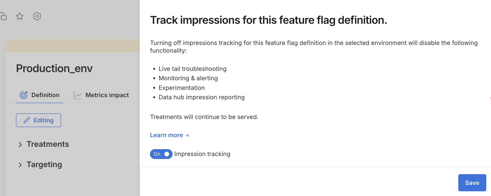

**Related documentation**

* [Tracking impressions](https://app.gitbook.com/s/rT2RGHAjtBTaObzchfpb/use-fme/feature-management/monitoring-and-analysis/impressions#tracking-impressions)

#### AI settings <a href="#ai-settings" id="ai-settings"></a>

***

**2025-03-19**

The new AI settings page in Admin settings provides a toggle to enable/disable Release Agent and manage whether Release Agent has permissions to process experimentation data for experiment summarization and Q\&A. This provides enhanced control over data privacy for AI features.

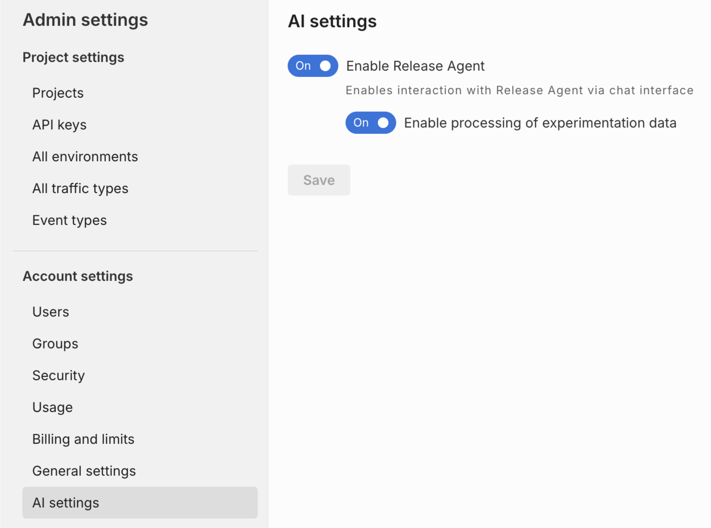

Your data is protected by the [Harness privacy policy](https://www.harness.io/legal/privacy) and the [OpenAI Enterprise privacy policy](https://openai.com/enterprise-privacy/). For more information go to [AI Release Agent](https://help.split.io/hc/en-us/articles/21188803158157-AI-Release-Agent#privacy).

**Related documentation**

* [AI Release Agent](https://help.split.io/hc/en-us/articles/21188803158157-Switch-AI-assistant)

### February 2025 <a href="#february-2025" id="february-2025"></a>

#### Elixir SDK <a href="#elixir-sdk" id="elixir-sdk"></a>

***

**2025-02-28**

**Elixir SDK General Availability**

The [Elixir Thin Client SDK](https://app.gitbook.com/s/rT2RGHAjtBTaObzchfpb/new-to-fme/sdks-and-customer-deployed-components/server-side-sdks/elixir-thin-client-sdk) enables developers to integrate Harness FME feature flagging and event tracking directly into their Elixir applications. Leveraging [Split Daemon (splitd)](https://app.gitbook.com/s/rT2RGHAjtBTaObzchfpb/new-to-fme/sdks-and-customer-deployed-components/customer-deployed-components/split-daemon-splitd), this lightweight SDK provides highly performant first-class FME support within Elixir.

Thanks are due to the team at [Cars.com](https://www.cars.com/) for the initial implementation, which they contributed to the FME user community. The Harness engineering team then finalized the work, making it generally available as a Harness-supported FME SDK.

**FME Thin Client SDK + Splitd Architecture**

FME Thin Client SDKs are known for their lightweight footprint and are always paired with Split Daemon (splitd). Splitd performs the storage and compute intensive operations and easily scales to high traffic volumes.

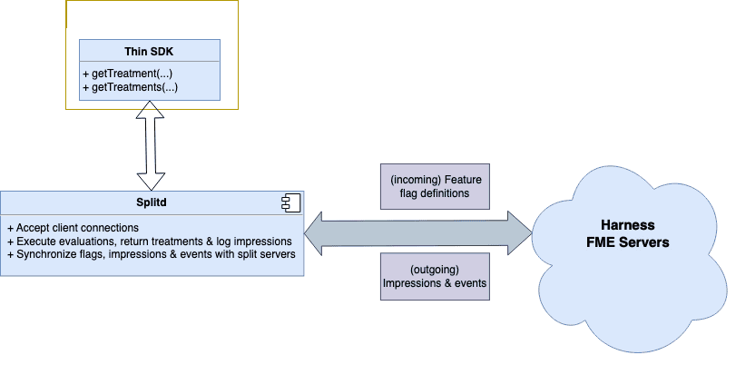

Splitd can be set up locally to the consumer application or be deployed as a sidecar to the consumer application container. See the [Split Daemon (splitd)](https://app.gitbook.com/s/rT2RGHAjtBTaObzchfpb/new-to-fme/sdks-and-customer-deployed-components/customer-deployed-components/split-daemon-splitd) documentation for details.

**Related documentation**

* [Elixir Thin-Client SDK](https://app.gitbook.com/s/rT2RGHAjtBTaObzchfpb/new-to-fme/sdks-and-customer-deployed-components/server-side-sdks/elixir-thin-client-sdk)
* [Split Daemon (splitd)](https://app.gitbook.com/s/rT2RGHAjtBTaObzchfpb/new-to-fme/sdks-and-customer-deployed-components/customer-deployed-components/split-daemon-splitd)

### January 2025 <a href="#january-2025" id="january-2025"></a>

#### Release Agent (AI Chatbot) <a href="#release-agent-ai-chatbot" id="release-agent-ai-chatbot"></a>

***

**2025-01-08**

**AI-Generated Summary Now Supports Follow-Up Questions**

The "Switch" AI chatbot in Harness Feature Management and Experimentation (FME) has been renamed to "Release Agent" and now supports follow-up questions after you click "Summarize" in metric details. To see the Metric summary and ask follow-up questions:

1. Drill into a metric tile on a Metrics impact dashboard and click **Summarize**.
2. After viewing the summary, type your follow-up question and click **Continue conversation in Release Agent**.
3. Continue to ask additional follow-up questions if you would like, including suggestions for next steps.

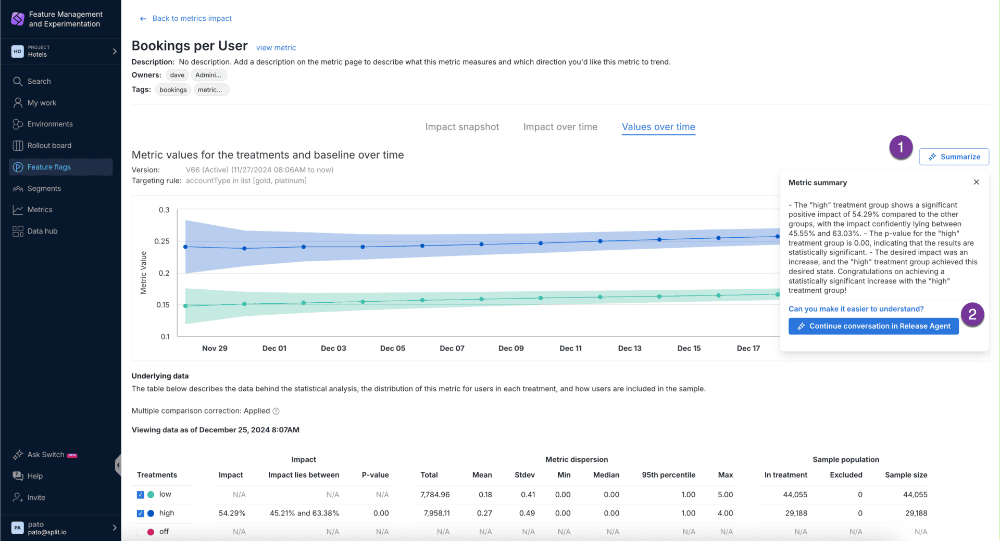

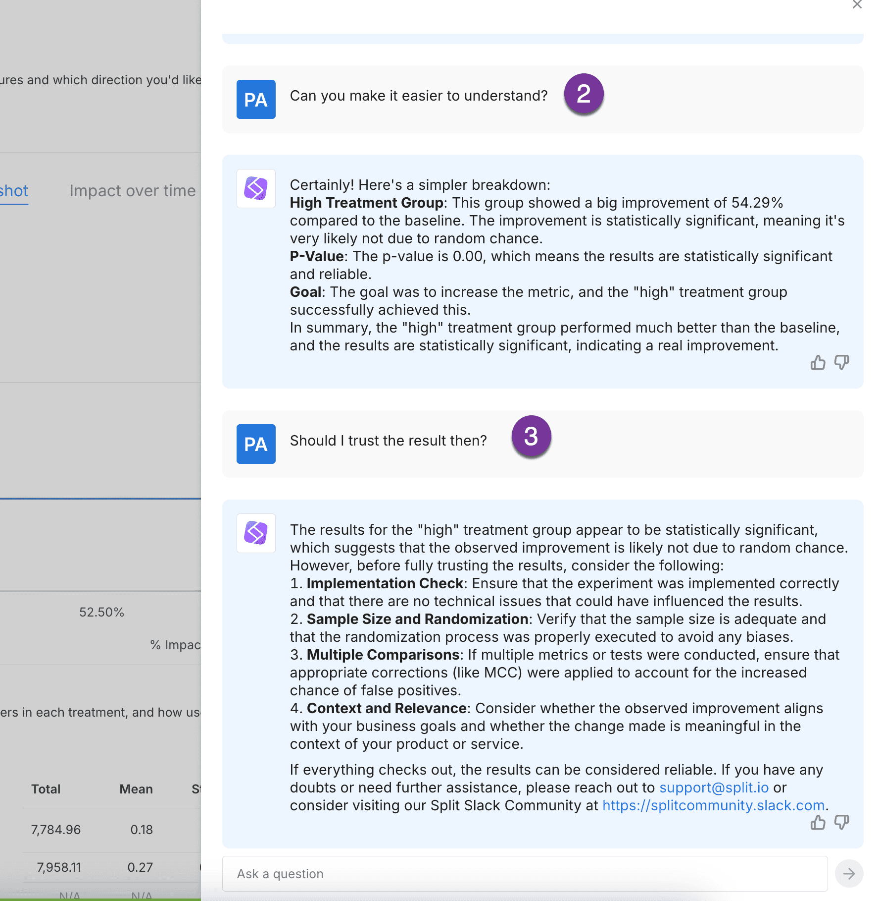

Note: The transition from "Switch" to "Release Agent" will take place gradually. For now, you'll still see **Ask Switch** in the lower left navigation of Harness Feature Management and Experimentation:

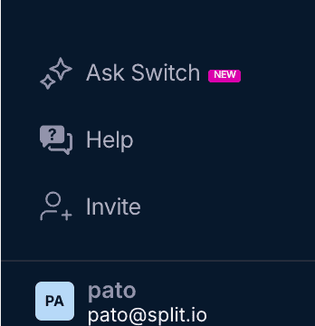

**Related documentation**

* [Metric details and trends](https://app.gitbook.com/s/rT2RGHAjtBTaObzchfpb/use-fme/experimentation/experiment-results/viewing-experiment-results/metric-details-and-trends)
* [Switch AI assistant](https://help.split.io/hc/en-us/articles/21188803158157-Switch-AI-assistant)

#### Targeting - Large segments <a href="#targeting-large-segments" id="targeting-large-segments"></a>

***

**2025-01-07**

Harness Feature Management and Experimentation (FME) now supports "Large segments" (lists of targeting IDs) that can contain more than 100,000 IDs. Large segments support multiple use cases where bulk targeting of specific IDs is required:

* Communicating with more than 100,000 specific customers in-app after an incident.
* Targeting any set of users based on attributes not available within the app at runtime.
* Performing large-scale A/B tests on specific user bases, exported from external tools. Effective immediately, Enterprise tier customers may create and use Large segments containing up to one million (1,000,000) IDs. Significantly higher limits are available by request.

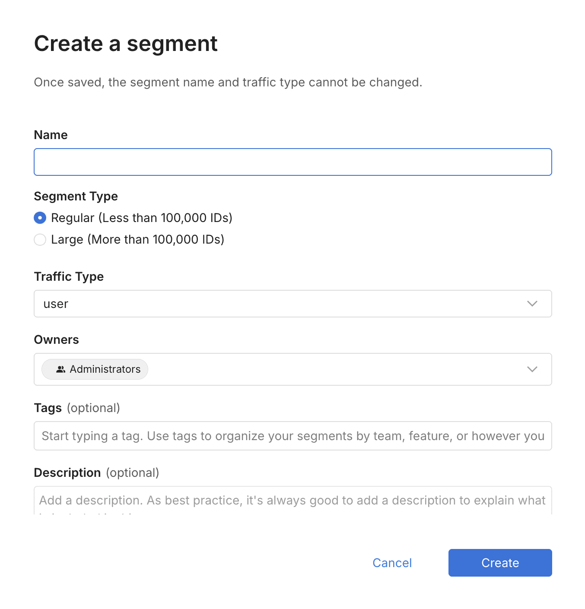 Learn more about Large segments and the ways they differ from Standard segments in the documentation:

* [Create a segment](https://app.gitbook.com/s/rT2RGHAjtBTaObzchfpb/use-fme/feature-management/targeting/segments)
* [Target segments](https://app.gitbook.com/s/rT2RGHAjtBTaObzchfpb/use-fme/feature-management/targeting/target-segments)

Note: The initial release of Large segments is focused on client-side SDK usage only. Server-side SDKs do not yet support Large segments, but soon will. Until they are supported, evaluations of feature flags that target Large segments will return control on server-side SDKs.

**Admin API Endpoints**

After familiarizing yourself with Large segments at the above links, you may find these UI and API equivalent documentation links handy for automating the steps via the Admin API:

**Steps for creating and populating a Large segment using either UI or API**

1. Create a Large segment (just **metadata**, no Environment definition)

* [UI steps](https://app.gitbook.com/s/rT2RGHAjtBTaObzchfpb/use-fme/feature-management/targeting/segments#creating-a-segment) (select Large)
* [API steps](https://docs.split.io/reference/createlargesegment)

2. Create a **definition** for a Large segment in an Environment (no user IDs)

* [UI steps](https://app.gitbook.com/s/rT2RGHAjtBTaObzchfpb/use-fme/feature-management/targeting/segments#adding-user-ids-to-a-segment) (step 3)
* [API steps](https://docs.split.io/reference/createlargesegmentinenvironment)

3. Add **user IDs** to a Large segment (to the definition created in step 2)

* [UI steps](https://app.gitbook.com/s/rT2RGHAjtBTaObzchfpb/use-fme/feature-management/targeting/segments#file-import-for-large-segments)
* [API steps](https://docs.split.io/reference/create-change-request#open-change-request-to-add-members-to-a-large-segment)

**Adding an approval step via Admin API**

To add an approval step for Large segment creation or update when using the Admin API, reference this example: [Open Change Request to add members to a Large Segment](https://docs.split.io/reference/create-change-request#open-change-request-to-add-members-to-a-large-segment).

### Previous releases <a href="#previous-releases" id="previous-releases"></a>

#### 2024 releases <a href="#id-2024-releases" id="id-2024-releases"></a>

<details>

<summary>Expand for 2024 releases</summary>

**December 2024**

**2024-12-06**

**Targeting**

**Semantic Versioning (SemVer) Attribute Dictionary Support**

Split FME now supports SemVer type attributes and suggested values in the attribute dictionary:

* Admins can create SemVer typed attribute names and suggested values.
* Users can see the SemVer attribute names and suggested values when editing targeting rules. Attribute dictionary support reduces guesswork and manual errors when editing targeting rules.

**What you need to know in a nutshell:**

* The [semver](https://semver.org/) standard calls for versions to be formatted as major.minor.patch
* Split FME added [SemVer support on June 6th, 2024](https://www.split.io/releases/2024-06-06/) , eliminating the need to write regular expressions (i.e. regex) to target version ranges or "is a version less than or equal to x.y.z"
* This update adds the benefits of standardized attribute names and suggested values delivered by our Attribute Dictionary.

**What SemVer attribute support looks like to an admin:**

Admins can create a custom attribute of type "Semver" and optionally enter suggested values.

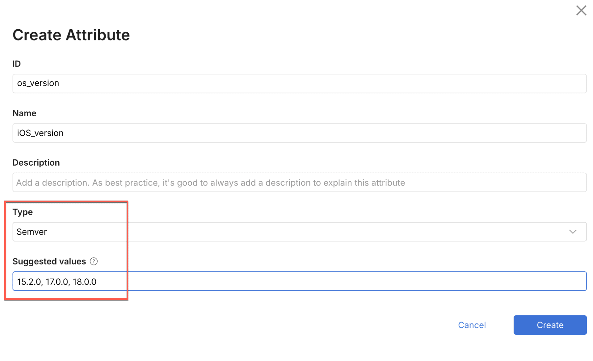

**What SemVer attribute support looks like to a user:**

Choose an attribute name from the attribute dictionary, such as "ios\_version":

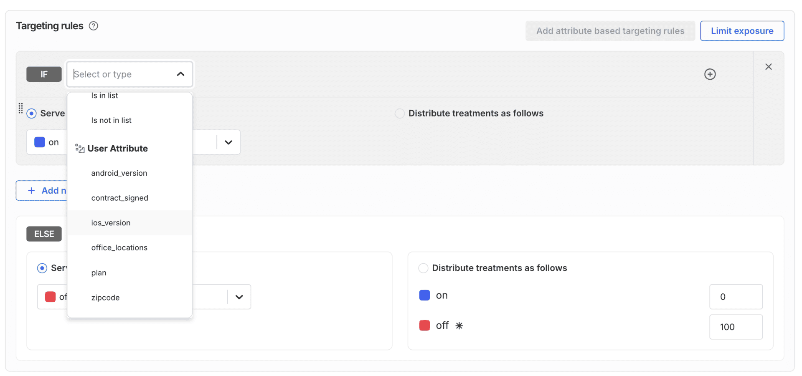

If the chosen attribute is of type SemVer, the appropriate matchers are shown:

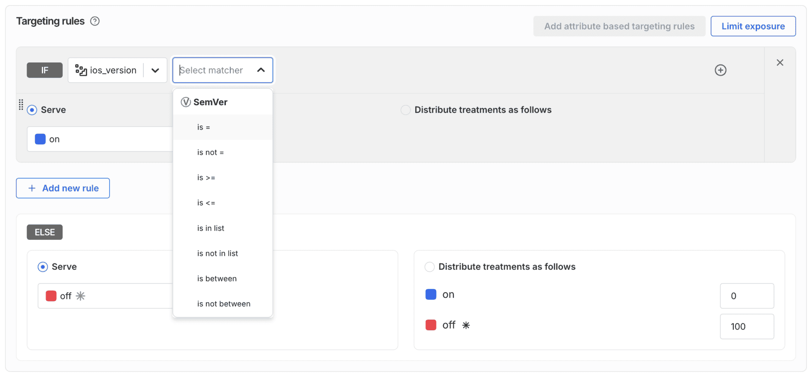

If "is in list" is chosen as the matcher type, suggested values are shown:

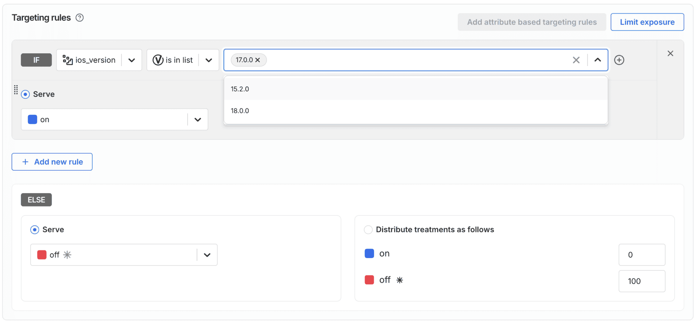

**Related Documentation:**

* [Creating individual custom attributes in Admin settings](https://app.gitbook.com/s/rT2RGHAjtBTaObzchfpb/use-fme/feature-management/targeting/target-with-custom-attributes#creating-individual-custom-attributes-in-admin-settings)
* [Creating multiple custom attributes in Admin Settings](https://app.gitbook.com/s/rT2RGHAjtBTaObzchfpb/use-fme/feature-management/targeting/target-with-custom-attributes#creating-multiple-custom-attributes-in-admin-settings) (CSV upload)

**November 2024**

**2024-11-27**

**Alerts**

**Guardrail and Key Metric Alerts Now Shown in the Alerts Table**

Previously, the Alerts table on the Monitoring tab displayed Metric alerts only. Guardrail Metric alerts and Key Metric alerts generated email notifications to feature flag owners, but were not persisted in the UI. Now all three types of alerts are shown on each flag's Monitoring tab for any team member to see. The table has been simplified to display the most valuable fields at a glance, reducing cognitive load. Details less critical for quick triage remain available under an info icon.

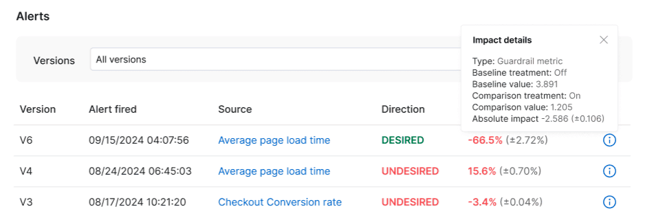

As a refresher, here is quick summary of the three alert types:

* **Metric Alert**
  * **Triggered**: when the relative or absolute impact threshold in an Alert policy is reached
  * **Configured:** at the metric level, by [creating an Alert policy](https://app.gitbook.com/s/rT2RGHAjtBTaObzchfpb/use-fme/experimentation/metrics/alert-policies#create-a-metric-alert-policy)
  * **Monitors:** percentage rollouts for all flags which have the same traffic type as the metric
* **Guardrail Metric Alert**
  * **Triggered:** when any statistically significant impact is detected, either desirable or undesirable
  * **Configured:** at the metric level, by [marking a metric's category as "Guardrail"](https://app.gitbook.com/s/rT2RGHAjtBTaObzchfpb/use-fme/experimentation/metrics/categories/index)
  * **Monitors:** percentage rollouts for all flags which have the same traffic type as the metric
* **Key Metric Alert**
  * **Triggered:** when any statistically significant impact is detected, either desirable or undesirable
  * **Configured:** at the feature flag level, by [marking a metric as a "Key metric" for that flag](https://app.gitbook.com/s/rT2RGHAjtBTaObzchfpb/use-fme/release-monitoring/alerts/automated-alerts-and-notifications/index#setting-up-feature-flag-alerting)
  * **Monitors:** percentage rollouts only for flags where the metric is a Key metric

**September 2024**

**2024-09-30**

**Better Together: Split + Harness**

**New Colors, Names for Organization and Workspace**

Starting on September 30th, we began a progressive rollout to update the Split UI, bringing it closer to the look of Harness:

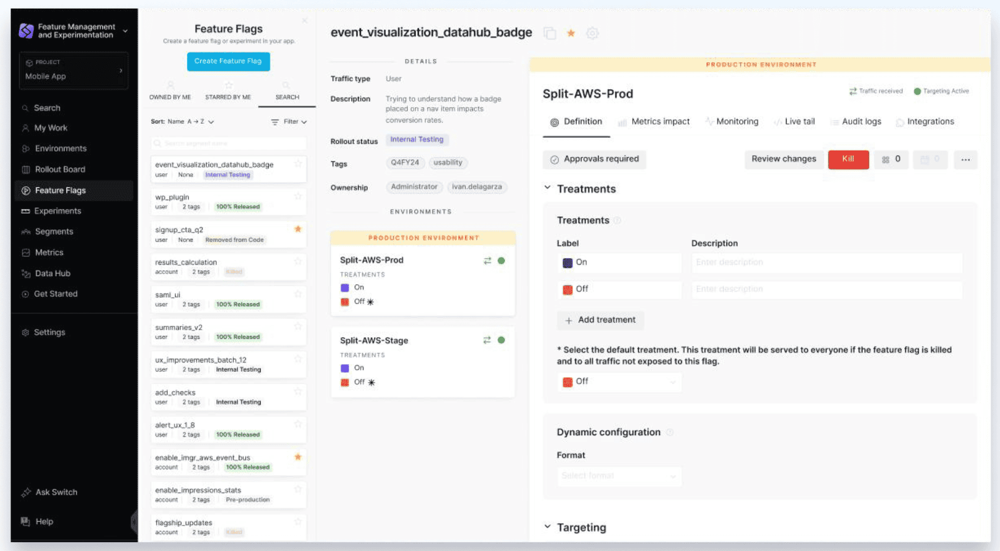

Beyond a change in color scheme, you will also see two changes to **terminology**:

* **Workspaces** will now be known as **Projects** in the UI
* **Organizations** will now be known as **Accounts** in the UI

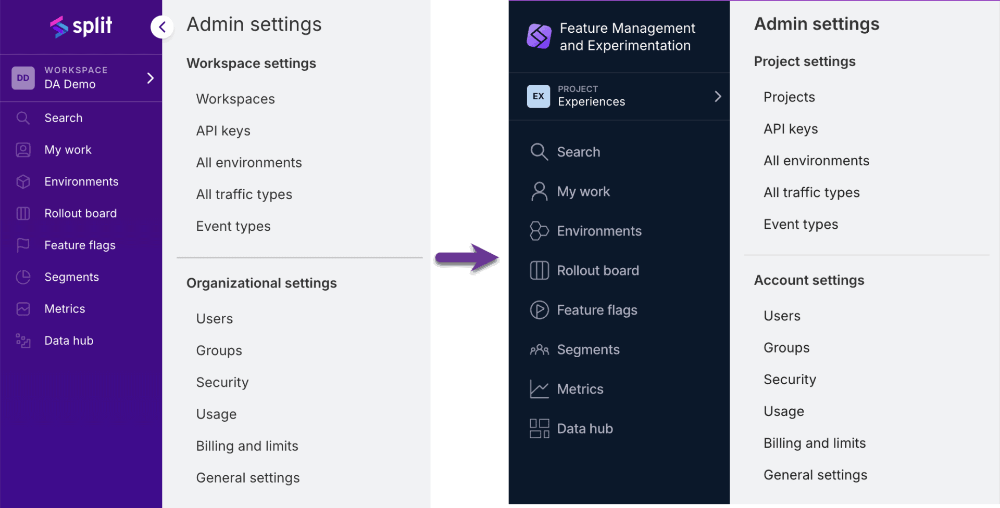

Note: These terminology changes are being made only to labels in the UI at this time. To avoid introducing a breaking change, the [Admin API](https://docs.split.io/reference/introduction) will continue to use the strings ws, workspace, organizationId, and orgId until further notice.

**2024-09-12**

**Monitoring**

**Traffic Insights and Alerts**

The **Alerts** tab has been renamed **Monitoring** and expanded to show real-time traffic insights over time and any alerts fired for the flag on a single page.

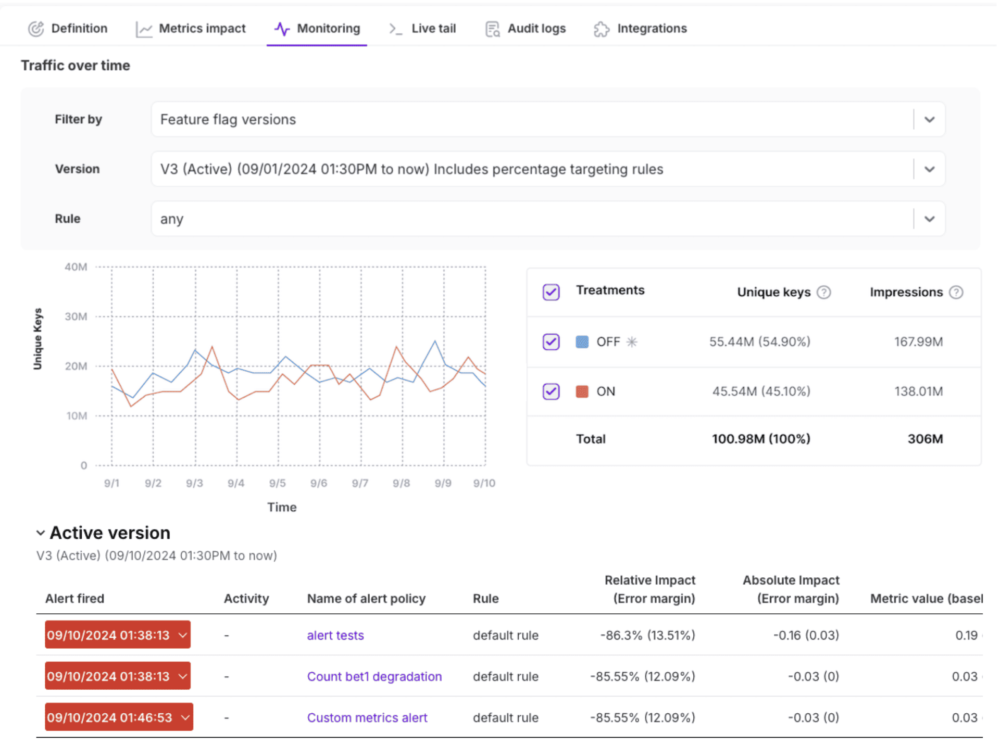

By default, traffic over the **Last 48 hours** is shown, but you may also select the **Last 7 days**, another **Time range**, or a specific **Feature flag version**:

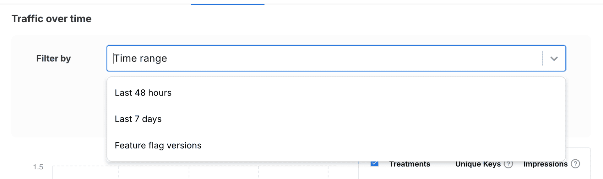

Changes made to flags (i.e., new flag versions) are displayed as vertical bars for context:

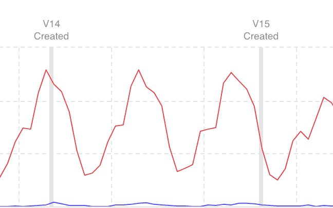

For more information, have a look at the [Monitoring tab docs](https://help.split.io/hc/en-us/articles/30098162579853-Monitoring-tab).

**2024-09-10**

**Metrics**

**Introducing Supporting Metrics**

We’re excited to announce the next step in improving metric categorization for your feature releases and experiments: **Supporting metrics**. This new metric category gives you greater control over metrics monitored per feature flag, helping you focus on what truly matters.

**What’s changing?**

On the Metrics impact page, we have replaced “Organizational metrics” with “Supporting metrics.” Now, you can easily select specific additional metrics to track for each release, reducing noise and making it easier to analyze your results.

**How do I assign flag-specific metrics?**

Key metrics and Supporting metrics are specific to individual feature flags, and can be managed on a flag’s Metrics impact tab. Under each category, click “Add metric” to initiate the process of assigning metrics to the category. Once metrics are added, you can wait until the next scheduled calculation or manually “Recalculate metrics” to see results.

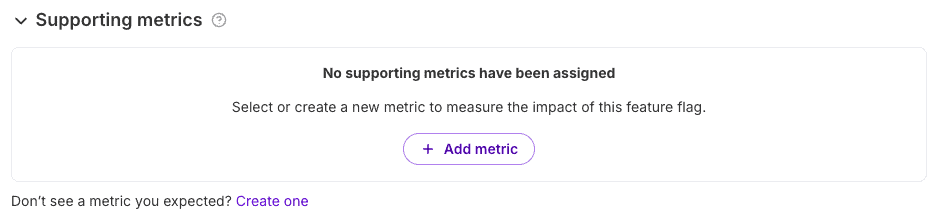

**How do I ensure my important metrics are still monitored for every flag?**

In June, Split introduced [Guardrail metrics](https://app.gitbook.com/s/rT2RGHAjtBTaObzchfpb/use-fme/release-monitoring/metrics/categories/index) to improve your ability to define which metrics should be monitored for every flag. Guardrail metrics include automated alerting, meaning flag owners will be notified as their releases or experiments impact these metrics.

Since Organizational metrics will no longer be available, **we recommend adding important metrics to the new Guardrail metrics category ASAP** to ensure they continue to be protected and limit any disruption of analyzing metric results.

Guardrail metrics can be assigned in the metric definition:

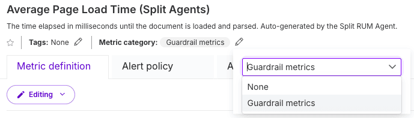

The combination of Key metrics, Guardrail metrics, and Supporting metrics will reduce noise and increase sensitivity while ensuring important metrics are monitored for every feature release or experiment. We welcome your feedback as we continue to improve our metric results!

**2024-09-04**

**Monitoring**

**Guardrail Metric Alerts**

Flag owners will now automatically receive alerts on any guardrail metric without manual configuration.

Alerts are sent to flag owners whenever a guardrail metric moves significantly in the desired or undesired direction. This feature is designed to help you make safe and accurate release decisions in a timely manner.

As a reminder, Guardrail Metrics ([released 2024-06-14](feature-management-experimentation.md#guardrail-metrics)) ensure that an organization’s most crucial metrics are protected and monitored throughout every feature release and experiment by making their calculation automatic and mandatory for all flags that use the same traffic type as the metric.

Metrics are set as guardrail metrics for your workspace on the Metric definition page. View the docs [here](https://app.gitbook.com/s/rT2RGHAjtBTaObzchfpb/use-fme/release-monitoring/metrics/categories/index).

**June 2024**

**2024-06-14**

**Monitoring**

**Guardrail Metrics**

Users can now categorize their organization’s most important metrics as “guardrails”. [Guardrail metrics](https://app.gitbook.com/s/rT2RGHAjtBTaObzchfpb/use-fme/release-monitoring/metrics/categories/index) are those your organization wants to protect during a feature release or experiment. Metrics are set as guardrail metrics for your workspace on the Metric definition page.

**2024-06-06**

**SDK Enhancements**

**Semantic Versioning Targeting**

Using the latest Split SDKs, users can more easily define targeting rules for new features based on app, OS, and other versions using attribute-based targeting. The SDK then automatically serves the appropriate treatment to users without needing additional code configurations. Split’s native [Semantic Versioning Targeting](https://app.gitbook.com/s/rT2RGHAjtBTaObzchfpb/use-fme/feature-management/targeting/target-with-custom-attributes#semver-attributes) removes the additional complexities and manual work that comes with targeting different application versions, allowing users to seamlessly deliver different experiences.

**May 2024**

**2024-05-31**

**Usability Enhancements**

**Left Navigation Enhancements**

Left-hand navigation within the application has been optimized. With this change, we've narrowed the navigation bar, migrated the search function to a modal dialog, and moved account settings to the bottom of the page. This makes frequently used actions (e.g. workspace switching) more readily accessible within the UI.

**2024-05-03**

**SDK Enhancements**

**Split Suite, iOS SDK**

Users can automatically capture event data in Split using their [iOS SDK](https://app.gitbook.com/s/rT2RGHAjtBTaObzchfpb/new-to-fme/sdks-and-customer-deployed-components/client-side-sdks/client-side-standard-sdks/ios-sdk) without needing additional agents, integrations, or track calls. This eliminates the manual process of sending events to Split, allowing users to quickly set up metrics and alert policies.

**Monitoring**

**Out-of-the-Box Metrics**

Split automatically creates metrics for any events being auto-captured by the Split Suite and RUM Agents ([Web](https://app.gitbook.com/s/rT2RGHAjtBTaObzchfpb/new-to-fme/sdks-and-customer-deployed-components/client-side-agents/browser-rum-agent#automatic-metric-creation), [Android](https://app.gitbook.com/s/rT2RGHAjtBTaObzchfpb/new-to-fme/sdks-and-customer-deployed-components/client-side-agents/android-rum-agent#automatic-metric-creation), [iOS](https://app.gitbook.com/s/rT2RGHAjtBTaObzchfpb/new-to-fme/sdks-and-customer-deployed-components/client-side-agents/ios-rum-agent#automatic-metric-creation)). This reduces the manual effort of creating metrics and allows users to easily calculate their engineering and performance metrics.

**April 2024**

**2024-04-16**

**Usability Enhancements**

**Switch Updates**

Users can now use Switch, Split’s in-app AI assistant, to easily summarize their experimentation results. Simply click on any metric card and hit the summarize button for a full analysis of your data. Please note, that this is a Generative AI feature that leverages end-user/customer data and will only be available to users who have specifically requested it to be enabled via Split’s Support team.

**February 2024**

**2024-02-16**

**Usability Enhancements**

**Change Request Management**

To help teams easily coordinate and collaborate on flag updates, we added shareable direct links to change requests. This allows teams to quickly share feature flag updates with key stakeholders and get faster approvals when needed.

**2024-02-09**

**Usability Enhancements**

**Switch Updates**

**Cancel responses mid-flight**

Users can cancel a response from Switch mid-flight. This allows users to move forward quickly in cases where they asked the wrong question or if the response they needed was already on the screen.

**Copy code snippets**

Users can now also copy code snippets directly from Switch, enabling faster time to value.

**2024-02-08**

**Usability Enhancements**

**Filtering Improvements**

To help teams quickly find the information they are looking for, Split has improved the filtering experience in these lists: **feature flags**, **segments**, and **metrics**. Users’ most recent search filters will be preserved as users continue to navigate the product.

**Feature Experimentation**

**Sequential Testing Update**

Users can now reduce the [minimum sample size to 100](https://app.gitbook.com/s/rT2RGHAjtBTaObzchfpb/use-fme/experimentation/setup/experiment-settings#minimum-sample-size#minimum-sample-size) at the organizational level via the admin setting. This allows users to get statistically significant results, faster.

**January 2024**

**2024-01-16**

**Usability Enhancements**

**Toast Notification Update**

Toast notifications will now appear in the lower right corner of Split’s UI. This increases the visibility of the notification and enables users to easily take additional action within Split.

**2024-01-09**

**SDK Enhancements**

**Split Suite, Android SDK**

Users can now automatically capture event data in [Split for their Android SDK](https://app.gitbook.com/s/rT2RGHAjtBTaObzchfpb/new-to-fme/sdks-and-customer-deployed-components/client-side-sdk-suites/android-suite) without needing additional agents, integrations, or track calls. This eliminates the manual process of sending events to Split, allowing users to quickly set up metrics and alert policies.

**2024-01-02**

**SDK Enhancements**

**Split Suite, Browser SDK**

Users can now automatically capture event data in [Split for their Browser SDK](https://app.gitbook.com/s/rT2RGHAjtBTaObzchfpb/new-to-fme/sdks-and-customer-deployed-components/client-side-sdk-suites/browser-suite) without needing additional agents, integrations, or track calls. This eliminates the manual process of sending events to Split, allowing users to quickly set up metrics and alert policies.

</details>

#### 2023 releases <a href="#id-2023-releases" id="id-2023-releases"></a>

<details>

<summary>Expand for 2023 releases</summary>

**December 2023**

**2023-12-20**

**SDK Enhancements**

**RUM Agent iOS**

With [RUM Agent iOS](https://app.gitbook.com/s/rT2RGHAjtBTaObzchfpb/new-to-fme/sdks-and-customer-deployed-components/client-side-agents/ios-rum-agent), the iOS SDK will automatically capture event data and send it back to the Split Cloud. Event data will then populate in Split’s Data Hub, similar to impression data. This eliminates the manual process of sending events to Split and enables a quicker setup of metrics and alert policies.

**2023-12-19**

**SDK Enhancements**

**React SDK Updates**

Split’s [React SDK](https://app.gitbook.com/s/rT2RGHAjtBTaObzchfpb/new-to-fme/sdks-and-customer-deployed-components/client-side-sdks/client-side-standard-sdks/react-sdk) hooks can now return the SDK’s readiness status and support update parameters to control when an application will render. These properties now allow users to easily refresh application components with just a few lines of code.

The `useSplitTreatments` hook has been optimized to detect duplicate `getTreatment` calls, improving the performance and UX of the application.

**2023-12-14**

**Usability Enhancements**

**Dynamic Configurations Update**

Dynamic Configuration’s JSON input field now supports text wraps. This allows users to easily view and edit content that contains very long strings like prompts for Large Language Models without needing to scroll horizontally across the screen.

**2023-12-12**

**Feature Flag Management Console**

**Flag Sets**

With [Flag Sets](https://app.gitbook.com/s/rT2RGHAjtBTaObzchfpb/use-fme/feature-management/manage-feature-flags/using-flag-sets-to-boost-sdk-performance), users can group flags that logically belong together, so that the SDK only retrieves relevant flag definitions when initialized. This reduces SDK latency, memory consumption, and CPU utilization.

**2023-12-11**

**Monitoring**

**Event Visualization**

With [Event Visualization](https://app.gitbook.com/s/rT2RGHAjtBTaObzchfpb/use-fme/release-monitoring/events/index#exploring-events), users are now able to easily view their event data in aggregate directly in Split’s Data Hub without needing an external tool. This enables users to quickly validate if their event data is properly flowing into Split, and see how that event is behaving over time.

**2023-12-06**

**Monitoring**

**Custom Metrics Event Grouping (OR)**

With [Custom Metrics, Event Grouping (OR)](https://app.gitbook.com/s/rT2RGHAjtBTaObzchfpb/use-fme/release-monitoring/metrics/index), users have the flexibility to choose more than one base event and aggregate up to 5 different events together when creating metrics. This allows users to build more complex metrics that fit their needs and combine different inputs into one metric.

**Event Type Management Enhancements**

Users can now create metric definitions without needing to set [event types](https://app.gitbook.com/s/rT2RGHAjtBTaObzchfpb/use-fme/release-monitoring/metrics/index#metric-types) beforehand in the Admin UI, removing bottlenecks between admins and users. Event types will be automatically deleted after 150 days of no data being received, eliminating the manual process of cleaning up unused types.

**November 2023**

**2023-11-29**

**Usability Enhancements**

**Keyboard Accessibility**

Users can now use tab-based navigation to access Split’s login page, change summary modal (including approval flow from email), and definitions tab. This is supported on the Edge, Firefox, Safari, and Chrome browsers.

**2023-11-09**

**Usability Enhancements**

**Switch**

[Switch](https://help.split.io/hc/en-us/articles/21188803158157) is an in-app AI assistant designed to streamline the use of the Split product. It offers multilingual support, rapid responses, and knowledge-based assistance by utilizing our public documentation and blogs. Switch makes it easy for all developers to get the help they need, without ever leaving the Split interface.

**2023-11-02**

**Feature Experimentation**

**Sequential Testing Update**

Sequential Testing will now be the default statistical method for all net-new organizations using monitoring and experimentation. The minimum sample size for [Sequential Testing](https://app.gitbook.com/s/rT2RGHAjtBTaObzchfpb/use-fme/experimentation/setup/experiment-settings#minimum-sample-size#minimum-sample-size) has been reduced from 200 to 100. This allows users to get statistically significant results, faster.

**Dimensional Analysis Update**

Users can now create up to [20 dimensions with 20 values per dimension](https://app.gitbook.com/s/rT2RGHAjtBTaObzchfpb/use-fme/experimentation/experiment-results/analyzing-experiment-results/dimensional-analysis#configuring-dimensions-and-values). This gives users even more flexibility when doing a deeper analysis of their feature experiments or releases.

**October 2023**

**2023-10-25**

**API Enhancements**

\####### Different Access Levels for APIs: Roles and Scopes for API Keys Define specific [roles](https://docs.split.io/reference/api-keys-overview#admin-api-key-roles) and [scopes](https://docs.split.io/reference/api-keys-overview#admin-api-key-scopes) for Admin API keys. Restrict access to resources at the organizational, workspace, or environment levels. This gives admins more flexibility when granting access to Split’s Public API.

**2023-10-24**

**SDK Enhancements**

**PHP in-memory (PHP Thin Client SDK) updates**

Split’s PHP in-memory SDK now supports [event tracking via the `track ()` call](https://app.gitbook.com/s/rT2RGHAjtBTaObzchfpb/new-to-fme/sdks-and-customer-deployed-components/server-side-sdks/php-thin-client-sdk#tracktrack), getting treatments with [Dynamic Configurations](https://app.gitbook.com/s/rT2RGHAjtBTaObzchfpb/new-to-fme/sdks-and-customer-deployed-components/server-side-sdks/php-thin-client-sdk#trackget-treatments-with-configurations), and retrieving information on cached flags via [SDK Manager](https://app.gitbook.com/s/rT2RGHAjtBTaObzchfpb/new-to-fme/sdks-and-customer-deployed-components/server-side-sdks/php-thin-client-sdk#trackmanager).

**2023-10-10**

**Monitoring**

**Feature Flag Significance Alerting**

With [Feature Flag Significance Alerting](https://app.gitbook.com/s/rT2RGHAjtBTaObzchfpb/use-fme/release-monitoring/alerts/automated-alerts-and-notifications/index#setting-up-feature-flag-alerting), users can now receive notifications when a statistically significant difference has been observed between two treatments on their flag’s key metrics. Feature Flag alerting is enabled automatically for releases with a percentage allocation. This enables users to make fast, accurate release decisions in a timely manner.

**Out-of-the-Box Metrics, Browser RUM Agent**

Split now [automatically creates metrics](https://app.gitbook.com/s/rT2RGHAjtBTaObzchfpb/new-to-fme/sdks-and-customer-deployed-components/client-side-agents/browser-rum-agent#automatic-metric-creation) for any events being auto-captured by the Split SDK (Browser RUM Agent). This reduces the manual effort of creating metrics and allows users to easily calculate their engineering and performance metrics.

**September 2023**

**2023-09-18**

**Integrations**

**Split-Segment Integration Update**

The `orginalTimestamp` precision has been updated to go from seconds to milliseconds when sending impressions to Segment. This update makes our timestamp field more consistent with the precision Segment uses.

**August 2023**

**2023-08-23**

**Feature Management Console**

**Feature Flag Editor Enhancements**

The feature flag definitions tab has added two minor UX updates to the editor flow. The treatment section will now automatically collapse once a flag definition has been created/updated. Also, users will be able to view treatment information via the environment cards on the left. These enhancements help the user understand which treatments are available in their environment and guide them to the targeting section.

**2023-08-15**

**SDK Enhancements**

**RUM Agents - Web & Android**

* Users can now automatically capture event data in Split for their [Web](https://app.gitbook.com/s/rT2RGHAjtBTaObzchfpb/new-to-fme/sdks-and-customer-deployed-components/client-side-agents/browser-rum-agent) and [Android](https://app.gitbook.com/s/rT2RGHAjtBTaObzchfpb/new-to-fme/sdks-and-customer-deployed-components/client-side-agents/android-rum-agent) SDKs. This eliminates the manual process of sending events to Split, allowing users to quickly set up metrics and alert policies.

**Monitoring**

**Custom Analysis Time Frame**

* With [Custom Analysis Time Frame](https://app.gitbook.com/s/rT2RGHAjtBTaObzchfpb/use-fme/release-monitoring/metrics/setup/filtering#selecting-custom-dates), users can now analyze across date ranges regardless of any changes made to the feature flag definition. This enables better flexibility when analyzing results.

**2023-08-07**

**SDK Enhancements**

**PHP in-memory (PHP Thin Client SDK)**

* Split now supports running PHP [locally](https://app.gitbook.com/s/rT2RGHAjtBTaObzchfpb/new-to-fme/sdks-and-customer-deployed-components/server-side-sdks/php-thin-client-sdk) using the [Split Daemon (splitd)](https://app.gitbook.com/s/rT2RGHAjtBTaObzchfpb/new-to-fme/sdks-and-customer-deployed-components/customer-deployed-components/split-daemon-splitd) process to store and maintain feature flag data. This eliminates the need to use Redis & the Split Synchronizer while using our PHP SDK and provides a simpler set-up process.

**2023-08-03**

**Learning and Onboarding**

**Split Arcade**

[Split Arcade](https://help.split.io/hc/en-us/articles/7996112174733-Split-Arcade-self-paced-certifications) is an interactive, gamified experience that provides persona-based technical training, tutorials, and best-practice guidance from industry experts. Users gain access to highly engaging content including product explainer videos, clickable product walkthroughs, manipulatable code examples, and more. With knowledge checks along the way, team members earn professional certifications and LinkedIn badges to validate progress.

**Language Library Enhancements**

**Flutter Plugin**

[Split's Flutter Plugin](https://app.gitbook.com/s/rT2RGHAjtBTaObzchfpb/new-to-fme/sdks-and-customer-deployed-components/client-side-sdks/client-side-standard-sdks/flutter-plugin) brings scalable feature flags to any app, website, or experience built with Flutter. Just inject the service into any component and start evaluating flags and tracking events.

**2023-08-01**

**SDK Enhancements**

**Instant Feature Flags**

* To reduce the latency of updates and increase the [reliability of SDKs](https://app.gitbook.com/s/rT2RGHAjtBTaObzchfpb/new-to-fme/sdks-and-customer-deployed-components#streaming-architecture), feature flag update notices delivered via streaming will not require a subsequent network request to fetch the changes. Instead, changes will be contained in the streaming payload itself.

**July 2023**

**2023-07-26**

**Integrations**

**SDK@Edge, Split-Vercel Integration**

* [Split’s integration with Vercel’s Edge](https://help.split.io/hc/en-us/articles/16469873148173) platform provides teams with the ability to incorporate feature flags and experiments into their Edge application and workstreams. Streamline Split data into the Edge without the extra network requests to retrieve config data.

**2023-07-24**

**Feature Management Console**

**Viewer Role**

* Admins can now assign the role, **Viewer**, to users. With the [Viewer role,](https://help.split.io/hc/en-us/articles/16432983870605-Managing-user-permissions) users can now be assigned a role that allows them to view data and objects within the Split application without the ability to make modifications. This will give admins more flexibility and control when assigning roles.

**June 2023**

**2023-06-22**

**Experimentation**

**Sequential Testing**

* [Sequential Testing](https://app.gitbook.com/s/rT2RGHAjtBTaObzchfpb/use-fme/experimentation/setup/experiment-settings#minimum-sample-size#using-sequential-testing) is a statistical testing method that allows users to obtain statistical results without the constraint of an experiment review period. This allows users to receive faster experimentation results, so that they make informed decisions about releases, quickly.

**2023-06-07**

**Monitoring**

**Metric Filtering Multiple Comparison Correction (MCC) Update**

When filtering your organizational metrics on the Metrics impact page, [MCC will only be applied once for all organizational metrics](https://app.gitbook.com/s/rT2RGHAjtBTaObzchfpb/use-fme/experimentation/key-concepts/multiple-comparison-correction#key-and-organizational-metrics). This will prevent users from seeing different p-values when metric results are filtered.

**May 2023**

**2023-05-24**

**Monitoring**

**Disabled Recalculating Metrics**

To help prevent unintentional resets of your data, the [recalculate metric button has been disabled](https://app.gitbook.com/s/rT2RGHAjtBTaObzchfpb/use-fme/experimentation/experiment-results/viewing-experiment-results/index#manually-recalculating-metrics) for feature flags that don't have any data available for calculations or haven't received traffic within Split's data retention period.

**2023-05-15**

**Usability Enhancements**

**Simplified Feature Flag Configurations**

The [feature flag configuration flow](https://github.com/iKettles/harness-gitbook/tree/main/release-notes/static/fme/simplified-feature-flag-configurations-1.pdf) on the definition tab has been reimagined with updated terminology and new visual cues. This will enable users to configure flags with a higher degree of confidence for any use case (percentage-based rollout, on/off, etc.).

**Visual Refresh to the Split User Interface**

The entire Split application has gone through a [visual refresh](https://github.com/iKettles/harness-gitbook/tree/main/release-notes/static/fme/simplified-feature-flag-configurations-1.pdf). Users will see a modern, forward-looking aesthetic with refined colors tuned for accessibility, visual cues, and more.

**Terminology Change**

To reduce the confusion between "Split", our product, and "split", the feature flag, we are [changing the term "split" to "feature flag"](https://github.com/iKettles/harness-gitbook/tree/main/release-notes/static/fme/simplified-feature-flag-configurations-1.pdf) across our application and documentation.

**2023-05-08**

**Integrations**

**Split's mParticle Integration Update**

Customers can now map Split traffic types to [mParticle MPID](https://app.gitbook.com/s/rT2RGHAjtBTaObzchfpb/management-and-administration/integrations/mparticle#harness-fme-as-an-event-output) when sending events to Split.

**April 2023**

**2023-04-27**

**Admin API Keys Enhancements**

**Clone API Keys**

Users can now [clone API Keys](https://app.gitbook.com/s/rT2RGHAjtBTaObzchfpb/management-and-administration/api-keys#cloning-api-keys) with the same access levels and scope as the key that is cloned. This will enable users to securely change/rotate keys on a regular basis while eliminating manual work.

**SDK Enhancements**

**TLS support**

Split now supports TLS encryption for [Split Synchronizer](https://app.gitbook.com/s/rT2RGHAjtBTaObzchfpb/new-to-fme/sdks-and-customer-deployed-components/customer-deployed-components/split-synchronizer#cli-configuration-options-and-its-equivalents-in-json--environment-variables) and [Split Proxy](https://app.gitbook.com/s/rT2RGHAjtBTaObzchfpb/new-to-fme/sdks-and-customer-deployed-components/customer-deployed-components/split-proxy#cli-configuration-options-and-its-equivalents-in-json-and-environment-variables) endpoints. This will enable developers to further secure their SDK traffic.

**2023-04-26**

**SDK Enhancements**

**Mobile SDK Cache Encryption**

Developers can now encrypt the persistent cache of rollout plans on their [iOS](https://app.gitbook.com/s/rT2RGHAjtBTaObzchfpb/new-to-fme/sdks-and-customer-deployed-components/client-side-sdks/client-side-standard-sdks/ios-sdk#configuration) and [Android](https://app.gitbook.com/s/rT2RGHAjtBTaObzchfpb/new-to-fme/sdks-and-customer-deployed-components/client-side-sdks/client-side-standard-sdks/android-sdk#configuration) SDKs. This will help enhance the security of this data.

**.NET Customizable Network Proxy**

Developers can now [configure specific proxies](https://app.gitbook.com/s/rT2RGHAjtBTaObzchfpb/new-to-fme/sdks-and-customer-deployed-components/server-side-sdks/net-sdk#proxy) using higher precedence than environment variables to perform the server requests for the .NET SDK. This will give developers the flexibility to proxy Split traffic separated from app traffic.

**2023-04-06**

**Feature Management Console**

**Essential Scheduling**

[Essential scheduling](https://app.gitbook.com/s/rT2RGHAjtBTaObzchfpb/use-fme/feature-management/manage-feature-flags/using-essential-scheduling) provides the capability to launch a feature on a certain date and time, up to 90 days in advance. This enables users to get all the necessary rollout work done, like getting approvals, long before the release.

**Simplified Feature Flag Configurations: Split Environment Usability Updates (Release 1)**

There are new UI and UX updates to the feature flag editing experience that make the selection of [environments](https://app.gitbook.com/s/rT2RGHAjtBTaObzchfpb/management-and-administration/environments) and the editing of flag details more intuitive and easier. The updates include an environment pick list showcasing feature flag traffic per environment, production environment indicators, and upgraded headers to easily edit flag details.

**Security**

**SCIM Support**

With [SCIM Support](https://help.split.io/hc/en-us/sections/14249918421005-SCIM), IT Admins can now manage Split users and groups using their preferred Identity Provider (IdP) including [Azure Active Directory](https://help.split.io/hc/en-us/articles/12386431119245-SCIM-for-Azure-AD) and [Okta](https://help.split.io/hc/en-us/articles/10488076923021-SCIM-for-Okta). This will help streamline the onboarding/offboarding processes as well as reduce the risk when governing users outside one's security platform.

**March 2023**

**2023-03-24**

**SDK Enhancements**

**SDK Offline Mode from JSON**

Developers can now start their [Go](https://app.gitbook.com/s/rT2RGHAjtBTaObzchfpb/new-to-fme/sdks-and-customer-deployed-components/server-side-sdks/go-sdk#json) and [Python](https://app.gitbook.com/s/rT2RGHAjtBTaObzchfpb/new-to-fme/sdks-and-customer-deployed-components/server-side-sdks/python-sdk#json) SDK instances in `localhost` mode, and easily download SDK data in the form of JSON files with just one command. These files can then mimic test or production environments, helping to improve the testing of applications offline.

**2023-03-23**

**Feature Management Console**

**Individual Target Key Limit**

The [individual target key limit](https://app.gitbook.com/s/rT2RGHAjtBTaObzchfpb/management-and-administration/environments) has been updated to 500. This will enable users to deliver changes to their users faster without any impact on the application load times.

**2023-03-17**

**Documentation**

**SDK Validation Checklist**

The [SDK validation checklist](https://app.gitbook.com/s/rT2RGHAjtBTaObzchfpb/new-to-fme/sdks-and-customer-deployed-components/validate-sdk-setup) helps users ensure that SDKs are implemented keeping best practices in mind. This checklist defines the general guidelines, checks, and validations that can be useful for developers and software architects to avoid common mistakes or oversights and to ensure optimal performance of the Split SDK.

**2023-03-08**

**Experimentation**

**Experiment Review Period Notification**

Users will now see a section on their **My Work** page that lists [experiments ready for review](https://help.split.io/hc/en-us/articles/360042494691-My-work#experiments-for-review). This will make it easier and faster for users to access their statistical results and encourage them to take informed next steps.

**Integrations**

**Split's Amplitude Integration Update**

[Split's Amplitude Integration](https://app.gitbook.com/s/rT2RGHAjtBTaObzchfpb/management-and-administration/integrations/amplitude#in-harness-fme) now supports Amplitude EU instances. This will enable customers using the EU region to properly configure the integration and send Split impressions to Amplitude.

**2023-03-01**

**Feature Management Console**

**Metric Audit Logs**

[Metric Audit Logs](https://app.gitbook.com/s/rT2RGHAjtBTaObzchfpb/management-and-administration/audit-logs) will now capture when a metric name is updated and when an alert policy is created, updated, or deleted. This will help increase visibility across teams of all the changes made across Split.### February 2023

**2023-02-27**

**Monitoring**

**Metric Definition Filters**

The [metric definition tab](https://app.gitbook.com/s/rT2RGHAjtBTaObzchfpb/use-fme/experimentation/experiment-results/viewing-experiment-results/metric-details-and-trends) has added an additional filter so users can now measure the metric event only if another event was completed beforehand. This will unlock a new way for users to measure the impact of experiments, and interpret their data.

**January 2023**

**2023-01-31**

**SDK Enhancements**

**SDK Offline Mode from JSON**

Developers can now start their [Java SDK](https://app.gitbook.com/s/rT2RGHAjtBTaObzchfpb/new-to-fme/sdks-and-customer-deployed-components/server-side-sdks/java-sdk#json) instance in `localhost` mode, and easily download SDK data in the form of JSON files with just one command. These files can then mimic test or production environments, helping to improve the testing of applications offline.

**2023-01-26**

**Monitoring**

**Alerting UX Enhancement**

Users will now see a [bell icon](https://app.gitbook.com/s/rT2RGHAjtBTaObzchfpb/use-fme/experimentation/experiment-results/viewing-experiment-results/index#viewing-metrics) within their metric list to easily identify whether or not an alert policy exists for a metric. If the icon is **white**, then no alert policy exists and if the icon is **gray**, then an alert policy exists for the metric. Clicking on the gray icon will take the user directly to the alert policy page for that metric.

**2023-01-23**

**Monitoring**

**Alerting UX Enhancement**

Previously, monitoring alerts were only generated when the sample size in each treatment reached 355. Now, users can receive alerts when the [sample size](https://app.gitbook.com/s/rT2RGHAjtBTaObzchfpb/use-fme/experimentation/setup/experiment-settings#minimum-sample-size) reaches a minimum of 200. This will allow users to fire alerts earlier, whether or not they have configured a lower sample size in their experiment settings.

**2023-01-18**

**Monitoring**

**Alerting UX Enhancement**

Users can now [manage their alert policy](https://app.gitbook.com/s/rT2RGHAjtBTaObzchfpb/use-fme/experimentation/experiment-results/viewing-experiment-results/metrics-impact-cards#actions-you-can-perform) directly from their metric cards on the **Metric impacts** tab. This change will make it simple to find where to manage alerts and/or know if alerts already exist for a metric.

</details>

#### 2022 releases <a href="#id-2022-releases" id="id-2022-releases"></a>

<details>

<summary>Expand for 2022 releases</summary>

**December 2022**

**2022-12-22**

**Feature Management Console**

**Usability Updates on the Targeting Rules page**

The usability updates on the [Targeting Rules page](https://app.gitbook.com/s/rT2RGHAjtBTaObzchfpb/use-fme/feature-management/setup/define-feature-flag-treatments-and-targeting#targeting-rules) include decluttering the tab, reducing confusion on default rule, and default targeting and starting the UI upgrade journey.

**2022-12-15**

**Integrations**

**Split-ServiceNow Integrations**

The [Split-ServiceNow Integration Beta](https://app.gitbook.com/s/rT2RGHAjtBTaObzchfpb/management-and-administration/integrations/servicenow) allows users to send change requests for feature flags and segments to ServiceNow DevOps and receive approvals back. This enables admins to leverage their customized change control process in ServiceNow without leaving the tool with which they're familiar.

**2022-12-12**

**Monitoring & Experimentation**

**Metric Card Update**

The **Metrics impact** tab now has [redesigned metric cards](https://app.gitbook.com/s/rT2RGHAjtBTaObzchfpb/use-fme/experimentation/experiment-results/viewing-experiment-results/metrics-impact-cards) to highlight essential information and improve the clarity of experiment data. New visual cues and layout enable users to quickly understand results at a glance.

**November 2022**

**2022-11-30**

**Experimentation**

**Dimensional Analysis**

[Dimensional Analysis](https://app.gitbook.com/s/rT2RGHAjtBTaObzchfpb/use-fme/experimentation/setup/experiment-settings#minimum-sample-size#dimensional-analysis) allows users to leverage event property data across all their sources to develop a set of dimensions. These can then be used to dissect experimentation results at a deeper level, giving you the insights needed to make better-informed future hypotheses and experimentation iterations.

**2022-11-16**

**Learning and Onboarding**

**Split Arcade**

[Split Arcade](https://arcade.split.io/certifications) has added a new onboarding and training course, **Level 1: Experimentation for Product Managers**. This approachable, functional certification gives product managers a deep dive into how to get started with experimentation, industry best practices, and hands-on training to learn how to easily build experiments in Split.

**2022-11-07**

**Feature Management Console**

**Attribute Dictionary Iteration**

Admins can now add up to 100 suggested values when creating [custom attributes](https://app.gitbook.com/s/rT2RGHAjtBTaObzchfpb/use-fme/feature-management/targeting/target-with-custom-attributes#creating-multiple-attributes) using the `string` type. This will give users more flexibility when creating targeting rules.

**2022-11-01**

**SDK Enhancements**

**Split Evaluator Update**

Users can now calculate flags for [multiple environments](https://app.gitbook.com/s/rT2RGHAjtBTaObzchfpb/new-to-fme/sdks-and-customer-deployed-components/customer-deployed-components/split-evaluator#multiple-environments-support) from a single instance of the Evaluator. This will require users to set individual API keys paired with a token for each environment they connect to the evaluator.

**October 2022**

**2022-10-26**

**SDK Enhancements**

**Support for watchOS, macOS, and tvOS**

Split has extended its iOS SDK capability to now [support watchOS, macOS, and tvOS](https://app.gitbook.com/s/rT2RGHAjtBTaObzchfpb/new-to-fme/sdks-and-customer-deployed-components/client-side-sdks/client-side-standard-sdks/ios-sdk). This brings scalable feature flags to any app, website, or experience built within the Apple ecosystem. Just inject the service into any component and start evaluating flags and tracking events.

**2022-10-20**

**Feature Management Console**

**Change Request ID More Accessible**

Users can now access the [change request ID](https://app.gitbook.com/s/rT2RGHAjtBTaObzchfpb/use-fme/feature-management/setup/approval-flows#reviewing-a-request) directly from the change summary page. This will eliminate the need to copy the ID from a web browser address bar.

**2022-10-14**

**SDK Enhancements**

**Evaluate Without Sending Impressions**

Split as added a new impression mode, `NONE`. Which can now enable [all Split SDKS](https://app.gitbook.com/s/rT2RGHAjtBTaObzchfpb/new-to-fme/sdks-and-customer-deployed-components#overview) to send only unique keys per Split rather than sending all impression data. This will help decrease network traffic from your system to Split, ultimately leading to lower resource consumption.

**2022-10-05**

**Learning and Onboarding**

**Split Arcade**

[Split Arcade](https://arcade.split.io/certifications) has added three new courses, **Feature Delivery Foundations for Admins & Product Managers**, **Administering Split**, and **Data Flow & Integrations**. These self-serve certification programs will help users level up their Split knowledge and admin capabilities through interactive tutorials, best practices, and knowledge checks along the way.

**September 2022**

**2022-09-27**

**UX Enhancements**

**Login Page Update**

[Split's Login](https://app.split.io/login) and [Reset Password](https://app.split.io/login/forgot-password) pages have gone through a refreshed visual style update. This will ultimately simplify the login process and reduce the number of errors.

**2022-09-14**

**Feature Management Console**

**Rollout Boards Enhancement - Ready to Clean Up View**

The [Ready to clean up](https://help.split.io/hc/en-us/articles/4405016480269-Use-the-rollout-board) view will filter the Rollout Board to show splits that have been in their status, 100% released, Removed from code, Ramping, or Killed, for at least 100 days. This will allow users to identify feature flags that can be retired which will help make the code more robust and readable.

**August 2022**

**2022-08-19**

**Feature Management Console**

**Create Multiple Attributes**

Admins can now create [multiple custom attributes](https://app.gitbook.com/s/rT2RGHAjtBTaObzchfpb/use-fme/feature-management/targeting/target-with-custom-attributes#creating-multiple-attributes) by uploading them using a CSV file, helping to reduce time and errors.

**2022-08-01**

**Feature Management Console**

**Attribute Dictionary**

With [Split's Attribute Dictionary](https://app.gitbook.com/s/rT2RGHAjtBTaObzchfpb/use-fme/feature-management/targeting/target-with-custom-attributes#adding-an-attribute), admins can now easily create custom attributes and suggested values. Users can then select from a list of predefined attributes and values to help decrease development time.

**SDK Enhancements**

**LogLevel Configurations**

LogLevel Configuration gives developers more granularity when choosing what level of logs they want to capture within their [i](https://app.gitbook.com/s/rT2RGHAjtBTaObzchfpb/new-to-fme/sdks-and-customer-deployed-components/client-side-sdks/client-side-standard-sdks/ios-sdk#track)[OS](https://app.gitbook.com/s/rT2RGHAjtBTaObzchfpb/new-to-fme/sdks-and-customer-deployed-components/client-side-sdks/client-side-standard-sdks/ios-sdk#configuration) and [Android](https://app.gitbook.com/s/rT2RGHAjtBTaObzchfpb/new-to-fme/sdks-and-customer-deployed-components/client-side-sdks/client-side-standard-sdks/android-sdk#configuration) SDKs.

**July 2022**

**2022-07-29**

**Integrations**

**Google Tag Manage**r The [Google Tag Manager (GTM) integration](https://app.gitbook.com/s/rT2RGHAjtBTaObzchfpb/management-and-administration/integrations/google-tag-manager) is an extension of our Google Analytics (GA) integration. With this extension, users can easily define which usage data to track and send over to Split to help make better-informed decisions.

**2022-07-26**

**Admin Console**

**Allow Admins to Skip Approval Flows**

To avoid delays when changes need to occur right away, admins can now [skip approval flows](https://app.gitbook.com/s/rT2RGHAjtBTaObzchfpb/use-fme/feature-management/setup/approval-flows) on selected environments.

**2022-07-15**

**Admin API Enhancements**

**Get/Create Split API Enhancements**

Our [Get Split](https://docs.split.io/reference/get-split) and [Create Split](https://docs.split.io/reference/create-split) endpoints now include owner IDs. This will facilitate workflows like sending feature flag retirement reminders to flag owners, building custom reports, and more.

**2022-07-07**

**SDK Enhancements**

**Client-Side Single Sync**

Client-side single sync allows customers to configure their [React](https://app.gitbook.com/s/rT2RGHAjtBTaObzchfpb/new-to-fme/sdks-and-customer-deployed-components/client-side-sdks/client-side-standard-sdks/react-sdk), [JavaScript](https://app.gitbook.com/s/rT2RGHAjtBTaObzchfpb/new-to-fme/sdks-and-customer-deployed-components/client-side-sdks/client-side-standard-sdks/javascript-sdk), [Node.js](https://app.gitbook.com/s/rT2RGHAjtBTaObzchfpb/new-to-fme/sdks-and-customer-deployed-components/server-side-sdks/nodejs-sdk), [React Native](https://app.gitbook.com/s/rT2RGHAjtBTaObzchfpb/new-to-fme/sdks-and-customer-deployed-components/client-side-sdks/client-side-standard-sdks/react-native-sdk), [Redux](https://app.gitbook.com/s/rT2RGHAjtBTaObzchfpb/new-to-fme/sdks-and-customer-deployed-components/client-side-sdks/client-side-standard-sdks/redux-sdk), [JavaScript Browser](https://app.gitbook.com/s/rT2RGHAjtBTaObzchfpb/new-to-fme/sdks-and-customer-deployed-components/client-side-sdks/client-side-standard-sdks/browser-sdk), and [Angular](https://app.gitbook.com/s/rT2RGHAjtBTaObzchfpb/new-to-fme/sdks-and-customer-deployed-components/client-side-sdks/client-side-standard-sdks/angular-utilities) SDKs to avoid processing updated or new targeting rules during a session. This enables the user experience to stay consistent while reducing performance impact.

**June 2022**

**2022-06-16**

**Integrations**

**Amazon S3 Inbound Integration Update**

Split has added functionality to the [S3 Inbound integration](https://app.gitbook.com/s/rT2RGHAjtBTaObzchfpb/management-and-administration/integrations/amazon-s3). With this update, all S3 bucket and status folder prefix will have a consolidated status file that includes all files with events that have been uploaded to Split during its latest batch.

**2022-06-03**

**Language Library Enhancements**

**Angular Library**

[Split's Angular Library](https://app.gitbook.com/s/rT2RGHAjtBTaObzchfpb/new-to-fme/sdks-and-customer-deployed-components/client-side-sdks/client-side-standard-sdks/angular-utilities) brings scalable feature flags to any app, website or experience built with Angular. Just inject the service in any component and start evaluating flags and tracking events!

**2022-06-01**

**Experimentation**

**Impact Snapshot**

[Impact snapshot](https://app.gitbook.com/s/rT2RGHAjtBTaObzchfpb/use-fme/experimentation/experiment-results/viewing-experiment-results/metric-details-and-trends#viewing-impact-snapshot) provides users with an up-to-date, aggregated view of the expected impact over baseline for each treatment and an estimated range for that impact.

**Deprecation of "Across" Metrics**

The creation of new "across" metrics has been deprecated. This deprecation will not impact any usage of the current "across" metrics. Users can still access the same information while using "across" metrics by using "[per traffic type](https://app.gitbook.com/s/rT2RGHAjtBTaObzchfpb/use-fme/experimentation/metrics/categories/index)" metrics and clicking into the metric cards.

**Management Console**

**Workspace View Permissions**

Admins can now control which users, groups, and Admin API keys can see if a certain Workspace exists and access the objects within it (splits, segments, metrics, traffic types, and environments). Use in order to keep sensitive projects private and to minimize cognitive load on users by reducing Workspaces visible to them. Visit the [documentation](https://help.split.io/hc/en-us/articles/360023534451-Workspaces#about-setting-workspace-permissions) to learn more.

**REST API Enhancements**

**Workspace Management API**

Several new additions and enhancements to [Split's Admin API](https://docs.split.io/reference/create-workspace) are now live. These include:

**New endpoints:**

* Create, update, and delete Workspaces
* Create, read, and update Workspace View Permissions
* Create and delete Traffic Type via Admin API

**Enhancements to existing endpoints:**

* List Workspaces by name
* Return API keys when creating new Environments
* Create and update Environment Permissions

**April 2022**

**2022-04-20**

**SDK Enhancements**

**User Consent Support**

Our [JavaScript](https://app.gitbook.com/s/rT2RGHAjtBTaObzchfpb/new-to-fme/sdks-and-customer-deployed-components/client-side-sdks/client-side-standard-sdks/javascript-sdk#user-consent), [Browser](https://app.gitbook.com/s/rT2RGHAjtBTaObzchfpb/new-to-fme/sdks-and-customer-deployed-components/client-side-sdks/client-side-standard-sdks/browser-sdk#user-consent), [React](https://app.gitbook.com/s/rT2RGHAjtBTaObzchfpb/new-to-fme/sdks-and-customer-deployed-components/client-side-sdks/client-side-standard-sdks/react-sdk#user-consent), and [Redux SDKs](https://app.gitbook.com/s/rT2RGHAjtBTaObzchfpb/new-to-fme/sdks-and-customer-deployed-components/client-side-sdks/client-side-standard-sdks/redux-sdk#user-consent) now allow you to easily disable the tracking of events and impressions until user consent for tracking is explicitly granted or declined.

**2022-04-07**

**Integrations**

**Microsoft Azure DevOps Integration Update**

Split has added functionality to the [Azure DevOps integration](https://app.gitbook.com/s/rT2RGHAjtBTaObzchfpb/management-and-administration/integrations/azure-devops). With this update, users will be able to map their Split workspaces to Azure DevOps projects. In Split, users will now be able to see the Azure DevOps work item assignee, work item status, and action.

**March 2022**

**2022-03-18**

**Management Console**

**Rollout Board Enhancement**

Within a status column, you now have additional options to customize the sort order of feature cards. By default, cards with pending changes will be listed first to easily see what actions are needed. Visit the [Sorting documentation](https://help.split.io/hc/en-us/articles/4405016480269-Use-the-rollout-board#select-your-sorting-order) to learn more.

**2022-03-15**

**Integrations**

**Datadog Integration Update**

Split has added functionality to the [Datadog integration](https://app.gitbook.com/s/rT2RGHAjtBTaObzchfpb/management-and-administration/integrations/datadog). With this update, account admins will be able to map the integration between a Split environment and a specific Datadog site. Split now supports the integration for any Datadog Site, including one for the EU.

**January 2022**

**2022-01-22**

**Management Console**

**Rollout Board Enhancement**

Users can now drag and drop feature cards on the Rollout Board to immediately update the status of a feature flag. Visit the [Drag and Drop documentation](https://help.split.io/hc/en-us/articles/4405016480269-Use-the-rollout-board#updating-status-from-the-rollout-board) to learn more.

**2022-01-17**

**SDK Enhancements**

**User Consent Support for Mobile**

Our [iOS](https://app.gitbook.com/s/rT2RGHAjtBTaObzchfpb/new-to-fme/sdks-and-customer-deployed-components/client-side-sdks/client-side-standard-sdks/ios-sdk#user-consent) and [Android](https://app.gitbook.com/s/rT2RGHAjtBTaObzchfpb/new-to-fme/sdks-and-customer-deployed-components/client-side-sdks/client-side-standard-sdks/android-sdk#configuration) SDKs now allow you to easily disable the tracking of events and impressions until user consent for tracking is explicitly granted or declined.

**Learning and Onboarding**

**Split Arcade**

[Split Arcade](https://arcade.split.io/certifications), our self-serve customer education, and certification platform is now available to our Free (Developer) users! All customers can now gain a deeper understanding of how Split supports the simplest needs for even the most advanced use cases. Free users can now get Split Certified in "Level 1: Feature Flagging Foundations" by registering [here](https://free-arcade.split.io/).

**2022-01-06**

**Feature Management Console**

**Admin Audit Logs**

[Admin Audit Logs](https://help.split.io/hc/en-us/articles/360051392872-Admin-audit-logs) will now capture any time a dimension is created, updated, or deleted.

</details>

#### 2021 releases <a href="#id-2021-releases" id="id-2021-releases"></a>

<details>

<summary>Expand for 2021 releases</summary>

**November 2021**

**2021-11-16**

**Integration**

**Azure DevOps integration**

Once configured, you can create feature flags and view flag statuses along with details associated with work items. In Azure DevOps, users can easily set up tasks to define custom rollouts in a pipeline. Visit the [documentation](https://app.gitbook.com/s/rT2RGHAjtBTaObzchfpb/management-and-administration/integrations/azure-devops) to learn more.

**Management Console**

**Rollout Board Enhancement**

Users can now use a variety of out-of-box dimensions to refine your search and narrow down to a specific set of features on the Rollout Board. Visit the [Advanced Filtering documentation](https://help.split.io/hc/en-us/articles/4405016480269-Use-the-rollout-board#filters) to learn more.

**August 2021**

**2021-08-10**

**Management console**

**Statuses and Rollout board**

You can now assign a status to each feature flag upon creation or when updating targeting rules. [Statuses](https://help.split.io/hc/en-us/articles/4405023981197-Use-statuses-in-beta-) indicate a feature's stage in the release process. [Rollout board](https://help.split.io/hc/en-us/articles/4405016480269) visualizes all flags by their assigned status so you can track multiple releases and experiments in one place.

**2021-08-04**

**SDK Enhancement**

**React Native SDK**

Our new [SDK for React Native](https://app.gitbook.com/s/rT2RGHAjtBTaObzchfpb/new-to-fme/sdks-and-customer-deployed-components/client-side-sdks/client-side-standard-sdks/react-native-sdk) is powered by Split's core TypeScript modules, and is optimized towards mobile lifecycle and use cases. It also uses a pluggable API to keep your bundle leaner by selecting only the features you need, with the ability to add more as we release them.

**June 2021**

**2021-06-08**

**Statistics**

**Share results from Metrics**

The new [Share results dropdown,](https://app.gitbook.com/s/rT2RGHAjtBTaObzchfpb/use-fme/experimentation/experiment-results/index#share-results) in the Metrics tab, allows you to share results from experiments with your teammates. Select the format that best meets their needs (JSON, PDF, CSV, or via URL). Available to all Experimentation customers.

**April 2021**

**2021-04-28**

**Integrations**

**Jira Software Integration Update**

A new Jira integration is now available, with which you can connect and view issue and flag details in both Jira and Split. With this bidirectional connection, you can track rollouts for an associated issue in Jira and issues tied to a feature flag in Split.

**REST API Enhancements**

**Approvals via the Admin API**

Engineers can now use Admin API endpoints to approve and reject change requests. This will allow teams to externalize approval processes to 3rd party applications already being leveraged for change management.

**March 2021**

**2021-03-30**

**SDK Enhancements**

**Lightweight Browser SDK**

Our new JavaScript SDK optimized for browser usage comes with a smaller footprint and offers a pluggable API so you can include the functionality you need while keeping your bundle leaner.

**February 2021**

**2021-02-18**

**Statistics**

**Split-level Statistical Settings**

Users can now customize statistical settings on a per-split basis. Each environment within each split can be customized to use different experimental settings such as significance threshold, review period, and minimum sample size.

**2021-02-16**

**Integrations**

**S3 Data Destination Integration**

Split can now send impression data directly to your S3 bucket. From here, impression data can be used to enrich customer data for deeper analysis in a BI or analytics tool.

**2021-02-09**

**REST API Enhancements**

**User and Group Management via the Admin API**

Engineers can now use Admin API endpoints to manage users and groups within your organization. These endpoints will allow an engineer to programmatically invite and deactivate users, create groups, and assign users to groups.

**January 2021**

**2021-01-26**

**Integrations**

**Amplitude Cohort Integration**

Users can now send Amplitude cohorts to Split as segments as a one-time, hourly, or daily sync. From here, these segments can be used to target relevant sample populations for feature flags and experiments.

**2021-01-21**

**REST API Enhancements**

**Environment Permissions for Admin API Keys**

Users can now scope Admin API keys down to one or more environments in a workspace. With a scoped down API key, engineers can now create automation and jobs for their specific needs without needing to worry about accidentally making changes for splits and segments in other environments

</details>

#### 2020 releases <a href="#id-2020-releases" id="id-2020-releases"></a>

<details>

<summary>Expand for 2020 releases</summary>

**December 2020**

**2020-12-15**

**Integrations**

**Amazon S3 Integration**

Split can now ingest events directly from files stored in your S3 bucket. The files inside the provisioned S3 bucket should be in Parquet format with a specific schema (as defined in our documentation) and should not exceed 100MB in size when compressed.

**November 2020**

**2020-11-17**

**Management Console**

**Admin Audit Logs**

Split now logs every time an admin creates, changes, or deletes objects such as users, settings, and integrations. Admins can access these logs to see every change that was made and who made them. Admin Audit Logs can be filtered by change type or object; each log also contains a summary of the edit and a diff view of what elements of the object were edited.

**Integrations**

**Admin Audit Logs Webhook**

Split will now publish all admin audit logs changes to any URL provided by an admin user. Customers will now be able to store all admin changes in an internal system for future auditing purposes.

**October 2020**

**2020-10-30**

**Statistics**

**Multiple Comparison Correction**

You can now apply a statistical correction to control the False Discovery Rate when making multiple comparisons in the same experiment. The significance threshold setting can be adjusted to higher or lower confidence. Using the default significance threshold of 5%, you can be confident that at least 95% of all the changes without meaningful impacts don't incorrectly show as statistically significant. This guarantee applies regardless of how many metrics you have.

**September 2020**

**2020-09-08**

**Management Console**

**Data export**

A new "Data Exports" tab is located within the Data Hub, where you will be able to create and download (CSV) exports for impressions and events for up to 90 days worth of data. Your organization can run 5 reports per day, and will also be able to access previously generated data exports for up to 7 days after their creation date.

**August 2020**

**2020-08-18**

**Statistics**

**Welch's T-Test**

Statistical results in Split are now calculated using Welch's T-Test. Unlike the more commonly used Student's T-Test, Welch's T-Test does not assume that the samples have equal variances. This makes the Welch approach more accurate in cases where there is both a difference between the variances of the samples and an unequal rollout plan, e.g. 5% on, 95% off.

**2020-08-17**

**SDK Enhancements**

**Filter splits**

You can now filter split definitions by name to specify which ones are downloaded to the SDK from a given environment. This is particularly helpful for client side SDKs because it allows you to only select the subset of splits that are used for a specific application.

**June 2020**

**2020-06-23**

**Management Console**

**Live tail**

The live tail functionality within the Data hub gives you a single place to view and query all of your impressions and your event data. You will be able to filter this data by a variety of dimensions so you can easily find data that is important to you.

**2020-06-08**

**Management Console**

**Approval flows environment settings**

You can now set controls for each of your environments to require approvals for an environment as well as restrict who can approve changes in a given environment.

**April 2020**

**2020-04-23**

**Management Console**

**My Work Landing Page**

Upon login users land on the new My Work page to view all your outstanding submissions and approvals in one place as well as any splits, segments, or metrics you own.

**Approval flows Admin API support**

You can now use the Admin API to submit changes for approval.

**March 2020**

**2020-03-26**

**Integrations**

**Receive data from Google Analytics**

Using Split's JavaScript SDK, easily send the data captured by Google Analytics - sessions, pageviews, performance and customer events -- to Split. Use these metrics to monitor each feature flag for defects and experiment on new features to determine their impact.

**Send data to Google Analytics**

Using Split's JavaScript SDK, easily send impressions and track events to Google Analytics to enrich the data you already capture via Google Analytics.

**2020-03-16**

**Integrations**

**mParticle Event Integration**

Split can now be used as an event output via our mParticle integration. With this capability, users can send product action, custom, session start, session end, and screen view events from their mParticle account into Split.

**2020-03-10**

**Management Console\*\*\*\***

**Approval Flows**

In addition to commenting on split and segment changes, now you can approve, reject, or withdraw changes. You'll also get notifications of changes and see approvals in audit logs to track past or present changes.

**January 2020**

**2020-01-31**

**Feature Experimentation**

**Recalculate metrics on demand**

You can now recalculate your metrics on demand. If you create a metric or modified a metric after the last updated metrics impact calculation, you can now push a recalculation to get the latest results.

**2020-01-27**

**SDK Enhancements**

**React SDK**

The new React SDK provides components and helper functions to access client and manager functionality, simplifying integration into React web apps.

**Redux SDK**

The new Redux SDK simplifies loading your flags into a Redux store as well as accessing the client and manager functionality, whether you use Redux for SSR or in the frontend. It also has some extra features for react-redux users!

**2020-01-20**

**Integrations**

**mParticle Feed Integration**

Split now integrates with mParticle as a feed. With this capability, users can export their impression data from their Split account into their mParticle account.

</details>


