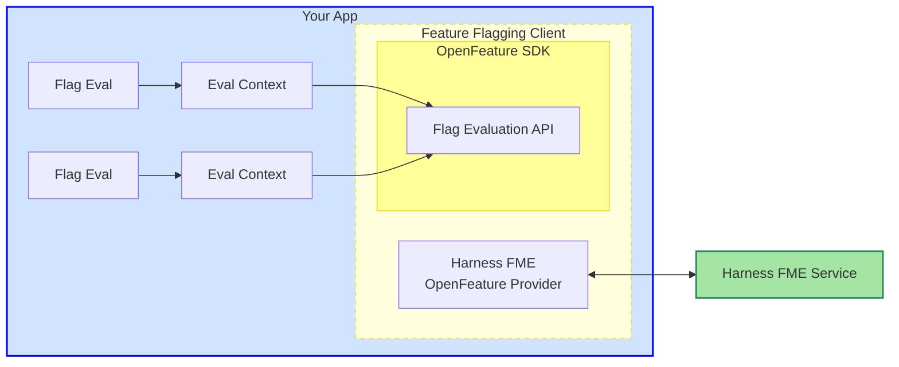

# OpenFeature Providers

[OpenFeature](https://openfeature.dev/docs/reference/intro) offers a standardized, vendor-agnostic SDK for feature flagging that can integrate with a variety of third-party providers. Whether you're using an open-source or commercial solution, self-hosted or cloud-hosted, OpenFeature gives developers a unified API for consistent feature flag evaluation.

OpenFeature SDKs provide flexible abstractions that make it easy to integrate feature flags into any application. Within your application, the feature flagging client uses the OpenFeature SDK to evaluate feature flags through the Evaluation API.

Each flag evaluation passes an evaluation context, which provides relevant data about the application or user.

 

The OpenFeature Provider wraps the Harness FME SDK, bridging the OpenFeature SDK with the Harness Feature Management & Experimentation (FME) service. The provider maps OpenFeature's standardized interface to the FME SDK, which handles communication with Harness services to evaluate feature flags and retrieve configuration updates.

### Use OpenFeature SDKs 

Harness FME offers official OpenFeature providers for the following SDKs.

<table data-view="cards"><thead><tr><th align="center"></th><th align="center"></th><th data-hidden data-card-target data-type="content-ref"></th></tr></thead><tbody><tr><td align="center"></td><td align="center"><strong>Android SDK</strong></td><td><a href="android-sdk.md">android-sdk.md</a></td></tr><tr><td align="center"></td><td align="center"><strong>iOS SDK</strong></td><td><a href="ios-sdk.md">ios-sdk.md</a></td></tr><tr><td align="center"></td><td align="center"><strong>Web SDK</strong></td><td><a href="web-sdk.md">web-sdk.md</a></td></tr><tr><td align="center"></td><td align="center"><strong>Dart SDK</strong></td><td><a href="dart-sdk.md">dart-sdk.md</a></td></tr><tr><td align="center"></td><td align="center"><strong>Angular</strong></td><td><a href="angular-sdk.md">angular-sdk.md</a></td></tr><tr><td align="center"></td><td align="center"><strong>React</strong></td><td><a href="react-sdk.md">react-sdk.md</a></td></tr><tr><td align="center"></td><td align="center"><strong>Java SDK</strong></td><td><a href="java-sdk.md">java-sdk.md</a></td></tr><tr><td align="center"></td><td align="center"><strong>Node.js</strong></td><td><a href="nodejs-sdk.md">nodejs-sdk.md</a></td></tr><tr><td align="center"></td><td align="center"><strong>Python SDK</strong></td><td><a href="python-sdk.md">python-sdk.md</a></td></tr><tr><td align="center"></td><td align="center"><strong>.NET SDK</strong></td><td><a href="net-sdk.md">net-sdk.md</a></td></tr><tr><td align="center"></td><td align="center"><strong>Go SDK</strong></td><td><a href="go-sdk.md">go-sdk.md</a></td></tr></tbody></table>

You can use these providers instead of the Harness FME SDK in your application.


